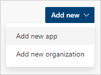
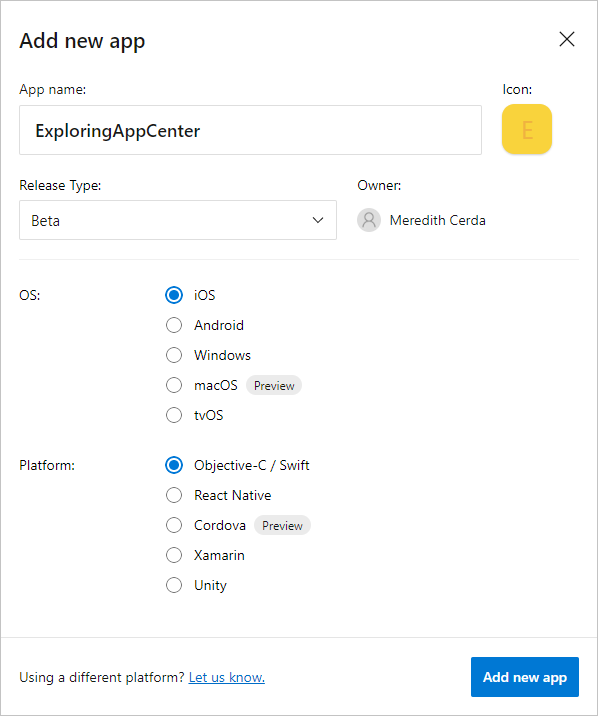
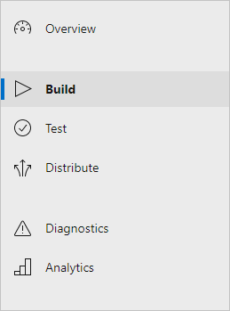
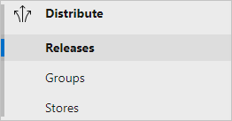
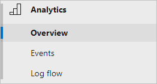

To get started using Visual Studio App Center, you'll need an App Center account. By following through the steps in this exercise, you'll create an App Center account and explore some of the features offered by the App Center portal.

## Navigate to App Center

* Navigate to the [App Center portal](https://appcenter.ms?utm_source=MSLearn&utm_medium=Azure&utm_campaign=Intro%20to%20App%20Center%20module) in a new browser tab or window.

If you aren't already signed in to App Center, you will be shown a page describing what App Center offers with links to pages about pricing, documentation, and support.

## Create an App Center account

To create an App Center account, you will register with another account and associate your App Center use with that account. Creating an App Center account is free, and App Center allows you to sign in with the following accounts to get started:

* GitHub account
* Microsoft personal account
* Microsoft company or school account
* Facebook account
* Google account

To create an App Center account, use the following steps:

1. Follow this link to **[Sign up with App Center](https://appcenter.ms/signup?utm_source=MSLearn&utm_medium=Azure&utm_campaign=Intro%20to%20App%20Center%20module)**.

1. Sign in to Visual Studio App Center authenticating with one of the providers: GitHub, Microsoft personal or work account, Facebook, or Google. You will proceed through whatever authentication system you pick, and when you complete authenticating with one of the providers, you'll return to App Center.

1. App Center will prompt you for a username. You can enter your desired username for App Center, or you can use the suggestion that App Center provides. You'll be able to change your username later from your App Center profile.

1. Click **Choose username** to continue to the App Center portal.

## Create an app

Next, you'll create a temporary app in App Center to explore the App Center services.

1. At the top right, click the **Add new** button.

1. The button will present the option to **Add new app** or **Add new organization**. Click **Add new app** to start creating a temporary App Center app.

    

1. Enter an **App name** of your choice.

1. Pick any one of the **Release Type** values for this temporary app. Notice the different options that available; for example: Alpha, Enterprise, Store, etc., or you can specify your own custom type.

1. As you select the different **OS** options, notice which platforms and languages are supported. For example, the platform options change between iOS and Android.

1. Pick an **OS** value of your choice for this app.

1. Select a **Platform** value of your choice.

1. Click the **Add new app** button at the bottom.

    

Once you have created your new app, App Center will present with the various service options on the left-hand navigation. The **Overview** section will be selected for you. Since this is a new app, the overview section will show you instructions and documentation links for integrating the SDK with the OS and platform you chose for your temporary app.

## Explore the App Center services

Next, you'll explore the various services represented in the left-hand navigation. Click through the App Center services for each section here.

### Build

* Click into the **Build** section from the left-hand menu. Depending on your web browser's window width, you may have to click the hamburger menu icon at the top left to see the left-hand menu.

  

The **Build** section is where you can configure builds of your app's source code. Builds can be started automatically for each commit to a branch, or manually from the App Center portal.

You can configure App Center to retrieve your app's code from several different services, as shown on the build page for this temporary app. Once you have configured a source code service and a repo within it, this page will present the various build configurations you have configured on your branches. You will be able to see the most recent commit to the branch and the status of the most recent build of the code in that branch. If there were any errors during the build, you can click into the specific build and investigate them from the build output.

### Test

* Click into the **Test** section from the left-hand menu. The **Test** section offers two sub-sections: **Test runs** and **Device sets**.

  * Creating a **test run** takes you through selecting individual real, physical devices you want to run your tests. Later, when you have created some preferred device sets, you can quickly pick a set of devices. From there, you will be given instructions to install and run the **appcenter-cli** npm package to allow you to run tests on the selected devices on-demand.

  * Creating a **device set** allows you to pre-select representative devices for testing your app. If you know most of your users are on fairly new Android devices, for example, you could pick a few of the most recent Android models. Alternatively, if you create an app specific to iPad tablets, you could pick out several iPad, iPad Mini, and iPad Pro devices. You would give the set of devices a name and be able to reference that set easily for your test runs.

You might also create a device set that represents the devices that seem to produce the most problems for your app's users. This would allow you to run test for known issues before releasing a new build to make sure you haven't introduced any regressions to those users.

### Distribute

* Click into the **Distribute** section from the left-hand menu. From the **Distribute** section, you can send previous builds to your various distribution groups, or directly to an app store. It has several sub-sections: **Release**, **Groups**, and **Stores**.

  

  * Within the **Releases** section of Distribute, you can distribute a release. You either upload a build manually or tell it which previous build you want to distribute. You will go through  You create distribution groups from the **Distribute** > **Groups** section. You'll be able to pick which release group or app store to send your build in the new release steps, destinations you set up in the other sections of Distribute. Within each release you distribute, you will be able to see the distribution group that was used as well as the download count of that release.

  * Inside the **Groups** section of Distribute, you can create and manage your distribution groups. You set up these groups to reach pre-defined sets of users, such as users who handle app testing or pre-publish approval reviews.

  * Finally, the **Stores** section of Distribute gives you options to set up links to the public app stores to release your app to end users. Connecting to a store allows you to publish your app. For iOS apps, you would set up a connection to the Apple App Store or Intune Company Portal. For Android apps, you would set up a connection to the Google Play Store or Intune Company Portal.

### Diagnostics

* Click into the **Diagnostics** section from the left-hand menu. After you have the App Center SDK incorporated into your app, you will start to see crash information in the **Diagnostics** section. These data points will start to show up when you start having crashes reported by your app users. There will be charts of crash counts as well as a list of error groups that you can click into to learn more about it.

### Analytics

* Click into the **Analytics** section from the left-hand menu. From the **Analytics** section, you'll have several sub-sections: **Overview**, **Events**, and **Log flow**.

  

  * Within the **Overview** section of Analytics, you'll see charts of active users and sessions counts. As well, you'll see charts to tell you your app's most popular devices, most common geographic locations and user languages, and most popular release versions. Once your app has collected some data, your analytics overview will start to look more like this screenshot.

  * After you have the App Center SDK incorporated into your app, the **Events** section of Analytics will give you a table of the events that your app has reported. You can then sort these events by overall count, trending movement, number of users, trend in user count, and the average per user.

  * If you want to see real-time events coming in from your app, you will find that data in the **Log flow** section of Analytics. This can help you confirm data is coming in correctly from your app after you set it up. If you know a particular even should be showing up, you can verify your app is sending it from this view.
