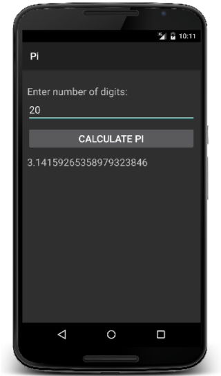
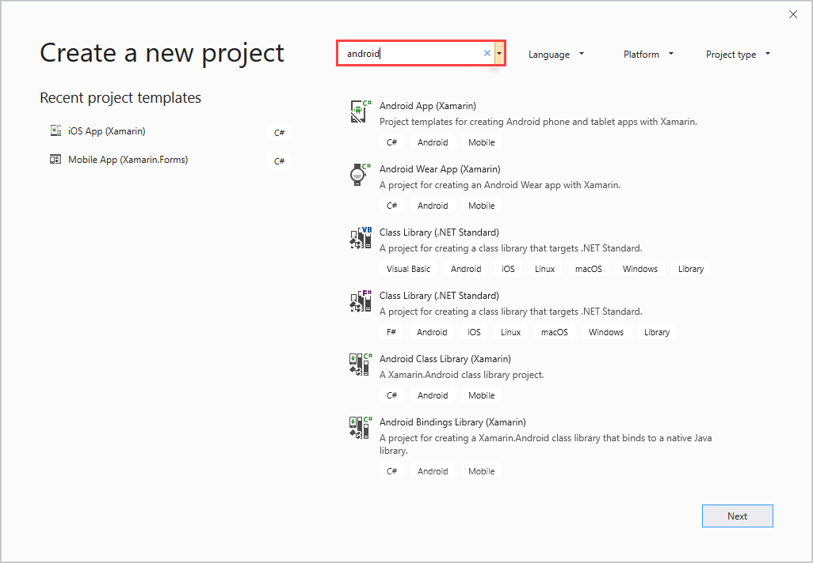

Visual Studio Tools for Xamarin is an open-source app-development platform that lets you build apps for many operating systems. Xamarin allows you to write apps that can take full advantage of the power, features, and performance of each platform with a single shared .NET code base. Xamarin.Android is a Xamarin framework you can use to create fully native Android apps by using C# in Visual Studio.


## What is a Xamarin.Android app?

A Xamarin.Android app is a native Android app that's built by using the Xamarin tools and libraries. The UI is created from Xamarin wrappers around native Android views so the app has the look and feel users expect. The behavior logic is written in C#, which is comfortable and familiar to the community of .NET developers.



## Use Visual Studio and C# to develop for Android

You can use Visual Studio or Visual Studio for Mac to build Xamarin.Android apps. Xamarin.Android supports the latest C# features, including generics, async/await, LINQ, and lambda expressions. This support means that all the familiar C# language constructs are available to you when you create Android applications.

The following code, for example, will compile without any problems:

```csharp
var employees = new List<Employee>();
var seniors = from e in employees where e.Salary > 50000 select e;
var client = new HttpClient();
var result = await client.GetStringAsync("");
```

C# support in Xamarin.Android stays up to date with the latest versions of the language so you have access to all the new language features as they're released.

## Use C# idioms in Xamarin.Android

Xamarin.Android lets you use the familiar C# and .NET style of programming. You don't have to use Java idioms to code, even though a Java API underlies the Xamarin C# wrappers. The Xamarin.Android bindings to Android libraries provide a familiar programming experience for C# developers.

Let's look at two of the most visible examples:

- Java uses _get_ and _set_ methods like `getText` and `setText`.

    ```java
    EditText input = new EditText(this);
    String text = input.getText().toString();
    ```

- Java uses listeners for callbacks.

    ```java
    input.addTextChangedListener(new TextWatcher() { ... });
    ```

You can use familiar idioms in C#. The Xamarin C# wrappers will:

- Translate Java's `getText` and `setText` methods into a `Text` property.

    ```csharp
    var input = new EditText(this);
    string text = input.Text;
    ```

- Let you use familiar event syntax with `+=` and `-=` instead of Java listeners for callbacks.

    ```csharp
    input.TextChanged += (sender, e) => { ... };
    ```

> [!NOTE]
> Xamarin C# wrappers provide both the Java-style listener pattern and the C#-style event pattern. Many classes offer two ways to do essentially the same thing. The C# style is usually preferred because the syntax is cleaner and you can use it to easily subscribe to a single event rather than implementing an entire listener interface.

## Use libraries in Xamarin.Android

Java Android apps have access to libraries for nearly all use cases. This access means you can develop your apps faster. Libraries are also accessible to you as a Xamarin.Android developer.


Xamarin.Android apps can use utility classes from three libraries.

| Library | Description |
| --- | --- |
| Java.* | Java Android apps have access to a Java library and an Android-specific library. The Java.* packages are utility classes: data structures, string manipulation, networking, and so on.|
| Android.* | The Android.* packages provide Android-specific functionality: access to the on-device file system and access to the device's radios, GPS, phone dialer, and so on. |
| Mono.NET | Xamarin.Android apps also have access to the Mono.NET libraries. The number of provided types is large. Xamarin calls it "an extended subset" of the standard desktop .NET library. |

Xamarin provides C# wrappers for the Java.* and Android.* packages. When a new version of the Android.* libraries is released, the Xamarin C# wrappers are available almost immediately.

## Use third-party Java libraries

Suppose you want to access a Bluetooth accessory that monitors a user's heart rate. Such accessories normally ship with an SDK you can use in your own Java-based Android apps.

You can incorporate existing Java .jar files into your Xamarin.Android app. To incorporate libraries, you can use:

- The Java Native Interface (JNI)
- A Java Bindings Library

Neither technique is simple, but both get the job done.

The decision between the two techniques is a matter of personal preference. If you use JNI, your code will look verbose, as if you're using a Reflection-style API. A Bindings Library yields nicer client code but requires more preparation.

## Use Xamarin.Android project templates

Let's look at the steps to create and run a Xamarin.Android app. We'll assume you're using Visual Studio 2019. Creating your app begins with the **Create a new project** option.


Xamarin.Android includes several project templates for Android apps and libraries. Each project type includes a quick summary of its purpose and content. Notice that we've used the keyword _android_ to filter the project options.



| Project type | Description |
| ----- | ----- |
| Android App (Xamarin) | Use this standard project template to create Android apps. This template creates an app that can run on a phone or tablet. |
| Android Wear App (Xamarin) | This template creates an Android app for wearable devices. It's typically a watch-style app. |
| Android Class Library (Xamarin) | This template creates a C# class library that targets only the Xamarin.Android platform. The library is shareable only between Xamarin.Android projects. Use .NET Standard class libraries if you want to create a shared cross-platform library.|
| Android Bindings Library (Xamarin) | Use this template to create an Android Bindings project. The project allows you to create your own C# wrappers to bind any Java Android library you might want to use. |

## Choose an Android project template

Suppose you want to create an app called Tip Calculator. You'll choose the **Android App (Xamarin)** option from the filtered list of project templates and then name your app. 

Here we've filtered the project options by using _xamarin_ as our keyword.


Both Visual Studio and Visual Studio for Mac offer a set of installed project templates you can use to create Android applications in a few different styles. Keep in mind that the app-creation experience differs a little between the two versions of Visual Studio.


Visual Studio 2019 lets you choose one of the following default templates:

| Template | Description |
| -------- | -------- |
| Single View Application | This is the basic application template. You'll use it in the lab exercise. It creates the app structure with a single page that contains a button. |
| Navigation Drawer App | This template creates an application with two panels. The first panel is a menu structure where each entry allows the user to navigate to a page. The second panel acts as a page placeholder for the selected menu option. |
| Tabbed App | This template creates a multipage application where each page is a tab. A button that represents the tab appears at the bottom of the screen. |
| Blank App | This template creates an application that contains an empty visual design file and an associated code class.  |

Notice the option to select a **Minimum Android Version**. This option allows you to specify the oldest Android OS version on which this app can be deployed.
