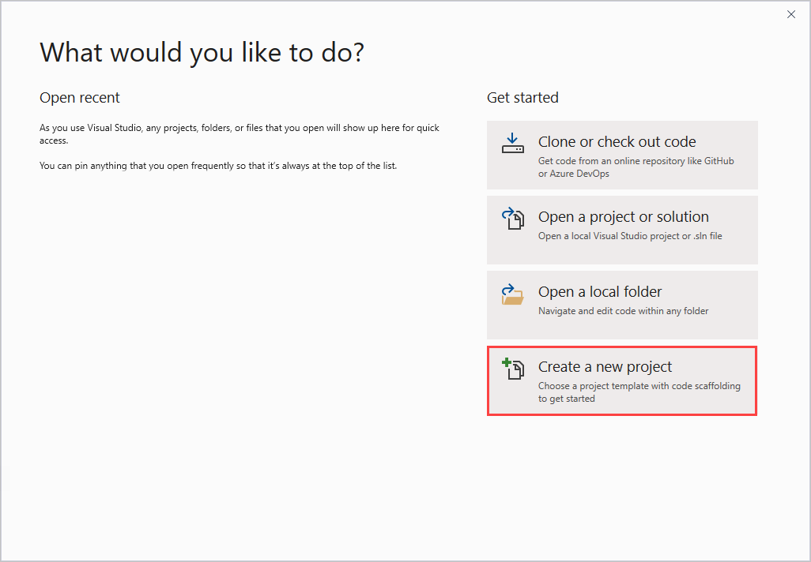
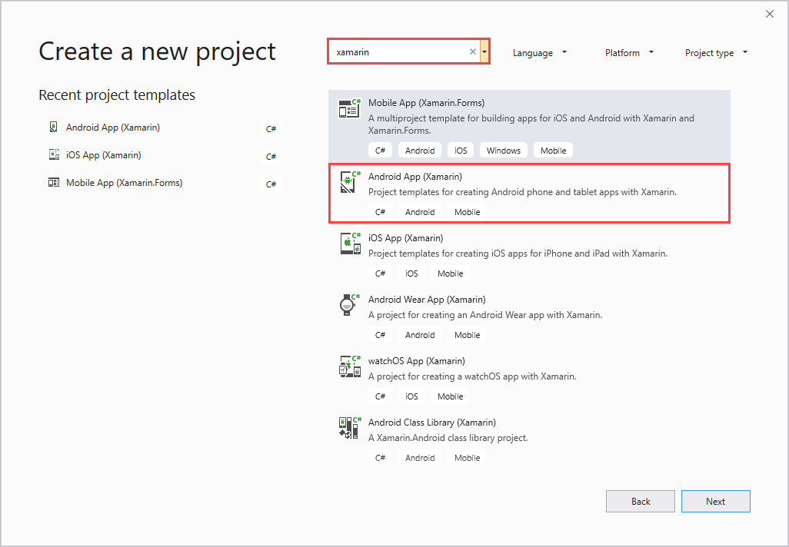
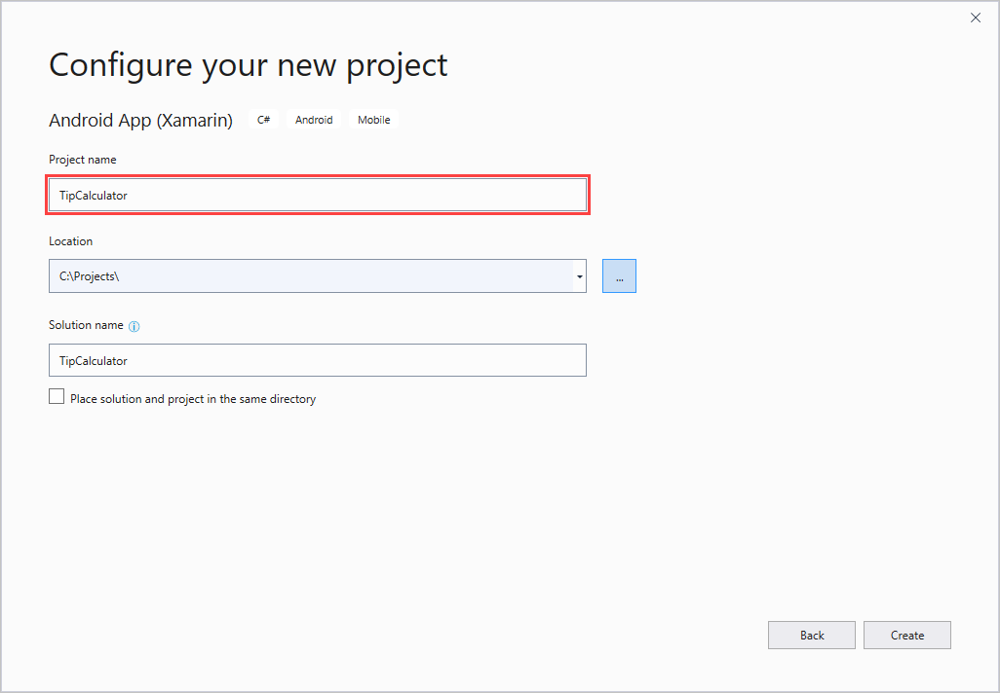
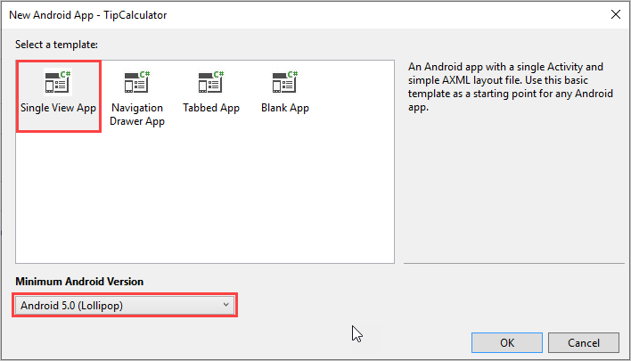
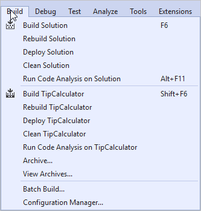
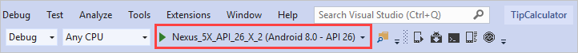
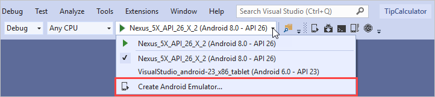
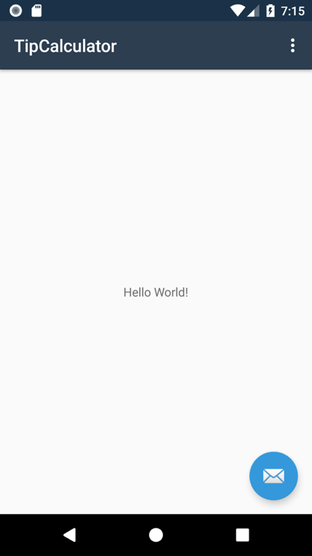

This exercise walks you through creating a new Xamarin.Android project. You won't need to write any code here. The instructions will point out a few key parts of the project as you create it.

## Create a new Xamarin.Android project

Let's create and run a Xamarin.Android app. We'll assume you're using Visual Studio 2019. 

To create a new project in Visual Studio for Windows:

1. Open **Visual Studio** for Windows.

1. To begin creating your app, choose **Create a new project**.

    

1. Filter the new project type options by using _xamarin_ as your search term. Then choose **Android App (Xamarin)** and select **Next**.

    

1. Name the project **TipCalculator**.

1. Choose a location for the project and select **Create**.

    

1. For the template, select **Single View App**.

    

1. Use the default values for all other project settings.

1. Select **OK**.

## Examine the application code

Let's take a closer look at the code.

1. Open the file **Resources** > **layout** > **activity_main.axml** in the source view. If you start in the design view, select the **Source** tab on the side of the window. You'll find the **Source** tab in the center of the window when you're using split view. When the design view takes up the full window, the **Source** tab appears on the right.

1. Examine the XML that declares the content of the screen. The screen includes a few interesting items.

    ```xml
     <android.support.design.widget.CoordinatorLayout ...>
        <android.support.design.widget.AppBarLayout ...>
            ...
        </android.support.design.widget.AppBarLayout>

        <include layout="@layout/content_main" />

        <android.support.design.widget.FloatingActionButton ... />
    </android.support.design.widget.CoordinatorLayout>
    ```

    The first interesting item is `CoordinatorLayout`, which is the layout container for this screen. `CoordinatorLayout` is like the layout containers we've already seen, but it has additional functionality. `CoordinatorLayout` can manage interaction between its child layout containers.

    The next interesting item is `AppBarLayout`. This control is used as a layout container to manage the application bar displayed in the app.

    The final interesting item is `FloatingActionButton`. This floating button is positioned above content and promotes a main action. The user can tap it when the app is running.

    We won't cover these items in detail in this module. Android provides extensive documentation for these controls.

1. Examine the XML that declares the floating action button. The button has an assigned `android:id`.

    ```xml
    <android.support.design.widget.FloatingActionButton
        android:id="@+id/fab"
        android:layout_width="wrap_content"
        android:layout_height="wrap_content"
        android:layout_gravity="bottom|end"
        android:layout_margin="@dimen/fab_margin"
        app:srcCompat="@android:drawable/ic_dialog_email" />
    ```

You'll notice some other controls also use the `android` namespace to declare `Id` and other attributes.

## View the main activity

1. Open the file **MainActivity.cs**.

1. The template generated an _activity_ for you. The `Activity` attribute for `MainActivity` has `MainLauncher` set to `true`. That setting makes this activity your app's primary entry point.

1. Notice two things in `OnCreate`. First, `SetContentView` takes an identifier for an XML file as its argument (**Resource.Layout.activity_main**) and instantiates the UI. Second, `FindViewById` takes an `android:id` value and returns a reference to the view with that ID. The code uses `android:id` values to access the views in the UI.

    The rest of the code in this class deals with UI behavior and components used in the app.

    ```csharp
    [Activity(Label = "@string/app_name", Theme = "@style/AppTheme.NoActionBar", MainLauncher = true)]
    public class MainActivity : AppCompatActivity
    {
        protected override void OnCreate(Bundle savedInstanceState)
        {
            base.OnCreate(savedInstanceState);
            Xamarin.Essentials.Platform.Init(this, savedInstanceState);
            SetContentView(Resource.Layout.activity_main);

            Android.Support.V7.Widget.Toolbar toolbar = FindViewById<Android.Support.V7.Widget.Toolbar>(Resource.Id.toolbar);
            SetSupportActionBar(toolbar);

            FloatingActionButton fab = FindViewById<FloatingActionButton>(Resource.Id.fab);
            fab.Click += FabOnClick;
        }

        public override bool OnCreateOptionsMenu(IMenu menu)
        {
            MenuInflater.Inflate(Resource.Menu.menu_main, menu);
            return true;
        }

        public override bool OnOptionsItemSelected(IMenuItem item)
        {
            int id = item.ItemId;
            if (id == Resource.Id.action_settings)
            {
                return true;
            }

            return base.OnOptionsItemSelected(item);
        }

        private void FabOnClick(object sender, EventArgs eventArgs)
        {
            View view = (View) sender;
            Snackbar.Make(view, "Replace with your own action", Snackbar.LengthLong)
                .SetAction("Action", (Android.Views.View.IOnClickListener)null).Show();
        }

        public override void OnRequestPermissionsResult(int requestCode, string[] permissions, [GeneratedEnum] Android.Content.PM.Permission[] grantResults)
        {
            Xamarin.Essentials.Platform.OnRequestPermissionsResult(requestCode, permissions, grantResults);

            base.OnRequestPermissionsResult(requestCode, permissions, grantResults);
        }
    }
    ```

## Run your application

To compile your code, you'll use the same technique you would for any other app. You can use the **Run** button on the toolbar, the **Build** menu, or a keyboard shortcut.



Build warnings and errors are reported through the **Error** window. You can turn the window on and off through the **View** menu.

On the toolbar, the **Run** button allows you to deploy your application to an available Android emulator.



If no emulator is shown, you can create a compatible emulator. An Android emulator is compatible if the app you want to deploy has a minimum supported Android version earlier than the OS version running on the emulator.



* Run the app. Spend some time using it so you understand its behavior. The template code typically creates a single page with a title bar and menu button, a label, and a floating action button that will display a message when it's selected.

    

You can view the completed solution in the **exercise1** > **final** folder in your copy of the cloned or downloaded [!INCLUDE [module-exercise-repo](module-exercise-repo.md)] from GitHub.
