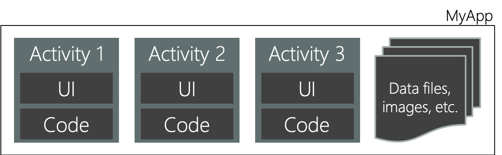
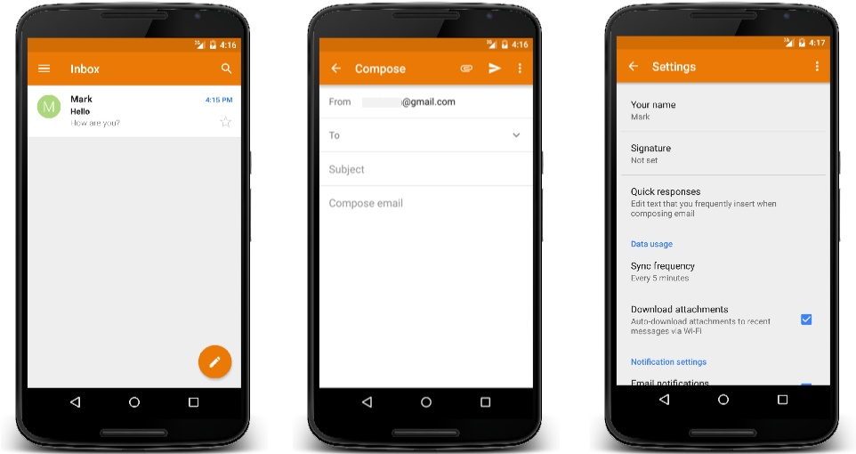
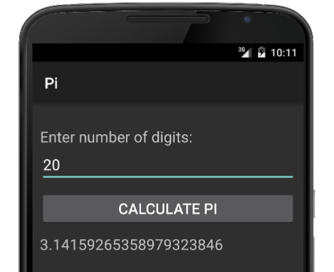
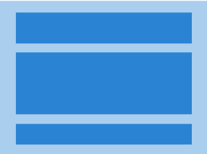
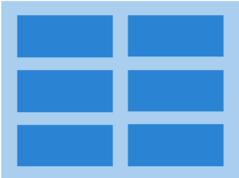
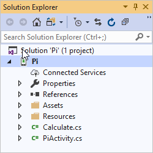
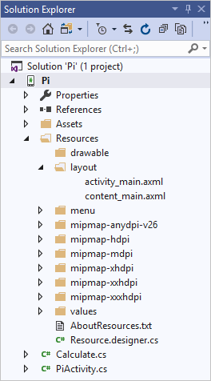
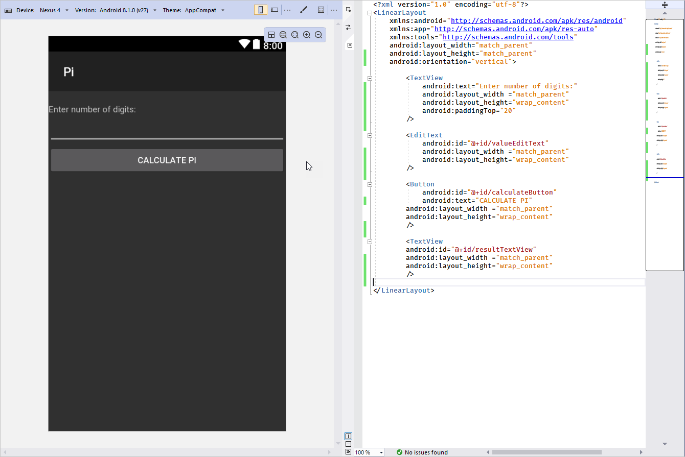
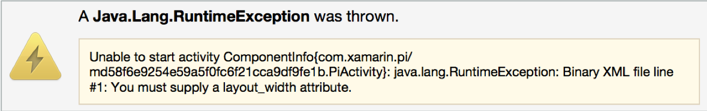

In the previous unit, we looked at the basics of creating a Xamarin.Android app. Here we'll talk about how to create a UI for a Xamarin.Android app. This information should help you decide how much your development team needs to know about Android UI layout concepts. 

## What is an activity?

An *activity* is the basic building block of an Android application. An activity groups together the UI and code that the user needs to do something with your app.



Conceptually, an activity defines UI for a single user task in your application. Here are a few task examples:

- Add a new contact
- List all contacts
- Dial a phone number
- Set an alarm

You can think of an activity as a page or screen in an app where the user completes a single task.

Suppose we have an app with a screen where the user calculates the value of pi. The user will complete a single task. This task is ideal for implementation in an activity.

> [!NOTE]
> *Pi* is the ratio of a circle's circumference to its diameter (pi = circumference / diameter).

Here's an example of the app's UI:


The app allows the user to enter how many decimal digits they want to return in the pi calculation. Then the user starts the calculation by tapping a button. The UI behavior is then managed in code.

Here's an example of code that executes when the user taps the calculate button:

```csharp
void OnClick(object sender, EventArgs e)
{
    int digits = int.Parse(input.Text);
    string result = CalculatePi(digits);
    output.Text = result;
}
```

The combination of UI and behavior is a key characteristic of an activity. For example, you wouldn't implement an Extensible Markup Language (XML) parser, a data structure, or part of your data model, as an activity. These items don't offer UI.

The scale of an activity can vary. However, it tends to be limited to a single, cohesive task that the app provides for the user.

## Explore example activities

Suppose you've decided to create an email app. Now think about the user's tasks in the app:

- Create new email
- Browse a list of received email
- Read an email message
- Add a new account
- Edit an account
- Modify user preferences



All of these tasks will likely make good activities in your app. Each one requires both UI and behavior.

## Understand Android controls and view hierarchy

You can use many Android UI controls to build your activities. Here are the most popular controls in Android, compared to controls in Windows, and iOS. In the table, the controls you'll use in your example app are marked by bold formatting:

| Windows | iOS | Android |
| ----- | ----- | ----- |
| Button | UIButton | **Button** |
| CheckBox | UISwitch | CheckBox |
| ComboBox | UIPickerView | Spinner |
| Image | UIImageView | ImageView |
| Label | UILabel | **TextView** |
| ListBox | UITableView | ListView |
| ProgressBar | UIProgressView | ProgressBar |
| Slider | UISlider | Slider |
| TextBox | UITextField | **EditText** |

In the Pi Calculator example app, your user will:

- Enter the number of decimal digits to calculate.
- Tap a calculate button.

When the button is tapped, the app will calculate pi up to the specified number of decimal digits. Then it will display the value on the screen.

Here are the controls you'll use:

- `Button` displays an interactive button to activate a feature.
- `TextView` is a piece of read-only text.
- `EditText` is an edit control that allows data entered from the onscreen or hardware keyboard.

## What is a view?

A *view* is the fundamental building block of an Android UI.

Views have a visual component and some coded behavior. For example:



- `TextView`: UI that displays the value of its `Text` property.
- `EditText`: UI that lets the user enter a value into its `Text` property, a `TextChanged` event, and so on.
- `Button`: UI that displays the value of its `Text` property, a `Click` event, and so on.

This description of a _view_ as a _visual component and code_ sounds like an activity. But although the concepts are similar, the scale is different. An activity is larger than a _view_.

> [!NOTE]
> In Android, the term _view_ is commonly used for the concept we're describing. However, the word _widget_ is sometimes used as well. _Widget_ is the name of the namespace where many of the views are defined. The main reason we choose to use _view_ here is because Android also uses _widget_ to describe the miniature apps that can sit on your home screen. Because of this potential confusion, we use the term _view_.

### Understand view hierarchy

The UI elements you add to a screen are arranged into an inheritance hierarchy with the `View` class at the root.

:::image type="complex" source="../media/4-view-hierarchy.png" alt-text="Diagram of the UI hierarchy from Object to View to ViewGroup.":::
    Object is the parent of View. View is the parent of both "Controls like button, text box, etc." and ViewGroup. ViewGroup is the parent of "Collection views like lists and grids" and "Layout panels that size and position their children".
:::image-end:::

Standalone elements like `Button` inherit from `View`. Elements that have multiple views derive from `ViewGroup`. This arrangement adds the ability to manage a collection of child views, such as lists and grids. Android also provides ways to group the controls together by using panels that derive from `ViewGroup`. These views are called layout panels.

## What is a layout panel?

A *layout panel* manages a collection of child views. Its job is to calculate the size and position of each child.

Child panels can specify their preferred layout size. Most panels try to accommodate their requests. But the panel can ignore a child's layout preferences if the available space is too small to accommodate the preferred size.

### LinearLayout



*LinearLayout* is the simplest panel. You specify a vertical or horizontal direction, and it lays out the child panels in a single column or row.

### GridLayout



*GridLayout* creates a grid of rows and columns and positions the children in the cells.

### RelativeLayout


*RelativeLayout* requires you to provide the relationships between the child panels. You specify things like "this child goes to the left of this other one" or "this child should be aligned with the right edge of the screen". RelativeLayout is a powerful and flexible panel. It's a good choice for the root panel of a UI.

We'll use LinearLayout for our example. It's a good place to start because it's the easiest panel to learn. Also, it's the most common panel in cases where you have a simple UI like the one we'll build.

Keep in mind that you can nest panels. For example, one of the rows of a vertical LinearLayout can be a horizontal LinearLayout row or a RelativeLayout row.

## What is a layout file?

You define your UI by using XML. The XML elements are view class names like `Button` and `TextView`.


The file that contains the XML is called a layout file. In Xamarin.Android, layout files use a **.axml** extension (Android XML). This piece of XML shows the basic structure of the elements in the layout file:

```xml
<LinearLayout ... >
    <TextView ... />
    <EditText ... />
    <Button ... />
    <TextView ... />
</LinearLayout ... >
```

Notice two things:

1. Child views are nested inside a layout panel. In this case, the layout panel is `LinearLayout`.

1. The order of child panels in the layout panel dictates the display order of the elements.

You typically start with a layout panel as your root element and nest its child panels inside.

## What are resources?

Android *resources* are noncode files that you include in your application.



Xamarin.Android creates a special folder named **Resources** to hold your app's resources. Resources can include many types of items. Here are the most common resources:

- Images
- Layout files
- Strings used for text and localization
- Styles

## Understand layout files

Android considers UI layout files to be resources, so they need to be placed under **Resources** in a folder named **layout**.



The **Resources** folder contains several types of files:

- **drawable**: Image files.
- **mipmap**: Icons in various sizes. The folder name indicates the intended screen density for the images. **Mdpi** is for medium-density screens of ~160 dpi, **hdpi** is for high-density screens of ~240 dpi, and so on. You supply the same image in multiple sizes, and Android automatically selects the right one based on the device's screen density.
- **layout**: UI layout files.
- **values**: Strings, colors, styles, and so on. The files in the **values** folder help you avoid the need to hardcode values in your layout files. You define values here and then do a lookup in your various layout files.

## What is UI Designer?

Xamarin provides a UI designer tool to help you build a UI. It's available in both Visual Studio and Visual Studio for Mac.



Instead of hand-coding XML, in UI Designer you drag views from the **Toolbox** onto the design surface. Instead of setting attributes in XML, you set them in a **Property** editor. Using UI Designer is much faster than writing XML manually.

## Set up view attributes

When you define a UI in XML, you're indirectly instantiating objects. For example, a `<Button>` element tag causes a `Button` object type to be created at runtime.

You use attribute tags in the XML to set property values on these underlying objects. For example, the text attribute in XML sets the `Text` property on the object.

In the following example, we set the `Text` property of `TextView` to `"Enter number of digits:"`:

```xml
<?xml version="1.0" encoding="utf-8"?>
    <LinearLayout xmlns:android="http://schemas.android.com/apk/res/android" android:orientation="vertical">
      <TextView android:text="Enter number of digits:" ... />
      ...
</LinearLayout>
```

Keep in mind that the XML attribute and corresponding class property names aren't always the same. Sometimes you can guess correctly but sometimes you can't.

For example, the closest match to the C# `TypeFace` property is the XML attribute `fontFamily`. Make sure to refer to Android documentation if you're not sure about an attribute or its usage. For each view class, the Android documentation provides a table that shows the available XML attribute names.

## Use an Android namespace

Objects are defined as types in assemblies. To instantiate from an assembly, you need to know which assembly to reference. When you define UI in XML, you're indirectly instantiating objects. To instantiate types, the Android runtime requires UI XML to include the Android namespace `http://schemas.android.com/apk/res/android`. This namespace specifies the assemblies where common Java Android types are defined. The namespace is declared by an `xmlns:` attribute:

```xml
<LinearLayout xmlns:android="http://schemas.android.com/apk/res/android" android:orientation="vertical">
```

By convention, the string `android` is mapped to the Android namespace. The use of the string `android` is only a convention. It's almost universally followed, so using it is considered a best practice.

You'll define additional namespaces when you include types that are outside the common Android. For example, you might have created a custom control that uses custom attributes.

## What is view sizing?

Views typically require you to set their width and height. An example of such a view is `LinearLayout`.

`LinearLayout` requires that you set the `layout_width` and `layout_height` attributes on every element in your XML layout file. If you don't set both, you'll get a runtime exception.



### Size views automatically

Android supplies two values you can use with `layout_width` and `layout_height`. These have special behavior:

- **match_parent**: Make this element the same size as its parent element.
- **wrap_content**: Make this element large enough to hold its content.

```xml
<LinearLayout ... >
    ...
    <TextView android:layout_width="match_parent" android:layout_height="wrap_content" ... />
    ...
</LinearLayout>
```

These two values are used frequently. You can build fairly complex UIs by combining just these two sizing values with nested layout panels.

You'll use automatic sizing when you want a child's parent, normally a layout panel, to manage the child's size.

### Set size based on pixels

You can set the child size by using specific units when you need the child to manage its own size. Android lets you specify sizes in pixels (px).

```xml
<Button android:layout_width="100px" ... />
```

However, Android's best-practice guidelines recommend that you avoid using **px**.

### What is a density-independent pixel?

A density-independent pixel (dp) is a unit of measure. When rendered to the screen, objects that are measured in density-independent pixels use the number of physical pixels calculated from the screen's pixel density.

Suppose you defined the following button in your UI:

```xml
<Button android:layout_width="100dp" ... />
```

The goal for the button is to occupy about the same area on the screen regardless of the device's screen density. On a high-resolution screen, this button would occupy more than 100 physical pixels.

A button with a width of 100 dp will appear about the same size on a 500-dpi screen and a 250-dpi screen. It will occupy a different number of physical pixels in the two cases to achieve the required size.

Android best-practice guidelines recommend that you use density-independent pixels to specify sizes.
