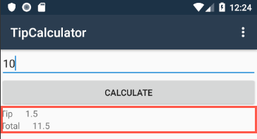
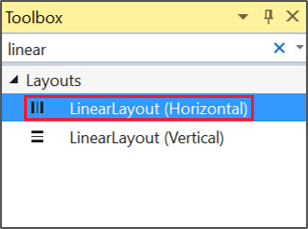
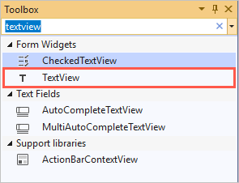
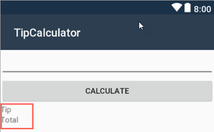
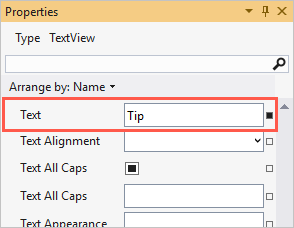
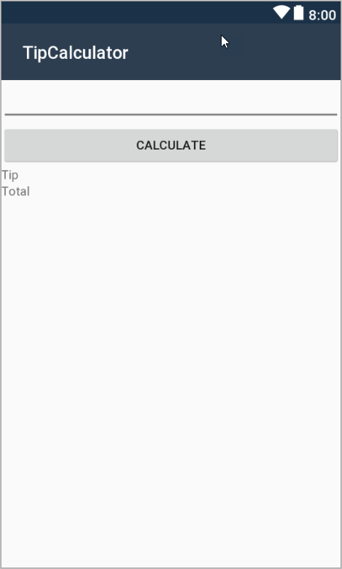

In this exercise, you'll build part of your UI manually in XML and part of it in Xamarin.Android Designer. 

Both of these building approaches involve useful skills. Understanding the raw XML can help you arrange your UI exactly the way you want. Knowing how to use the Designer tool helps you build a UI more quickly than you could by coding XML by hand.

In this exercise, you'll work on an app to compute the tip for a restaurant bill. In the app, the user will enter the amount of the bill and tap the **Calculate** button. The app will retrieve the bill amount from the UI, calculate the tip and total, and display those two values in the UI. 

This exercise covers only creating the UI. You'll work on the code for the calculations in a later exercise.

This exercise builds on the previous exercise. You can use your existing solution or begin from the **exercise1** > **final** folder in your copy of the cloned or downloaded [!INCLUDE [module-exercise-repo](module-exercise-repo.md)].

## Remove the template code

Some of the templates for Xamarin.Android display and interact with a button. We won't use the default code. If you've completed the steps in the previous exercise, the code is present. Remove it by following these steps:

1. Open the solution.

1. Open **MainActivity.cs**.

1. Remove the method `private void FabOnClick(object sender, EventArgs eventArgs)`. This is the event handler for `FloatingActionButton`. You won't use this button in the exercise.

1. Remove the `FloatingActionButton` variable from `MainActivity`. Also remove its `Click` event subscription. When you finish, the `MainActivity` class should match this code:

    ```csharp
    [Activity(Label = "@string/app_name", Theme = "@style/AppTheme.NoActionBar", MainLauncher = true)]
    public class MainActivity : AppCompatActivity
    {
       protected override void OnCreate(Bundle savedInstanceState)
       {
            base.OnCreate(savedInstanceState);
            Xamarin.Essentials.Platform.Init(this, savedInstanceState);
            SetContentView(Resource.Layout.activity_main);

            Android.Support.V7.Widget.Toolbar toolbar = FindViewById<Android.Support.V7.Widget.Toolbar>(Resource.Id.toolbar);
            SetSupportActionBar(toolbar);
       }
    }
    ```

## Remove the template button XML

Xamarin.Android includes a UI designer that's integrated into Visual Studio. Use the designer to modify the XML of the layout file. Make sure you switch to the designer's XML view.

Remove `FloatingActionButton` from the layout of the `MainActivity` class if it exists in your solution.

1. Open **Resource** > **Layout** > **activity_main.axml**.

1. Xamarin.Android Designer will likely open when you open **activity_main.axml**. In Designer, select the **Source** tab to switch to the source view.

1. Delete the `FloatingActionButton` instance that the starter template added.

    ```xml
    <android.support.design.widget.FloatingActionButton
        android:id="@+id/fab"
        android:layout_width="wrap_content"
        android:layout_height="wrap_content"
        android:layout_gravity="bottom|end"
        android:layout_margin="@dimen/fab_margin" app:srcCompat="@android:drawable/ic_dialog_email" />
    ```

## Configure the layout container

You'll need to configure the layout container to add the controls for the TipCalculator app.

1. Continuing in the **activity_main.axml** file in the source view, notice the `<include layout="@layout/content_main" />` element that the file specifies. `CoordinatorLayout` can include other layout files. In this case, it includes the `content_main.axml` file.

    You'll keep this code as it is, and you'll update `content_main.axml` with the new app layout.

1. Open the file **Resources** > **layout** > **content_main.axml** in the **Source** view.

Notice that the layout in this file is `RelativeLayout`. You'll replace `RelativeLayout` with `LinearLayout`. Here's how your code should look:

```xml
<LinearLayout xmlns:android="http://schemas.android.com/apk/res/android"
    xmlns:app="http://schemas.android.com/apk/res-auto"
    xmlns:tools="http://schemas.android.com/tools"
    android:layout_width="match_parent"
    android:layout_height="match_parent"
    app:layout_behavior="@string/appbar_scrolling_view_behavior"
    tools:showIn="@layout/activity_main">

    <TextView
        android:layout_width="wrap_content"
        android:layout_height="wrap_content"
        android:layout_centerInParent="true"
        android:text="Hello World!" />

</LinearLayout>
```

By default, `LinearLayout` is horizontal. Here you need it to be vertical. To change the orientation, add `android:orientation="vertical"`.

```xml
<LinearLayout ...
    android:orientation="vertical">
    ...
</LinearLayout>
```

## Add an EditText control

Recall that you're creating the TipCalculator app. You'll start your UI by adding an input text field to allow the user to enter the bill amount.

1. Remove the `TextView` child from `LinearLayout`.

1. Add an `EditText` control inside `LinearLayout`.

1. Set the control's `android:layout_width` attribute to `match_parent`.

1. Set the control's `android:layout_height` attribute to `wrap_content`.

    ```xml
    <EditText
        android:layout_width="match_parent"
        android:layout_height="wrap_content" />
    ```

## Add a button

Next you'll add a button to calculate the tip.

1. Add `Button` inside `LinearLayout` and below the `EditText` control.

1. Set the button's `android:layout_width` attribute to `match_parent`.

1. Set the button's `android:layout_height` attribute to `wrap_content`.

1. Set the button's `android:text` attribute to `CALCULATE`.

    ```xml
    <Button
        android:layout_width="match_parent"
        android:layout_height="wrap_content"
        android:text="CALCULATE" />
    ```

## Switch to Designer

In the next few steps, you'll use Designer to build the lower part of the UI shown below. You'll add:

- Four `TextView` controls.
- Two `LinearLayout` objects that manage the text.

    

Open Designer:

1. Right-click the **Resources** > **layout** > **content_main.axml** file.

1. Choose **Open With**.

1. Select **Android Layout file**.

1. Select **OK**.

    > [!NOTE]
    > To learn more about Designer, see [Xamarin.Android Designer basics](https://docs.microsoft.com/xamarin/android/user-interface/android-designer/designer-basics?tabs=windows).

## Add LinearLayout

Here you add the two `LinearLayout` objects that will manage the four `TextView` controls that display the tip and total.

1. From the **Layouts** section of the **Toolbox**, drag **LinearLayout (Horizontal)** to the _bottom_ of the existing views in your UI (that is, below the button). This action will add a `LinearLayout` object to the root layout.

1. Repeat the previous step to add a second **LinearLayout (Horizontal)** object below the first one.

    

## Add TextView controls

Now you'll add four `TextView` controls to display the tip and total amounts. Two `TextView` controls will go inside each of the horizontal `LinearLayout` objects you added in the previous step. Two of the `TextView` controls will display static text. In the other two `TextView` controls, code will dynamically set the text.

1. From the **Form Widgets** section of the **Toolbox**, drag a **TextView** to the _first_ horizontal **LinearLayout**.

    In the following **Toolbox**, the correct view is highlighted.

    

1. Repeat the previous step to add a second **TextView** to the first **LinearLayout**.

1. From the **Toolbox**, drag a **TextView** to the _second_ horizontal **LinearLayout**.

1. Repeat the previous step to add a second **TextView** to the second **LinearLayout**.

## Edit properties

Next you'll use the Designer **Properties** window to set the text in two of the **Tip** and **Total** `TextView` controls.



1. Select the leftmost **TextView** in the top horizontal **LinearLayout**.

1. In the **Properties** window, locate the **Text** property and set it to **Tip**.

1. Repeat the previous two steps to set the text of the lower-left **TextView** to **Total**.

    Here's an example of the **Properties** window where the correct property is highlighted and the value is filled in.

    

## Check your AXML UI

1. Switch to the **Source** view.
1. Remove the **Text** attribute from the second **TextView** in each **LinearLayout**, because code will generate their values.
1. Check your work. Verify that the structure you built matches the following XML.

    ```xml
    <LinearLayout ... >

        <EditText
            android:layout_width ="match_parent"
            android:layout_height="wrap_content" />

        <Button
            android:layout_width ="match_parent"
            android:layout_height="wrap_content"
            android:text ="CALCULATE" />

        <LinearLayout
            android:layout_width ="match_parent"
            android:layout_height="wrap_content">
            <TextView
                android:text ="Tip"
                android:layout_width ="wrap_content"
                android:layout_height="wrap_content" />
            <TextView
                android:layout_width ="match_parent"
                android:layout_height="wrap_content" />
        </LinearLayout>

        <LinearLayout
            android:layout_width ="match_parent"
            android:layout_height="wrap_content">
            <TextView
                android:text ="Total"
                android:layout_width ="wrap_content"
                android:layout_height="match_parent" />
            <TextView
                android:layout_width ="wrap_content"
                android:layout_height="match_parent" />
        </LinearLayout>

    </LinearLayout>
    ```

    You'll notice that the designer automatically adds `android:id="@+id/..."` to each of the controls you've added to the layout.

1. Delete the `android:id="@+id/..."` attributes. You'll add new `Id` attributes in the following exercise.

## Run the app

When you run the TipCalculator app, you should see the UI you defined. Your app won't have any behavior yet. By running it now, you can check for syntax errors and make sure the UI looks reasonable on the emulator.

You can view the completed solution in the folder **exercise2** > **final** in your copy of the cloned or downloaded [!INCLUDE [module-exercise-repo](module-exercise-repo.md)].


