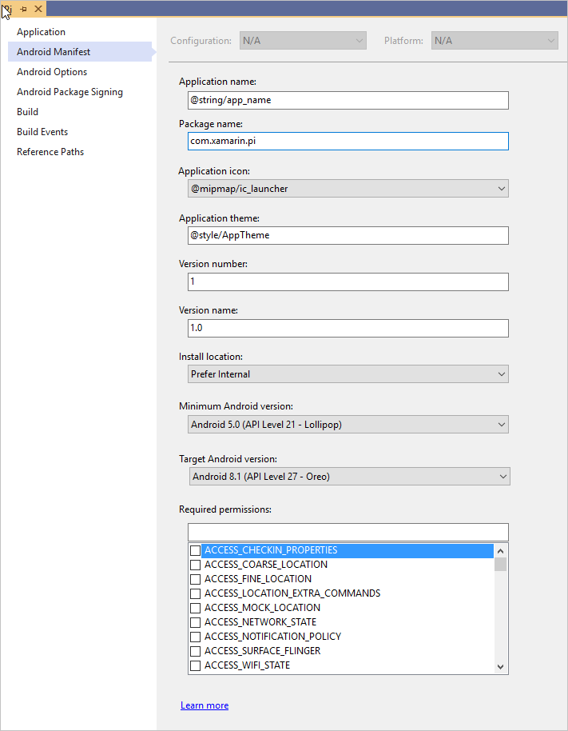
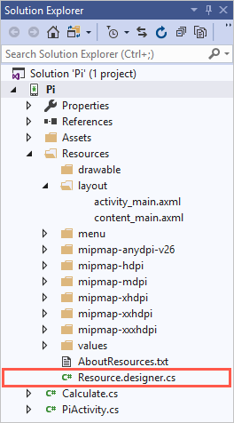

In the previous unit, you looked at the basics of creating a UI for a Xamarin.Android app. Here we'll talk about how to code the UI behavior for a Xamarin.Android app. This information should help you decide how much more your development team needs to know about Android code concepts.

An *activity* is the basic building block of an Android application. An activity groups together the UI and the code that allows the user to do something with your app.

## Define an activity

An activity is defined in two files:

* An XML layout file for the UI.
* A C# code file that implements the behavior.

The code file is called an *activity*. It needs to inherit from Android's `Activity` base class.

Android requires an activity class and its behavior to be registered within your app. You add `ActivityAttribute` to the class to register it. `ActivityAttribute` has several properties that affect how Android treats your activity. For example, Android uses `ActivityAttribute` to identify this activity as the first screen of the app or to determine whether other apps are allowed to launch this activity.

## Set the main activity

An application chooses an activity as an entry point by setting `MainLauncher=true` on the `ActivityAttribute` instance:

```csharp
[Activity(MainLauncher = true)]
public class PiActivity : Activity
{
    ...
}
```

Activities with `MainLauncher=true` appear on the Android launch screen. When the user taps your activity's launch icon, Android creates an instance of that activity.

## Set up the app manifest

Android requires every app include a manifest. Keep these requirements in mind:

* The file must be named **AndroidManifest.xml**.

* It must be in the **Properties** of the app's directory structure. The build tools ensure the final manifest is placed in the correct folder within the .apk file structure installed on devices or emulators.



You can edit the **AndroidManifest.xml** file directly or by using your project's options property panel. The property panel is more convenient, but it doesn't cover all the options you might want to set. Sometimes you'll have to update the XML by hand.

The manifest tells Android about your app. For example, it:

* Identifies information such as the unique package name.
* Includes branding such as the app name and icon.
* Specifies the versions of Android your app works with.
* Identifies the Android services and permissions your app will need to run. For example, it identifies camera, phone dialer, and internet access. For security purposes, you'll need to set permissions to allow the services to function properly on the user's device.

## Set up the main activity and the manifest

The manifest has information about every activity in your app. It includes information like each activity's icon, label, and name.

Xamarin.Android uses `ActivityAttribute` to generate an entry for an activity in the app manifest file. This attribute is always used to update **AndroidManifest.xml**. It overrides any entries you might have for a specific activity:

```xml
<manifest ...>
    <application ...>
        <activity ...>
            <intent-filter>
                <action android:name="android.intent.action.MAIN" />
                <category android:name="android.intent.category.LAUNCHER" />
            </intent-filter>
        </activity>
    </application>
</manifest>
```

When you set `MainLauncher=true` on your main activity, the build tools use this value to add extra entries to that activity's information in the manifest when the app is compiled.

Any information you directly specify in the **AndroidManifest.xml** file will always supersede any attributes or definitions provided in code. In other words, if you set values directly in this file, they'll always take precedence over anything the compiler provides.

These additional details tell Android that this activity is the app's main activity. They cause Android to list the activity on the device's launcher screen.

## Initialize an activity

In a normal C# class, you typically use the constructor to initialize fields and instantiate types that you'll use in the class. In an activity, your initialization code is placed in an override of the activity's `OnCreate` method. Android calls this method after it instantiates your activity:

```csharp
[Activity(MainLauncher = true)]
public class PiActivity : Activity
{
    protected override void OnCreate(Bundle bundle)
    {
        base.OnCreate(bundle);
        ...
    }
  ...
}
```

Android requires you to call the base version of `OnCreate`. If you don't, you'll get a runtime exception.

## Identify a layout file

An activity's UI isn't loaded automatically. In fact, there's no automatic relationship between a layout file and an activity class. You need to manually load your UI layout file in your activity's C# code file.

To load a file, you need some way to identify your layout file from code. Using the file and folder names is awkward, so Android provides a nice convenience. The build process automatically generates a `Resource.designer.cs` class file.



Android generates a field to identify each layout file. The build process also automatically generates a `Resource.Layout` class that contains an identifier for each of your layout files:

```csharp
public partial class Resource
{
    public partial class Layout
    {
        public const int Pi = 2130903040;
        ...
    }
    ...
}
```

### What is a resource identifier?

The automatically generated fields are called resource identifiers. Many Android APIs take these resource identities as an argument. Resource identifiers are a convenient way to identify resources in your app.

The following conventions are used when the build process automatically generates resource identities:

* The name of the field matches the name of the layout file but lacks the _.axml_ extension.
* The field is nested inside two classes. Because of this nesting, you need to prefix the field name. In this example, precede the field name with `Resource.Layout` to access the layout file's resource identifier.

## Load a layout file

You tell Android to instantiate the UI for your activity. You do it by calling `SetContentView` and passing the resource identifier for the layout file. The `Activity.SetContentView` method instantiates all the views in a layout file and loads them as the activity's UI:

```csharp
[Activity(MainLauncher = true)]
public class PiActivity : Activity
{
    protected override void OnCreate(Bundle bundle)
    {
        base.OnCreate(bundle);
        SetContentView(Resource.Layout.Pi);
    }
    ...
}
```

`SetContentView` does two things:

* It parses the XML and instantiates all the layouts and views inside it.
* It displays the result to the user, setting the activity's visible UI.

## Use a view ID property

The `View` class defines an `Id` property that is used to uniquely identify an instance of a view:

```csharp
namespace Android.Views
{
    public class View
    {
        public virtual int Id { get; set; }
        ...
    }
}
```

`Id` isn't a field you must set. You use it only when you need to identify a specific view object. Generally, you'll identify a view object when you need to access a view from code:

* Assign an `id` value in the XML.
* Use the `Id` from code to get a reference to that view.

All the views and layouts you work with in your UI inherit from the `View` class, so they all have an `Id` property:

```xml
<EditText android:id="@+id/digitsInput" ... />
```

In XML, you use the `android:id` attribute to set the underlying `Id` property. You use the special syntax `@+id` to set the `android:id` attribute. The syntax tells Android you want it to generate a new `Id`. The string that follows after the `/` is used as the name of a generated field. This string must be unique within a layout file. The same string value can be used in a different layout file.

This example shows what an `Id` might look like:

```csharp
public partial class Resource
{
    public partial class Id
    {
        public const int digitsInput = 2131034113;
        ...
    }
    ...
}
```

The field has type `Int`. Android takes care of assigning a unique integer value to the field. The field is assigned to the `View.Id` property.

## Access views from code

You use `Activity.FindViewById` to look up a view in an activity's UI after the call to `SetContentView` in the `OnCreate` method:

```csharp
[Activity(MainLauncher = true)]
public class PiActivity : Activity
{
    protected override void OnCreate(Bundle bundle)
    {
        base.OnCreate(bundle);
        SetContentView(Resource.Layout.Pi);

        var digitsInputEditText = FindViewById<EditText>(Resource.Id.digitsInput);
        ...
    }
    ...
}
```

The `Activity.FindViewById` method takes a resource identifier and searches the activity's UI for a view that has the `Resource.Id` value. `FindViewById` returns null if it fails to find a view that has the given `Resource.Id` value. After you have a reference, you can work with the view. For example, you could access the `Text` property to retrieve user input from an `EditText` control, or you could subscribe to the `Click` event of a `Button` instance.
