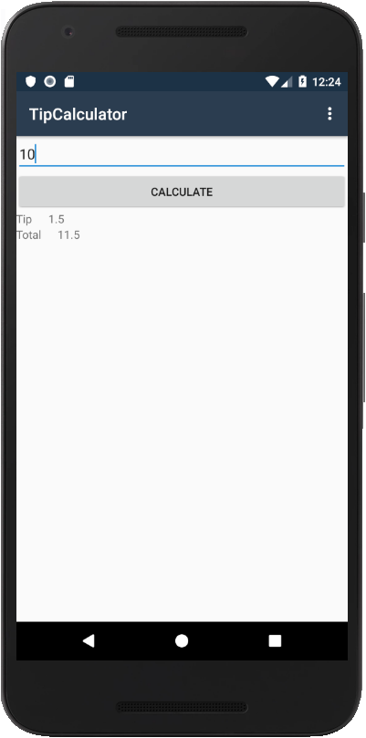

In this exercise, you'll write C# code to access and manipulate the UI of an activity. Your code will read and write the properties on several text controls. It will also subscribe to an event on a button.

You'll continue to work on the TipCalculator app. The two `TextView` controls that display the words _Tip_ and _Total_ are static, and you won't need to access them. All other views will need to be accessed from code: 

- The `EditText` control lets you read the amount of the bill. 
- The `Button` object lets you subscribe to its `Click` event.
- The other two `TextView` controls display the values you calculate for the tip and total.

This exercise builds on the previous exercise. You can use your existing solution or begin from the folder **exercise2** > **final** in your copy of the cloned or downloaded [!INCLUDE [module-exercise-repo](module-exercise-repo.md)].

## Add IDs to your views

You'll add IDs to several of your UI views so you can access them from code.

1. Open the file **Resources** > **layout** > **content_main.axml** in the **Source** view.

1. Add an ID to the `EditText` control, as in the following XML. The `@+id` characters indicate that you want to create a new `Id` value. The text after the forward slash is the value for the ID.

    ```xml
    <EditText android:id="@+id/inputBill" ... />
    ```

1. Add an ID of `calculateButton` to the `Button` object.

    ```xml
    <Button
        android:id="@+id/calculateButton"
        ... />
    ```

1. In the first of the two horizontal `LinearLayout` instances, add an ID of `outputTip` to the *second* `TextView` control.

    ```xml
    <TextView
        android:id="@+id/outputTip"
        ... />
    ```

1. In the second of the two horizontal `LinearLayout` instances, add an ID of `outputTotal` to the *second* `TextView` control.

    ```xml
    <TextView
        android:id="@+id/outputTotal"
        ... />
    ```

## Look up views in code

Now use the IDs to look up views in code. You'll store the references in fields inside your `Activity` class.

1. Open **MainActivity.cs**.

1. Add four fields to the **MainActivity** class, one for each of the four views to which you added IDs. That is, add one field for `EditText`, one for `Button`, and two for the `TextView` instances.

    ```csharp
    EditText inputBill;
    Button calculateButton;
    TextView outputTip;
    TextView outputTotal;
    ```

1. Inside `OnCreate`, use the `FindViewById` method to look up each of the four views and assign the returned references to the corresponding fields. Be sure to place your lookup code after the call to `SetContentView`. The views you're trying to access are created in `SetContentView`, so they don't exist until after that call finishes.

    ```csharp
    protected override void OnCreate(Bundle bundle)
    {
        base.OnCreate(bundle);
        SetContentView(Resource.Layout.Main);
        ...
        inputBill = FindViewById<EditText>(Resource.Id.inputBill);

        outputTip = FindViewById<TextView>(Resource.Id.outputTip);
        outputTotal = FindViewById<TextView>(Resource.Id.outputTotal);

        calculateButton = FindViewById<Button>(Resource.Id.calculateButton);
        ...
    }
    ```

> [!NOTE]
> When you type this code, make sure to use the `Resource` (singular) namespace instead of `Resources`. Otherwise, you won't be able to find the `Id` members for your app.

## Subscribe to an event

Your app needs to respond when the user taps the **Calculate** button. This tap signals that the user has entered the bill amount and is ready to calculate the tip and total.

Inside `OnCreate`, subscribe a handler to the button's `Click` event. The `Click` event uses the standard .NET event pattern, so the handler will have an `object` parameter and an `EventArgs` parameter.

```csharp
using System;
...

protected override void OnCreate(Bundle bundle)
{
   ...
   calculateButton = FindViewById<Button>(Resource.Id.calculateButton);
   calculateButton.Click += OnCalculateClick;
}

void OnCalculateClick(object sender, EventArgs e)
{
}
```

## Retrieve user input

1. In your handler for the `Button` object's `Click` event, retrieve the `Text` instance from the `EditText` control. The value will be the amount of the bill. Store it in a local variable of type `string`.

1. Convert the bill input from `string` to `double`. Store the result in a local variable. Use `double.TryParse` to make sure the code doesn't throw an exception if the user enters nonnumeric data in the `inputBill` `TextView` control.

    ```csharp
    void OnCalculateClick(object sender, EventArgs e)
    {
        string text = inputBill.Text;
        double bill = 0;
        if (double.TryParse(text, out bill))
        {
        }
    }
    ```

## Compute the results

Continue working in the `Click` event handler for the **Calculate** button.

1. Compute a 15-percent tip for the bill and store it in a local variable.

1. Compute the total payment (the original bill + tip) and store it in a local variable.

    ```csharp
    void OnCalculateClick(object sender, EventArgs e)
    {
        string text = inputBill.Text;
        double bill = 0;
        if (double.TryParse(text, out bill))
        {
            var tip = bill * 0.15;
            var total = bill + tip;
        }
    }
    ```

## Display the results

1. Load the tip amount into the `Text` property of the `TextView` control that will display the tip. Your tip amount should be in a variable of type `double` so you can use its `ToString` method to convert it into a string. You can then assign the string to the `Text` property of the `TextView` control.

1. Load the total payment into the `Text` property of the `TextView` control that will display the total.

    ```csharp
    void OnCalculateClick(object sender, EventArgs e)
    {
        string text = inputBill.Text;
        double bill = 0;
        if (double.TryParse(text, out bill))
        {
            var tip = bill * 0.15;
            var total = bill + tip;

            outputTip.Text = tip.ToString();
            outputTotal.Text = total.ToString();
        }
    }
    ```

## Adjust the margin

Currently, the text labels _Tip_ and _Total_ aren't spaced apart from the result values to their right. You can adjust the spacing by setting a layout margin on these `TextView` controls. A margin adds space around the outside of a view. You can choose from several margin options. Here we'll use only the variant that adds space to the right side.

1. In **content_main.axml**, add the following right-margin attribute to the `TextView` control that displays the text **Tip**.

    ```xml
    android:layout_marginRight="20dp"
    ```

1. Repeat the previous step for the `TextView` control that displays the text **Total**.

## Run the app

Run the app to test your work. The following image shows an example of the expected output.

You can view the completed solution in the folder **exercise3** > **final** in your copy of the cloned or downloaded [!INCLUDE [module-exercise-repo](module-exercise-repo.md)].


