You've now seen how to create a basic Xamarin.Android app. Behind the scenes, Xamarin.Android uses many of the native Android tools and libraries. Your goal in this unit is to understand enough about how Xamarin.Android uses these tools and libraries to make sure your development environment is up to date.

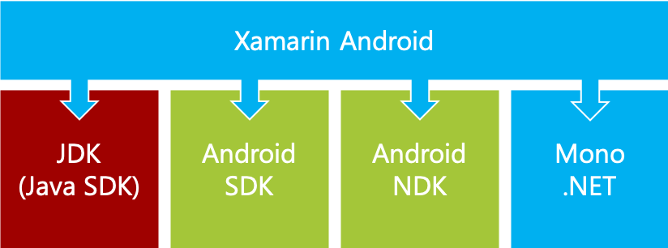

If you want to target new versions of Android with your Xamarin.Android app, you can update the underlying Android SDK installed on your development machine.

## What is the Java Development Kit?

Let's put aside Android for a moment and talk about Java.

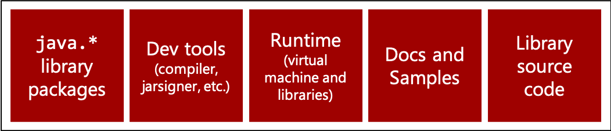

Java apps are built using the tools and libraries from the *Java Development Kit* (JDK). The JDK includes several things that Java apps need:

- The standard Java libraries that contain a huge number of utility classes. These classes are used for string handling, networking, GUI building, database access, file manipulation, and so on. The Java library is analogous to the .NET Framework class library.
- Tools like the Java compiler.
- The execution environment.

Some of the Java development tools are used in the Android build process, so the JDK should be installed on your development machine. Android doesn't use the library packages and runtime.

## What is the Android SDK?

The *Android SDK* provides many key resources for native Android development:

- **Java libraries**: These libraries are part of the SDK platform and are the Android version of the Java libraries. They contain the utility types you would expect in any modern library. You can use them for string handling, networking, data structures, and so on. These libraries are unique to Android. They aren't the same as the libraries found in any Java edition (J2ME, J2SE, J2EE).

- **Android libraries**: These libraries are part of the SDK platform. They let you access Android services to make a phone call, find your current location, start an activity, and so on.

- **Tools**: A wide range of tools support both build time and runtime. One example in this category is the DEX compiler, which translates standard Java bytecode to Android Dalvik Executable (DEX) bytecode. Another example is the apkbuilder packaging tool, which gathers all your compiled source code into a single file. This file is uploaded to the Play store.

## What is the Android Native Development Kit?

The *Android native development kit* (NDK) contains tools to let you integrate native code such as C++ into your Android application.

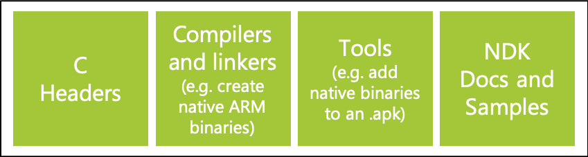

The native code runs directly on the Android platform, outside of the Dalvik virtual machine. The NDK is useful when you have an existing C++ codebase that you don't want to port to Java. You can use the NDK to directly incorporate the codebase into your Android app.

## What is Mono?

The Mono project is an open-source implementation of the Microsoft .NET Framework.

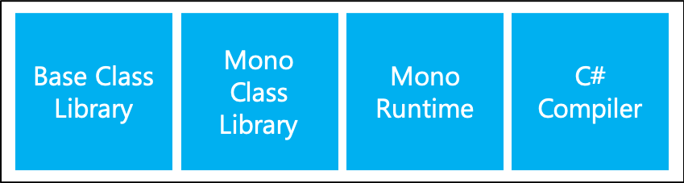

Xamarin.Android uses many Mono tools and libraries because Mono has the core pieces needed to build many kinds of apps:

- **Mono base class library (BCL)**: The BCL is the same as the .NET Framework class library that contains all the familiar utility classes. Xamarin.Android includes a subset of the .NET Framework class libraries. This subset includes features like LINQ, Tasks, XML, Regex, I/O, and networking APIs.

- **Mono class library**: This library provides extra classes outside the scope of the standard .NET Framework (for example, classes for handling zip files).

- **Mono runtime**: The Mono runtime executes Microsoft intermediate language (MSIL). This version of the Mono runtime is customized for Xamarin.Android. The runtime runs side by side with the Java runtime. The Mono runtime provides app features such as type checking, static reflection, interoperability, and garbage collection.

- **C# compiler**: The C# compiler is used to create the initial MSIL that will be used to execute your app.

## How does native Java Android compile code?

Native Android apps are written predominantly in Java. Your Java source code is compiled to Java bytecode. Android compiles your code by using the standard Java compiler from the JDK.

The Java bytecode is then translated into Android's proprietary bytecode format, called Dalvik bytecode, or into a Dalvik Executable (DEX) format.

## Package your native Android app

Android apps are combined into a single file for deployment. You can deploy this file to a device or upload it to the Android Play store.

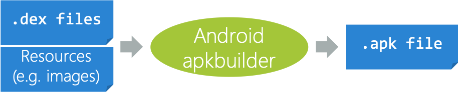

The file is called an *application package*, and it has an .apk extension. It contains all your app's assets:

- Your executable code that's now in DEX-bytecode format
- Your layout files that are now in a binary format
- All your noncode assets, such as images
- NDK precompiled libraries, if any are included

After apkbuilder creates your .apk file, take two more steps to upload the app to the Play store:

- Sign your .apk file by using jarsigner to identify you, the app publisher.
- Run zipalign to modify the .apk file so data begins on 4-byte boundaries.

## Understand native execution

The execution engine for native Android apps is Android Runtime (ART). ART translates the bytecode in the .apk file to native code when the app is installed. Translation happens only once.

Android is based on Linux. Apps run in their own process and get their own copy of ART. Because the processes are separate, apps are isolated from each other. Their isolation helps to improve security.

## How does Xamarin.Android compile code?

The C# source code in Xamarin.Android apps is compiled to MSIL and packaged into assemblies.

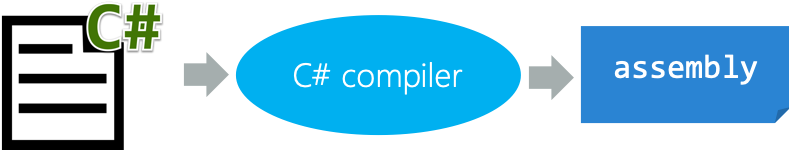

## Understand Xamarin.Android and the Mono runtime

Xamarin.Android apps contain MSIL, so they need a runtime to manage MSIL execution.

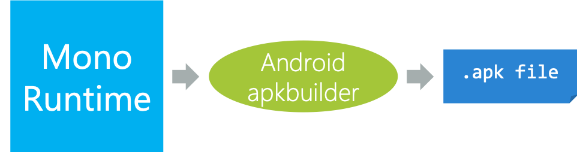

The Xamarin.Android build tools automatically include the Mono runtime in the .apk file. The Mono runtime is analogous to Common Language Runtime (CLR) from .NET. The Mono runtime has an MSIL compiler, a garbage collector, and so on.

## Understand Xamarin.Android execution

The Mono runtime is part of your app's process to execute your intermediate language (IL).

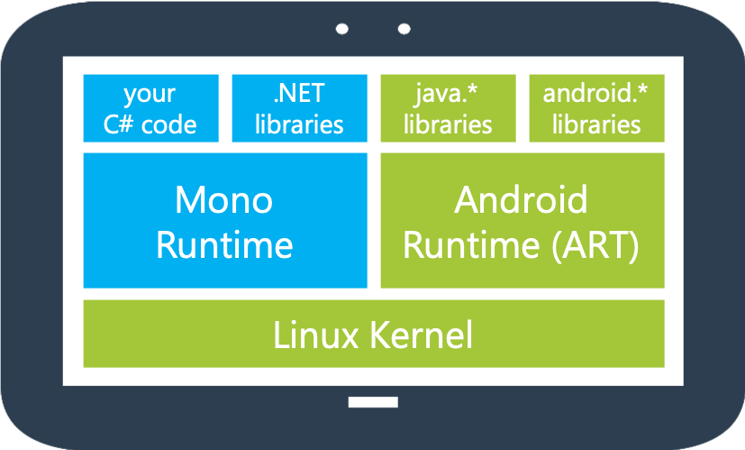

ART is part of your app's process to execute the native Java code. For example, the Xamarin.Android libraries are C# wrappers around the underlying java.* and android.* Java packages. These packages are native Android types and aren't written in C#. The packages have to run on ART.

The Mono runtime and ART run side by side in your app's process.

## Install Xamarin.Android

When you set up your development machine, you'll run the Xamarin unified installer. Visual Studio should be installed on Windows. On macOS, the installer includes Visual Studio for Mac.

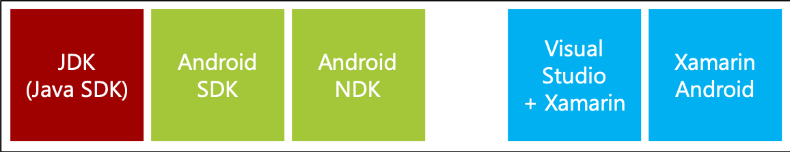

The installer puts all the prerequisites onto your machine:

- **Java**: JDK
- **Android**: SDK and NDK
- **Xamarin**: Xamarin.Android and Mono

When updates are available, the Xamarin components proactively notify you. Notifications help you keep the Xamarin parts of your installation up-to-date.

The JDK and NDK are fairly stable, so updates are rarely needed. But new versions of Xamarin.Android sometimes require you to update the JDK. For example, a 64-bit version of the JDK is required for custom controls in the Android designer.

The Android SDK is updated frequently. It won't notify you when updates are ready. You need to proactively look for updates and start the installation manually.

## Update the Android SDK

To target the latest versions of Android, you need to have those Android versions installed on your development machine.

You'll update two key pieces:

- **The SDK platform**: This option contains all the libraries you need to compile against. The SDK platform includes both the java.* types and the android.* types. In other words, these types are the Android APIs you use to do things like launch other activities, dial the phone, access the files system, and build your UI.

- **Tools**: This option includes a long list of tools you can use to build and run your apps.

## Identify Android versions

You can identify an Android version by a code name and two numbers. Use these version numbers to decide which of the new Android tools and libraries to install or update.

| Code name | Version | API level |
| --- | --- | --- |
| Pie | 9.0 | 28 |
| Oreo | 8.0 - 8.1 | 26 - 27 |
| Nougat | 7.0 - 7.1| 24 - 25 |
| Marshmallow | 6.0 | 23 |
| Lollipop | 5.1 | 22 |
| Lollipop | 5.0 | 21 |
| ... | ...| ...|

Three attributes identify an Android version:

- Code name
- Version number
- API level

The *code name* is useful in conversation but isn't specific enough to identify a version. Notice that one code name maps to more than one version number.

The *version number* is more specific than the code name, but it's still not specific enough. You care about the APIs you'll use. When APIs change, you might need to update your code. If the API remains stable, no code changes are needed.

Android supplies an integer API level that identifies a specific set of APIs. The API level helps you determine when the APIs changes. A change shows you that new APIs might be available or that some existing types might have been deprecated.

## What is Android SDK Manager?

Android SDK Manager is a graphical user interface tool from Google that helps you keep the Android SDK up-to-date on your development machine.

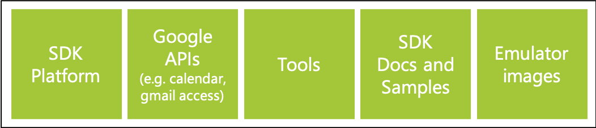

You can use Android SDK Manager to install new versions of every part of the Android SDK. To target a new Android version with your app, the SDK platform and the tools are the key pieces you need to install.

## Open Android SDK Manager

You can open Android SDK Manager from Visual Studio or Visual Studio for Mac. Here's the menu item in Visual Studio:

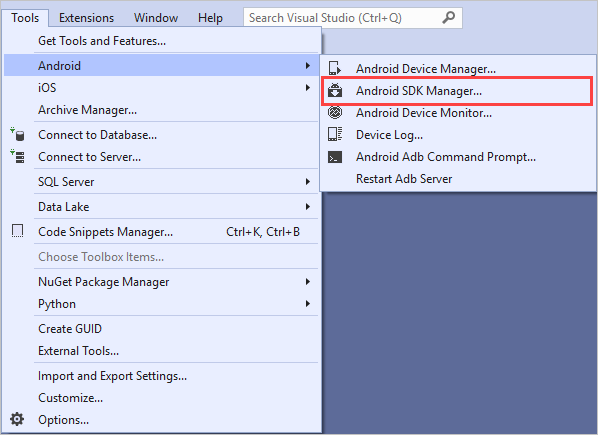

## Update platform versions

To target a specific API level of Android, you need the SDK platform for that installed API level.

You'll install the SDK platform only for the API levels you want to target. You don't need to install every one. For example, you would rarely need to install and target API level 7 because it's many years out of date.

## Update tools

Android splits the tools into three logical groups that you can update independently.

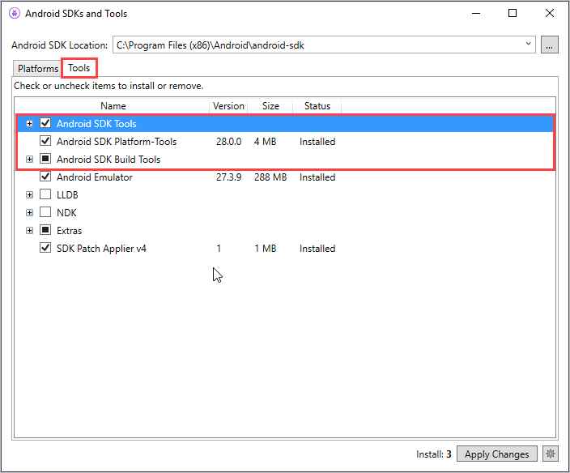

The standard advice is to keep all three categories up-to-date. The tools are backward compatible, so you rarely need to avoid an update.
