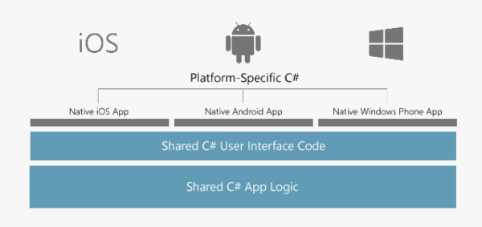

Visual Studio Tools for Xamarin is an open-source app development platform. It lets you build apps for many operating systems from a single, shared .NET code base. Xamarin allows you to write apps that can take full advantage of the power, features, and performance of each platform. Xamarin.iOS is one of the Xamarin frameworks that you use to create fully native iOS apps using C# in Visual Studio.

## What is a Xamarin.iOS app?

A Xamarin.iOS app is a native iOS app that you build with  Xamarin tools and libraries. Xamarin's controls are wrappers around the native iOS views. Because the app uses the native iOS views at runtime, your UI has the native look-and-feel that users expect. You use C# to write the behavior logic for a Xamarin.iOS app. C# is comfortable and familiar to the community of .NET developers.

## What is included in the Xamarin.iOS framework?

The Xamarin.iOS framework includes the complete iOS SDK APIs. This API access means that anything you can do in Swift or Objective-C for iOS, you can do in C# with Xamarin.iOS. The Xamarin.iOS framework also includes both compile-time and runtime components that form part of a customized version of Mono built for iOS.

### What is Mono?

Mono is an open-source implementation of Microsoft's .NET Framework. Xamarin.iOS uses many of the Mono tools and libraries. Mono has the core pieces that are used to build and manage your Xamarin.iOS apps.

Two Mono components handle the Xamarin.iOS compile-time aspects of your app:

- **C# Compiler**: This compiler creates the initial Microsoft Intermediate Language (MSIL) that's used to execute your app on the iOS simulator.
- **Native compiler and linker**: Xamarin.iOS has an Ahead-of-Time (AOT) compiler to compile your managed code to a native iOS binary. When apps run on a device, AOT-compiled binary code performs like native-compiled binary code. The linker optimizes apps by stripping out unused libraries and code.

Two Mono components handle the Xamarin.iOS runtime and execution of your app:

- **Mono Base Class Library (BCL)**: The BCL is the same as the .NET Framework Class Library that contains all of the familiar utility classes. Xamarin.iOS contains a subset of the .NET Framework Class Libraries with features like LINQ, Tasks, XML, Regex, I/O, and networking APIs.
- **Mono runtime**: The Mono runtime is what executes MSIL. It's customized for Xamarin.iOS and runs side by side with the Objective-C runtime. The Mono runtime provides several features to your app, such as: type checking, static reflection, interoperability, and Garbage Collection services to your app.

> [!NOTE]
> You're not limited to the Xamarin.iOS .NET Framework Class Libraries. Xamarin.iOS also supports .NET Standard libraries if you need a wider range of .NET APIs.

## What are the hardware and software requirements for Xamarin.iOS development?

Apple has strict requirements when it comes to building apps. For example, you need to use a Mac and run Xcode to create your apps. Xcode is the integrated development environment (IDE) for macOS that is developed and maintained by Apple. Xcode includes a suite of apps used for developing software for macOS, iOS, watchOS, and tvOS. You build and distribute your apps with tools that come with the Xcode IDE.

Xamarin.iOS also uses the Xcode tools to create the final binary and distribution packages for iOS apps. This requirement means you need a Mac that runs macOS and Xcode to complete the final compilation and deployment of a Xamarin.iOS app. Before you distribute your app, you also need to deploy your app to an iOS device for testing.

> [!NOTE]
> From time to time, Apple requires you to upgrade to the latest versions of all operating systems as well as the native development environment. You also need to update the Xamarin tools to match. You should keep Xcode up-to-date and use the latest Xamarin stable releases. See the [Xamarin installation instructions](https://docs.microsoft.com/xamarin/ios/get-started/installation/index).

## Write code for Xamarin.iOS apps

Even though iOS app creation is dependent on the Xcode tools, you don't write Xamarin.iOS apps in the Xcode IDE. You have two IDE choices for writing a Xamarin.iOS app.

- **Windows**: Visual Studio supports Xamarin.iOS. You can even use the free Community edition of Visual Studio. You also need a Mac with macOS, Xcode, and the Xamarin tools installed. Visual Studio uses the Mac as a build host to complete the final compilation and deployment of your app. Make sure to add the Mobile development with .NET workload when you install Visual Studio. This workload isn't added by default on new installations of Visual Studio.

- **Mac**: Visual Studio for Mac supports Xamarin.iOS. You can even use the free Community edition of Visual Studio for Mac. This IDE looks and behaves similarly to Visual Studio and provides a familiar development experience to .NET developers.

> [!NOTE]
> You don't need an additional build host when you use Visual Studio for Mac because all compilation happens on the local machine.

You need to install the [Visual Studio](https://visualstudio.microsoft.com/) IDE?
