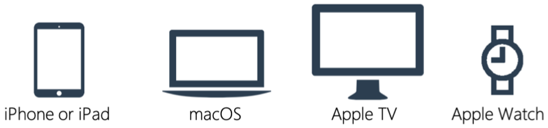
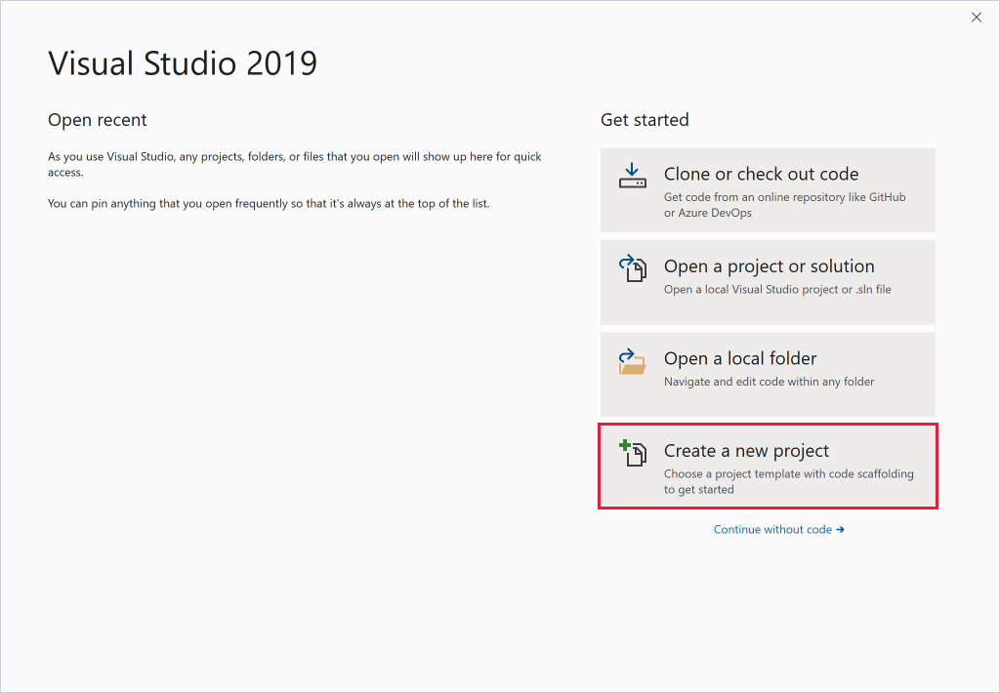
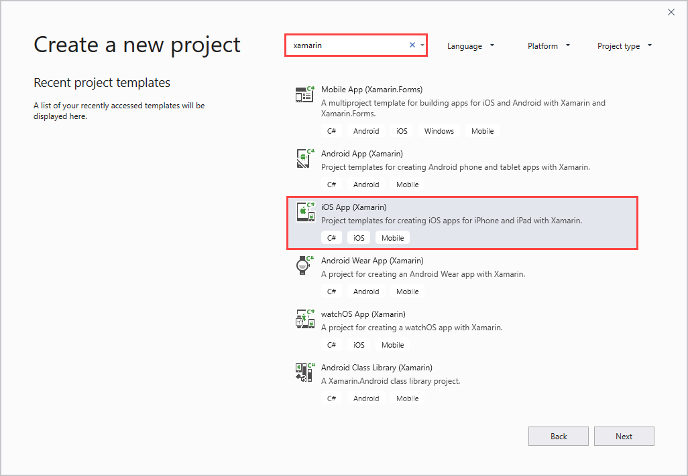
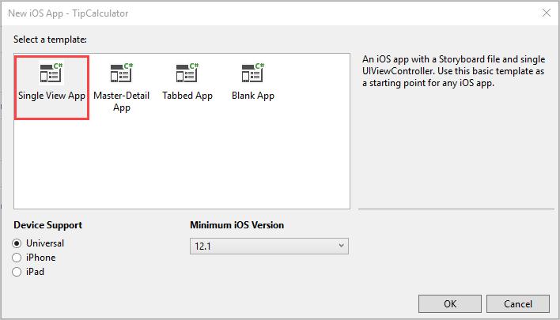
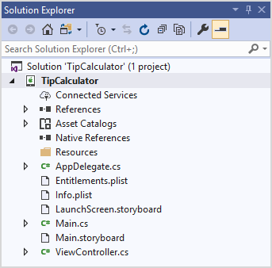
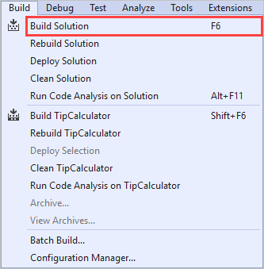

Now that you have an overview of Xamarin.iOS, you're ready to learn how to use it to create a new iOS app. This information should help you decide whether Xamarin.iOS is a good fit for your development team.

Even though this module focuses on creating an iOS application, remember that Xamarin.iOS supports all variations of Apple devices.

## Start a new Xamarin.iOS project

The steps to create and run an Xamarin.iOS app start by opening Visual Studio or Visual Studio for Mac. This example shows the steps you take in Visual Studio 2019. First, you select the **Create new project** option.

The easiest way to find the available Xamarin project types is to filter the options using _xamarin_ as your search term. Next, select the **iOS App (Xamarin)** option.

## Choose an iOS project template

Visual Studio has a set of installed project templates to create Apple applications in a few different styles.

Visual Studio 2019 gives you the option to choose one of the following default templates:

| Template | Description |
| -------- | -------- |
| Single View App | Creates a simple application structure with a single, empty page. You use it in the following exercise. |
| Master-Detail App | Creates an application with two views: <ol><li>**Master** list of scrollable records, each of which represents a piece of data.</li><li>**Detail** view for a single record.</li></ol> |
| Tabbed App | Creates a multi-page application with a tab at the bottom of the UI for accessing each page. |
| Blank App | Creates an application that doesn't contain a visual design file called a Storyboard. Instead, it contains a single, coded view called a ViewController. |

## Xamarin.iOS project structure

Xamarin.iOS creates a standard .NET type solution with your new Xamarin.iOS project included. No matter which IDE choice you made earlier, this solution and project is usable on both Windows and Mac. Team members with different operating systems can continue development without interruptions.

Here is an example of typical Single View App project:

Notice that the project contains a number of items common to other .NET-based solutions. However, it also includes some items specific to iOS development, such as **AppDelegate**, **plist files**, **Storyboards**, and **ViewControllers**. If you have an iOS development background, the familiarity of these items should make the transition from Swift and Objective-C to C# development easier.

## Build your application

After you create your project, you can build it. To compile your code, you use the same technique as you do for any other app. You can use the **Run** button on the toolbar or in the **Build** menu.

You can view build warnings and errors in the **Error** window. Turn the window on and off through the **View** menu.

Make sure you configure a connection to your Mac build host before you do a complete build of your application. Visual Studio prompts you to set up this connection if it isn't available.

Your Mac build host is properly configured if the icon is shown green.

## Test your application

You have a couple of options for testing your application:

- Test with the **iOS Simulator**.

  

  The simulator comes with the iOS SDK and is distributed as part of your Xcode installation. The simulator allows you to select different form factors directly from the toolbar. For example, you can choose to run your app on an iPhone or iPad to see visual design differences.

- Test on a **Physical device**.

  You can connect an Apple mobile device to your Mac with a USB cable and both IDEs will detect it.

  

  Notice how the configuration option differs from the previous example where a simulator is selected. In this case, you select the iPhone build configuration to create native AOT package. Visual Studio for Mac will automatically select the proper configuration based on the device you're deploying to.

## Requirements for deployment to a device

Always test with a physical device during your development cycle because of runtime differences on the simulator. Configuring a physical device requires additional setup. For example, your apps must be signed with an Apple-supplied certificate, and test devices need to be registered with Apple's developer portal.

For instructions, see [device provisioning for Xamarin.iOS.](https://docs.microsoft.com/xamarin/ios/get-started/installation/device-provisioning/index).
