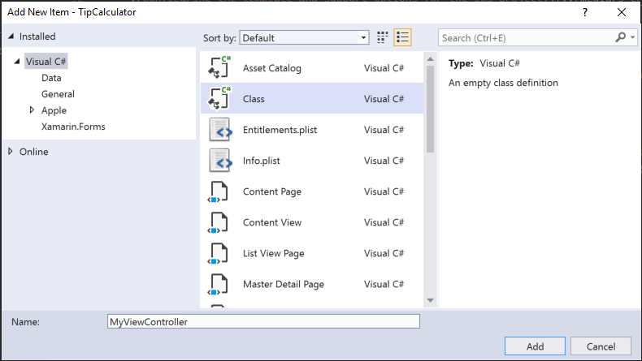
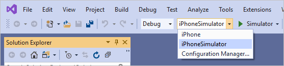
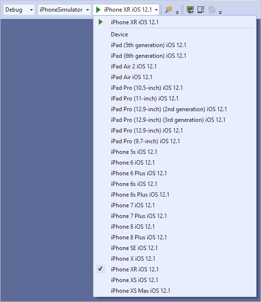
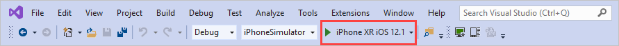

In this exercise, you walk through the creation of a new Xamarin.iOS application with Visual Studio 2019. You can also use Visual Studio 2017 or Visual Studio for Mac, but keep in mind that some steps might be slightly different.

The primary goal of this exercise is to disable the default Storyboard UI from the TipCalculator project you created in the previous exercise. After that, you replace it with a code-based `UIViewController`, which will be set as the `RootViewController` for the application.

> [!NOTE]
> Running Xamarin.iOS apps on devices or simulators requires a connected macOS build host machine. For more information, review the [Pair to Mac for Xamarin.iOS development doc](https://docs.microsoft.com/xamarin/ios/get-started/installation/windows/connecting-to-mac/).

## Create Single View App

1. Launch **Visual Studio**.

1. To start the project creation wizard, select **Create a new project** on the Visual Studio start page. You can also access the new project dialog in the **File** > **New** > **Project** menu.

    

1. Use the search term _xamarin_ and filter the project types in the **Create a new project** dialog. Select the **iOS App (Xamarin)** template from the filtered list of options.

   

1. Give your new project the name `TipCalculator` and select **Create**.

> [!NOTE]
> During the project creation process, you might be prompted to connect to a Xamarin build host. For more information, see [Connecting to the Mac](https://developer.xamarin.com/guides/ios/getting_started/installation/windows/connecting-to-mac/).

On the next screen:

1. Select the **Single View App** template.

1. Leave the **Device Support** as **Universal** to support both iPad and iPhone devices.

1. Pick your preferred **Minimum iOS Version** or leave it set to the newest version.

1. Click **OK** to create the project.

   

   Visual Studio creates and loads a new solution with a single iOS project.

   

## Delete boiler plate code

The Single View App template creates both a Storyboard UI and a view controller with some basic overrides that are linked to the UI. We want to start from scratch in this app. In this step, we'll delete the existing view controller code and replace it with a new C# class to act as our primary view controller.

1. Open your **TipCalculator** solution.

1. Locate **ViewController.cs**.

1. **Right-click** and then select **Delete**.

## Add a new class

1. You can add a new class file to the project in two ways:
   - Select **Project > Add Class** from the menu.
   - Select **Add > Class** from the project context menu

1. In the **Apple** category, select **Class** - the empty class template. Enter **MyViewController** as the name for your class file.

1. Select **Add** to create the file and add it to your project.

  

## Inherit from UIViewController

1. Open the new source file.

1. Make sure to set the class constructor to `public` and update the class to derive from `UIViewController`.

1. You need to fully qualify the class or add the UIKit namespace using statement to the file.

    ```csharp
    using System;
    using UIKit;

    namespace TipCalculator
    {
        public class MyViewController : UIViewController
        {
            public MyViewController()
            {
            }
        }
    }
    ```

## Assign a UIWindow

1. Open **AppDelegate.cs**.

1. Locate the `FinishedLaunching` method and remove **all** of the code and comments from within the method.

1. Create a new `UIWindow` object and assign it. The constructor for `UIWindow` takes a `CGRect` structure, which defines the rectangle that the window will cover. You want it to cover the entire device screen so use the static property `UIScreen.MainScreen.Bounds` as the parameter.

1. Assign the created `UIWindow` to the existing `Window` property.

    ```csharp
    public override bool FinishedLaunching(UIApplication application, NSDictionary launchOptions)
    {
        // Create a new window instance based on the screen size
        Window = new UIWindow(UIScreen.MainScreen.Bounds);
    }
    ```

## Display a view controller

1. Create a new instance of `MyViewController` and assign it to the `Window.RootViewController` property. This assignment displays your view controller (and the view it controls) as the initial screen when the app starts.

    ```csharp
    public override bool FinishedLaunching(UIApplication application, NSDictionary launchOptions)
    {
        // Create a new window instance based on the screen size
        Window = new UIWindow(UIScreen.MainScreen.Bounds);

        // Assign the root view controller
        Window.RootViewController = new MyViewController();
    }
    ```

## Set the primary window

1. To direct iOS to make this new window the *primary* or *key* window, you need to call the `MakeKeyAndVisible` method on the `UIWindow` object.

1. Return `true` from the method to finish the implementation.

    ```csharp
    public override bool FinishedLaunching(UIApplication application, NSDictionary launchOptions)
    {
        // Create a new window instance based on the screen size
        Window = new UIWindow(UIScreen.MainScreen.Bounds);

        // Assign the root view controller
        Window.RootViewController = new MyViewController();

        // Make the window visible
        Window.MakeKeyAndVisible();

        return true;
    }
    ```

## Build and run app

Next, you select the deployment target for your new iOS application. In this example, you use the iOS simulator which requires an active connection to your Mac build host.

1. Choose **iPhoneSimulator** from the **Solution Platforms** dropdown on the Visual Studio toolbar.

    

    With **iPhoneSimulator** selected, you can now choose from the available simulators installed on the Mac. The available devices and versions might change when Xcode is updated on the Mac.

1. Select any **iPhone** simulator.

    

    The simulator variations are created and installed through Xcode on your Mac build host. Visual Studio reads the configuration and displays what's available from the build host you've selected. If you don't see the simulator image you're looking for, you can create it through Xcode.

## Build the application

Compile and deploy the application to the iOS Simulator. The application displays as a black screen when it's up and running. You'll fix the view's background color in a following exercise.

Start the application by selecting the **Play** button in the toolbar. This action builds and launches the application on the simulator. You can also build from the **Build** menu.



Remember, the simulator is hosted on your Mac build host. With the **Remoted iOS Simulator** installed, a window launches on your Windows development machine to preview and interact with the iOS simulator directly. If the Remoted iOS Simulator isn't installed, the simulator window appears and deploys on your **Mac** build host. Switch to your Mac to see the window there.

For more information, see the [Remoted iOS Simulator documentation](https://docs.microsoft.com/xamarin/tools/ios-simulator/).

Congratulations! You've created a new iOS application with the **Single View App** template.

You can view the completed solution in the **exercise1** > **final** folder in your copy of the cloned or downloaded [!INCLUDE [module-exercise-repo](module-exercise-repo.md)] from GitHub.
