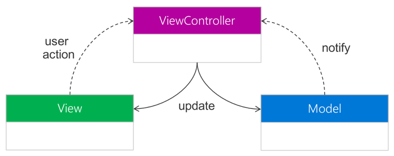

In the previous unit, you walked through the basic steps to create a Xamarin.iOS app. Now, you learn some common terminology and the design pattern used to structure apps in iOS. This information should help you decide how much additional iOS knowledge your development team needs.

This unit explains some of the terms from the project and source files in the previous exercise that might not be familiar to you.

The iOS platform contains some terms that are also used in .NET, but have a slightly different purpose or meaning. This unit contains information about these specific terms and explains how Apple defines them. Because Xamarin.iOS runs on top of Apple's frameworks, these words likely refer to the Apple definition and not the .NET definition.

## What is an iOS framework?

You use various libraries to create .NET applications. For example, you use _mscorelib_ to access various functions: reading and writing files, processing XML, and creating graphics. A library is called a _framework_ in iOS. You use various _iOS frameworks_ when you create your iOS apps.

## What is CocoaTouch?

_CocoaTouch_ is the application development environment for iOS. CocoaTouch includes the APIs that are used for developing applications that run on iOS.

## What is UIKit?

_UIKit_ is a user interface (UI) framework that provides infrastructure to your iOS apps. UIKit gives you access to various components in your iOS application. These components include items like the window and view infrastructure, infrastructure to handle multi-touch user interactions, and the main run loop of your application. UIKit's feature support is extensive and is covered thoroughly in Apple's documentation.

## What is a protocol?

You use an interface to specify a code contract in C#. This code contract contains definitions for related functionality a class can implement. The interface specifies what functionality is required and the class specifies how the functionality is implemented.

A Swift and Objective-C _protocol_ is the same as a C# interface. iOS documentation refers to some classes as _conforming_ to a protocol. A protocol is the Apple way of saying that a class implements a specific contract.

Like in C#, an iOS class can implement multiple protocols to interact with different things. Unlike C# interfaces, iOS protocols can define methods or properties that are considered optional to the contract.

Protocols also allow you to define static operations that don't require an instance to invoke. These static operations are called class-level operations in iOS.

Xamarin.iOS uses a combination of interfaces and abstract classes to model iOS protocols.

- You use interfaces to define the intent of a class, which is what allows a class to _conform_ to a protocol.
- Abstract classes provide support for features, such as required versus optional methods. An abstract class gives a placeholder for static method implementations. You mark methods with the abstract keyword to specify required method implementations. You use the virtual keyword with an empty body for optional methods.

You derive protocols from these abstract classes. However, because you model optional methods in the abstract class, there may not be a base method to invoke. A good practice is to treat the base class like an interface.

> [!IMPORTANT]
> Do not call base class methods for a protocol implementation unless you're certain that the method is implemented. Because Apple commonly leaves methods unimplemented, runtime failures can result when you call them. Check Apple's documentation to be sure whether a method is a protocol or a real class.

## What is a delegate in iOS?

_Delegates_ are an important and integral part of iOS, but not quite the same as a .NET delegate. In .NET, a delegate is a type-safe callback or method pointer.

In iOS, a delegate represents a set of methods and properties that are used for notifications. An iOS delegate is similar to an interface in .NET and a language feature of protocols. You use delegates throughout iOS apps for notifications and behavioral customization without derivation.

To use a delegate, you implement a delegate handler class and then set a property on the publisher to point to your delegate implementation. The publisher sends messages to the delegate to determine:

- Whether an action should be taken
- Inform the publisher that an action will be taken
- Inform the publisher that an action did happen

In the **TipCalculator** exercise app, you added code into a class named **AppDelegate**. AppDelegate is a required and necessary part of your application structure. iOS calls methods on it to let you know that things are happening. For example, `FinishedLaunching` tells you that the app is loading, and `WillEnterForeground` tells you the app is going to be presented to your user again.

```csharp
using Foundation;
using UIKit;

namespace TipCalculator
{
    // The UIApplicationDelegate for the application. This class is responsible for launching the
    // User Interface of the application, as well as listening (and optionally responding) to application events from iOS.
    [Register("AppDelegate")]
    public class AppDelegate : UIApplicationDelegate
    {
        ...

        public override bool FinishedLaunching(UIApplication application, NSDictionary launchOptions)
        {
            return true;
        }

        ...

        public override void WillEnterForeground(UIApplication application)
        {
        }

        ...
    }
}
```

These method names reflect their purpose with the prefixes **Should**, **Will**, and **Did**. Xamarin.iOS  might drop a prefix and rename the methods to something closer to .NET conventions.

## What is the Model-View-Controller pattern?

Model-View-Controller (MVC) is a mature presentation pattern. It's applied to all sorts of application types from graphic user interfaces (GUI) to web apps. In fact, it's the default design approach for any iOS or macOS application as Apple even adopted the pattern in CocoaTouch and UIKit.



### What is the Model in the MVC pattern?

The _model_ manages both the behavior and the data of the application domain. Models can be singular objects or complex object graphs made up of multiple objects that represent your domain model.

A model can be based on a database or on the results from web services. A domain model might map exactly to what the user sees. Or it can be formatted, altered, or combined for visual presentation. Models should always be platform-agnostic and have no dependencies on how they're displayed.

The model exposes data for the view to present and responds to change requests that the controller handles.

### What is the View in the MVC pattern?

A _view_ is a visual representation of one or more models. It presents that information to the user and might also allow the user to change that information. The view acts as a presentation filter in that it can  highlight certain data values of the model and suppress others.

The view only contains the visual aspects of your application. It includes colors, fonts, layout, navigation paradigms, and so on. The view isn't responsible for storing data, although it can cache data for performance reasons or for state restoration. For example, you might sometimes want to cache the state of a view when your mobile app is suspended.

## What is a UIView?

_UIView_ is the base class for views in iOS. There are two ways to create views with UIView: declaratively through visual layout files, or imperatively in code. The declarative approach uses files called _Storyboards_ for multiple screens or _XML Interface Builder (XIB)_ files for single screens.

### What is the Controller in the MVC pattern?

A _controller_ acts as the intermediary between the application's view objects and its model objects. It's responsible for handling user input and then updating the model or the view.

Suppose you've created a view with an **OK** button. When the user taps the button, the action generates a touch message that the view sends to its controller. The controller determines how to process the information. It might respond by updating the model with new data or by changing the view's state.

## What is a UIViewController?

In iOS, the controller is represented by a real type:  a class called `UIViewController`. You use the `UIViewController` to manage a single page in the application. iOS apps provide a derived implementation of this type to control a single screen of the mobile app.

The controller in iOS receives notifications about UI changes. In controller code, you create event handlers or otherwise deal with messages from the view. To handle these messages, the controller usually needs to actively look for them. To know about the notifications and handle them, it conforms to an iOS protocol. The controller then decides what specific things to monitor, and it listens for those activities.

All of your controllers will ultimately derive from UIViewController. However, iOS has a bunch of derived implementations to manage different UI behaviors that you can use directly or derive from. For example, stack-based navigation is provided by a `UINavigationController`.

## What is the UIWindow?

The _UIWindow_ is the primary window that provides your app's visual surface on the device. The window is defined by a built-in class called the `UIWindow` that you derive from `UIView`. It's created when the app launches and will always be at the root of your visual hierarchy.

## Putting the pieces together

Let's see how you can use the preceding elements to create the first screen in your app.

The **Main.cs** class file in the **TipCalculator** solution is the entry point into your app from a C# point of view. It's similar to what you see in a console app, for example.

```csharp
using UIKit;

namespace TipCalculator
    {
    public class Application
    {
        // This is the main entry point of the application.
        static void Main(string[] args)
        {
            // if you want to use a different Application Delegate class from "AppDelegate"
            // you can specify it here.
            UIApplication.Main(args, null, "AppDelegate");
        }
    }
}
```

When the application starts, the `Main` method launches the UIKit framework and points it at the `AppDelegate` class. This class is derived from `UIApplicationDelegate`, which in turn implements the `IUIApplicationDelegate` interface. In this way, the `UIApplicationDelegate` conforms to the protocol.

The `AppDelegate` class must do three things during the initialization sequence:

1. Create a `Window` to display content on the device. There's a window for each physical screen your app draws to.
1. Assign the initial view controller to start the application. Apple calls this controller the `RootViewController`.
1. Make the primary window the *key* window. The `AppDelegate` class uses the key window information to decide which window should accept touch input.

If your app is using a **Storyboard**, then this task is handed to the **Storyboard** APIs. You use the designer to select the initial view controller in the **Storyboard** APIs.

If you want to do this task yourself, you can override the `FinishedLaunching` method and take control of creating the initial view controller and window.

Here is example code that shows the creation of the `UIWindow`.

```csharp
public class AppDelegate : UIApplicationDelegate
{
    public override UIWindow Window { get; set; }

    public override bool FinishedLaunching(...)
    {
        Window = new UIWindow(UIScreen.MainScreen.Bounds);
        Window.RootViewController = new MyViewController();
        Window.MakeKeyAndVisible();
        return true;
   }
...
}
```

Notice how the `AppDelegate` class has a defined property, named `Window`, which must be assigned. The `UIWindow`'s size is specified by passing a rectangle parameter that is used to draw the view. You typically want to use the entire device screen and can do so by using the static property on `UIScreen` named `MainScreen.Bounds`.

Remember that controllers are represented by the built-in `UIViewController` class. Your app always has at least one custom view controller derived from `UIViewController`. It can often have a view controller for each main view or screen displayed by your app.

You need to create an instance of the `UIViewController` class in our `FinishedLaunching` method and assign it to the window's `RootViewController` property. This assignment is what identifies `MyViewController` as the starting screen for the app in the above example.

In the final step, you make your window the _key_ window and return true from the method. You do so by calling the `MakeKeyAndVisible` method on `UIWindow` so that it receives touch events.

Remember, the code added here is normally handled by the **Storyboard**. You don't need to override this method at all unless you want to do customized app-level initialization. Even so, you might find it useful to understand what's happening and how you can intercept and customize initialization.
