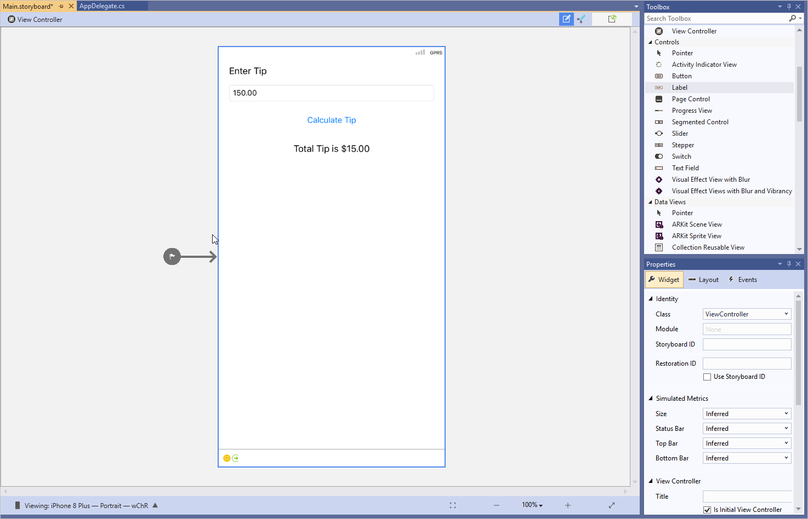
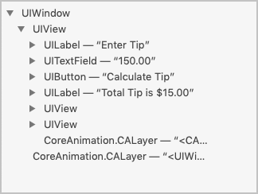
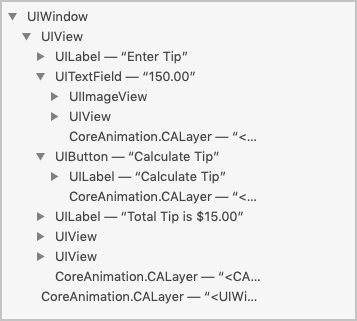
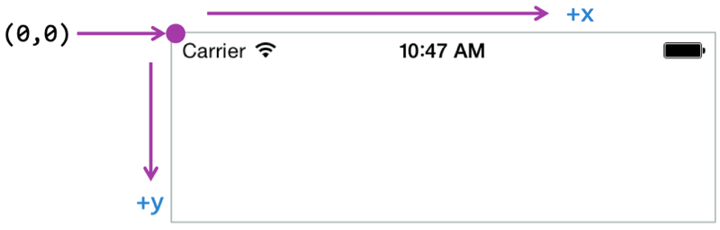
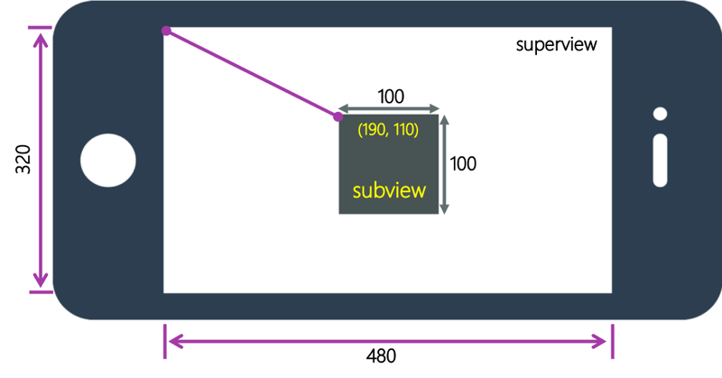
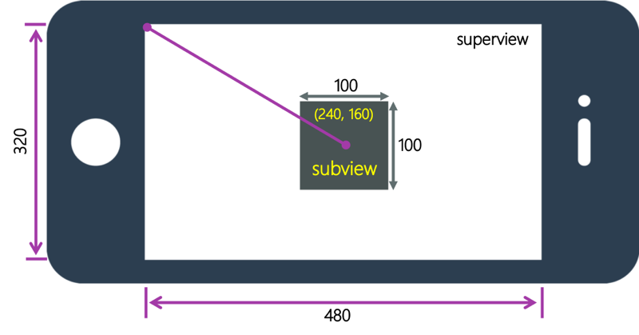
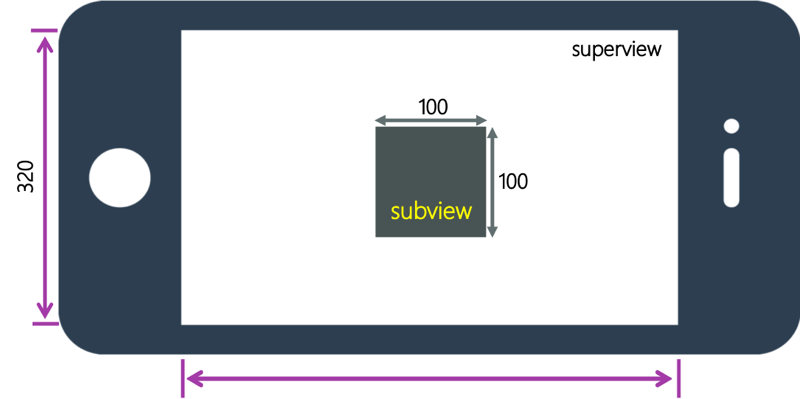

You previously looked at iOS terminology. You also learned that a view controller is created for the first screen in your app. In this unit, you learn how to create a UI and get to look at options for positioning controls in iOS.

## Create screens in Xamarin.iOS

Remember that you can create screens in two ways:

- **Imperatively**: You can use code to create controls and add them into the visual layout.
- **Declaratively**: You can use the GUI designer built into the IDE to add UI into the Storyboard file that is part of your project.

Here is what the TipCalculator UI design might look like in the GUI designer.



This module looks at the code-based approach. It forces you to understand how a UI is constructed.

## Create a view

Screens in iOS are built as a hierarchy of parent-child relationships. Remember that the `UIView` class is the base class for everything visual in iOS. Your app uses a `UIWindow` window that draws your UI in the physical device screen. `UIWindow` always has a single child that is considered the _root_ of the visual tree. This child is called the `RootViewController`. To add controls to the screen, you add child `UIView` objects to this root view.

### What is a subview?

A _subview_ is a child view that is added to a parent view in iOS.

## What is a superview?

A _superview_ is a parent view to which child views are added in iOS.

Suppose you decide to lay out the TipCalculator app's first screen like the UI showed above. The visual tree for the hierarchy would look like this structure:



Notice how `UIWindow` forms the root of the visual tree. `UIView` is a subview of the `UIWindow`. `UIView` is also the superview of a number of views, including two `UILabel`, a `UITextField`, a `UIButton`, and few other views not visible in the designer.

This hierarchy extends further into the controls.



The `UIButton` view has a single `UILabel` child that displays the text for the label. `UITextField` is an even more complex superview, containing `UIImageView` and another `UIView`. Each of these controls extends further with additional subviews.

## Access the view

When you think about the structure of the app's views in relation to the view hierarchy above, you might notice that there's something missing from the view hierarchy. It's the root view controller. Remember, you added a custom `UIViewController` to `UIWindow`. iOS uses the MVC design pattern. The `UIViewController` isn't shown as part of the view hierarchy. It's the controller of the view. `UIView` is displayed as the child of `UIWindow` and managed by a controller. However, you do not access the view via UIWindow. You use the `UIViewController.View` property to access the view.

Once you have access to the view, you can start adding controls to it.

## Add controls to the view in a view controller

Recall the `UIWindow` window you created earlier. It required you to pass a rectangle parameter to its constructor. All views must have a rectangle - a frame defined to draw itself in.

The frame is used not only to size the view, but also to position the view. Views are always positioned using resolution-independent, floating-point values called **points**.

iOS uses an absolute layout coordinate system to position views. The coordinate system is set up so that you position a subview from its top-left corner, relative to the top-left corner of the parent. The top-left corner of the parent view is considered the _origin_ (0,0). Positive coordinates run right and down, and negative coordinates run left and up.



## Position a subview in a superview

When setting the position of a subview within its parent, there are several related properties that control the subview's position.

| Property | Definition |
| -------- | ---------- |
| Frame | The rectangle (X, Y, width, height) for the view defined in the coordinate system of the superview. The frame decides the overall drawing area within which the view can render. |
| Center | The center point (X,Y) for the view in the superview coordinate system.|
| Bounds | The rectangle of the view in its own coordinate system.  Often this property is similar to the frame. However, it might not include the space used for margins or applied effects, such as shadows. |

Suppose you have an original iPhone in landscape orientation. The size of the parent view is 480x320 points. The top-left corner of the root view is the origin, (0,0). The dimensions of the view are 480 (width) by 320 (height).

To add a subview that's 100 (width) x 100 (height), centered in the parent, you can use `Frame`, `Center`, and `Bounds` to position the view.

### Use the Frame property of the view

Suppose you want to use a frame to specify the location of the new view. The parameters to create a frame are X, Y, width, and height. How would you define `Frame` property?



The calculation can be a bit tricky. You have to calculate the frame to position the top-left corner of the subview and to set the width and height of the rectangle.

You use the coordinate `(190,110)` and set the width as `100` and the height as `100`.

### Use the Center property of the view

Again, suppose you have to add a subview that's 100 (width) x 100 (height), centered in the parent. Here you use the `Center` property of the view.

The `Center` property is the center point of the subview. The coordinate used for this property is also within the parent's coordinate system. What would you use as the center coordinate?



Since you have a `480x320` area, and you've centered this `100x100` view in that area, your center point is `(240,160)`. You calculate this coordinate from the origin of the superview.

### Use the Bounds property of the view

The `Bounds` property is what the subview uses to determine its own dimensions. It's also used to position any children of its own. If you change the X and Y for the `Bounds` property, children of this subview will adjust in response.



The `Bounds` property would be a rectangle with the values `(0,0,100,100)`, where the origin is the top-left corner of the subview itself.

Choose the `Bounds` property when you're overriding positions inside the view itself. For example, you consult this property when you need to know the size of the view.

## Set a view's position in code

After you gain access to the view, you can start adding controls to it. Suppose you want to add a `UIVIew` subview to the view in your app's view controller. You want to use this subview as a container for the rest of the UI you'll add later.

You define the `Frame` property when you're setting a subview's position and size within the parent. See the following code for an example of how to position the new view:

```csharp

public partial class ViewController : UIViewController
{
    public ViewController(IntPtr handle) : base(handle)
    {
    }

    public override void ViewDidLoad()
    {
        nfloat height = View.Bounds.Height;  // Current view coordinates
        nfloat width = View.Bounds.Width;

        var subview = new UIView()
        {
            Frame = new CGRect(width/2-20, height/2-20, 40,40)
        };

        View.Add(subview);
        ...
    }
}
```

The preceding code illustrates one more important aspect that you have to keep in mind. Notice how the new `UIView` is created in the `ViewDidLoad` method and then added to the `View`. `ViewDidLoad` is a life-cycle method for the `ViewController`'s view. The `ViewController` view receives a `ViewDidLoad` message after its `View` is fully initialized. Only interact with the view hierarchy after this message is executed.
