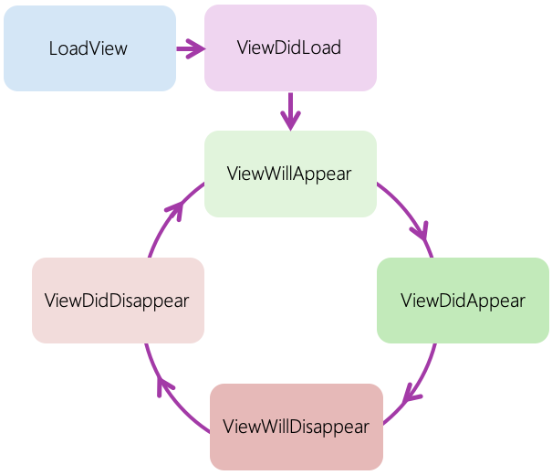

In the previous unit, you saw how to position a view. Now you look at how to build the tip calculator UI and add behavior by using standard iOS controls.

UIKit includes a full set of common controls you can use to create your application UI. Look in the following table for the most popular iOS controls and their analogs in Android and Windows:

| Android | Windows | iOS |
| ----- | ----- | ----- |
| Button | Button | **UIButton** |
| CheckBox | CheckBox | UISwitch |
| Spinner | ComboBox | UIPickerView |
| ImageView | Image | UIImageView |
| TextView | Label | **UILabel** |
| ListView | ListBox | UITableView |
| ProgressBar | ProgressBar | UIProgressView |
| Slider | Slider | UISlider |
| EditText | TextBox | **UITextField** |

In the Tip Calculator example app, your user is going to enter an amount and then tap on a button. Once the button is tapped, you calculate a tip value and then display it as a total on screen.

You use the controls marked in bold in the preceding table. They are:

- `UIButton` to display an interactive button to activate a feature.
- `UILabel` to show a piece of text that the user can't edit.
- `UITextField` to present an edit control for the user to enter data from the on-screen or hardware keyboard.

All controls in iOS ultimately derive from `UIView`. You create the control, set the `Frame`, and add the control to a parent view to display on screen.

## Build the Tip Calculator app's UI

The goal is to create the UI for the TipCalculator application. Your current app launches into a single screen with no additional UI. We'll add the following three types of controls to the application:

- `UITextField` to hold the total price we want to calculate a tip for.
- `UIButton` to let the user execute the tip calculation logic.
- `UILabel` to display the tip amount.

### Add an entry field

You start with the entry field. The entry is used for the total amount due by the customer. You can create a `UITextField` control and set the `Frame` property to be the rectangle where the edit field is placed.

All controls in iOS provide many properties to customize the look and behavior of each control.

For example, assume you want your users to only have access to digits when they enter values into the application. You can use the `KeyboardType` type property to control which keyboard is shown. Several styles are available. Examples include Email, PhonePad, NumberPad, Url, and Default.

You might want to put a rounded rectangle border on the edit field. You can use the BorderStyle to set the new style.

You might even decide that you want to use a placeholder. The placeholder displays light gray text when there's no value in the entry field. You can use the `Placeholder` property to set this value.

If you want to implement all of the mentioned options, you can use the following code:

```csharp
UITextField emailEntry = new UITextField()
{
    Frame = new CGRect(10, 20, View.Bounds.Width - 20, 35),
    KeyboardType = UIKeyboardType.EmailAddress,
    BorderStyle = UITextBorderStyle.RoundedRect,
    Placeholder = "Email Address"
};
```

### Add a button

Next, you add a button to the UI using the built-in `UIButton` class. You specify the button type with the button's constructor. There are several options that match the iOS system styles, or you can choose to create a custom button.

For example, the default button style is called _Standard_. It displays a button with the system colored text and a transparent background.

Suppose you want to change the button's background color. In this case, you can't use a _Standard_ button style. You need to create a new `Custom` button type and set the `BackgroundColor` property to a `UIColor` value.

You always set the button's title unless you use a system-based button style or an image. You call the `SetTitle` method to set the button's title. You can define different button titles depending on the state of the button. For example, you can set one title for pressed button and different title for when it's not pressed. You set all the other states at once by setting the button's `UIControlState` to _Normal_.

If you want to implement all of these options, you can use the following code:

```csharp
UIButton button = new UIButton(UIButtonType.Custom)
{
    Frame = new CGRect(....),
    BackgroundColor = UIColor.FromRGB(0.5f, 0, 0),
};
button.SetTitle("Login", UIControlState.Normal);
```

### Add a label

Finally, you need to add a label to display the tip result. You can use the `UILabel` control to display this information.

You supply the `Frame` as a constructor parameter when creating the control. In fact, you can initialize a control with `Frame` as a constructor parameter for most controls. It's identical to setting the Frame property separately.

Typically, you also use the `Text` and `TextColor` properties to set the appearance of the text. Here is an example:

```csharp
UILabel label = new UILabel(new CGRect(190, 110, 100, 35))
{
    Text = "This is a label",
    TextAlignment = UITextAlignment.Center,
    TextColor = UIColor.Blue
};
```

### Add views to a screen

After you've created all your subviews, you need to insert them into your screen. You add them as child views to the root view collection in one of the following ways:

- Add a single child to the collection using `AddSubview`.
- Add a group using `AddSubViews`.

There are multiple ways to add subviews. The most common way is to access the `View` property where you can use `Add`, `AddSubview`, or `AddSubviews`. `AddSubview` and `AddSubviews` are native iOS methods. However, Xamarin.iOS provides the more common .NET method, `Add`. It's familiar and allows collection-initializer syntax when you create a view and a set of subviews together. Xamarin.iOS also includes a convenient `Add` method on the `UIViewController` class that just calls the `View.AddSubview` method.

The order of the controls is relevant during the rendering process. iOS renders controls in the order they're listed in the superview's collection. The first control you add to a superview is the first view rendered on the screen. This ordering is referred to as a control's Z-index.

```csharp
public override void ViewDidLoad()
{
    ...
    var label = new UILabel() { ... }
    var entry = new UITextField() { ... }
    var button = new UIButton() { ... }

    View.AddSubview(label);            // Add one view, or View.Add(label)
    View.AddSubviews(entry, button);   // Add multiple views
}
```

## Access subviews in a superview

Suppose you want to dynamically update an app's UI. You can remove controls and later refresh the UI with a different layout. To examine the subviews for a view, Xamarin.iOS makes the `UIView` class `IEnumerable`. Thus, you can use `foreach` to iterate through the children and examine each one.

The following code walks through all the children views and removes each one. There's no _Remove_ method on the parent. Instead, you remove the child using the child itself. The parent is notified of the child's removal through a set of virtual methods.

```csharp
void RemoveAllContent()
{
    foreach (UIView subview in View)
    {
        // Remove from the parent view
        subview.RemoveFromSuperview();
    }
}
```

## Add behavior to a screen

Many controls in Xamarin.iOS expose .NET events to provide interactivity notification. Xamarin.iOS maps these events over event actions of the native control. iOS sends messages from the `UIView` class to subscribers when there's user interaction. Xamarin.iOS hooks into this system and exposes these messages as traditional .NET events.

Here are a few examples:

- `TouchUpInside` on the `UIButton` indicates that the user tapped within the button boundaries.
- `UITextFiled` includes several events. For example:
  - `EditingDidBegin` shows that the user started editing and the text field has input focus.
  - `ValueChanged` indicates that the text field's value changed.
  - `EditingDidEnd` shows that the user stopped editing and the text field has lost input focus.
  
These notifications all use the standard event handler pattern with an object sender and event arguments. Some controls also have customized event arguments and can report additional data.

Make sure to unsubscribe event handlers for controls located in your view controllers. `ViewWillAppear` and `ViewWillDisappear` are both additional life-cycle methods that the view controller exposes. These two methods are balanced calls. `ViewWillAppear` is called as the view appears and `ViewWillDisappear` as the view disappears.

### What is the view presentation life cycle?

Views in iOS have a distinct presentation life cycle. This life cycle represents the messages sent from the view to the view controller. Suppose you want to refresh controls with data when the user navigates to or away from a screen. You need to know which life-cycle step is next for the current screen.

There are six notifications that the view sends to the view controller. These notifications are implemented as methods.

| Method | Called when |
| --- | --- |
| LoadView | Creates the root view |
| ViewDidLoad | View created / loaded |
| ViewWillAppear | View about to be shown |
| ViewDidAppear | View has been rendered |
| ViewWillDisappear | View about to be hidden |
| ViewDidDisappear | View has been hidden |

The following diagram shows the sequence of these methods in relation to `ViewDidLoad`.



### Subscribe to a button event

Suppose you want to react to a `UIButton`'s tap event message. Xamarin.iOS exposes the familiar .NET event handling technique that allows you to use delegates. Messages are converted to events that you can subscribe to. `UIButton` exposes a standard `TouchUpInside` event to represent a tap or click. You subscribe to the event in the `ViewWillAppear` override to add behavior logic, and unsubscribe from the event in the `ViewWillDisappear` override.

Here is an example:

```csharp
public override void ViewWillAppear()
{
    ...
    button.TouchUpInside += OnLoginButtonClicked;
}

public override void ViewWillDisappear()
{
    ...
    button.TouchUpInside -= OnLoginButtonClicked;
}

void OnLoginButtonClicked(object sender, EventArgs e)
{
    ... // Do sign in logic here
}
```

You could also use lambdas and anonymous delegates to subscribe to UI control events in iOS. However, you should avoid doing so. It's better to use the above pattern to subscribe and unsubscribe from control events. This practice helps you avoid memory leaks in your Xamarin.iOS apps that are hard to track down.

## Dismiss the iOS keyboard

Mobile devices typically have small screens that provide users with concise information. You want to make sure your UI layout is clean and easy to understand. You also want to avoid hiding information from the user unnecessarily. The keyboard in iOS is a view that presents itself when the user focuses on a data-entry control. The keyboard view slides from the bottom of the device screen and overlays the app UI. Make sure to dismiss the keyboard when you don't want your app UI to be hidden.

iOS views don't automatically dismiss the keyboard. For example, the view must resign _first responder_ status on the active `UITextField` control to hide the keyboard. The iOS keyboard is automatically displayed with controls like `UITextField`, but it's not automatically dismissed when you tap on a different control.

In iOS, touch events are delivered through a responder chain. The responder chain decides which control should handle a touch event when it occurs. The control that handles a touch event becomes what iOS calls the _first responder_. After a `UITextField` control becomes the first responder for events, it won't automatically release this status. Either something else needs to become first responder, or the control has to specifically release the first responder state. Some controls like buttons and labels, however, are ineligible for first responder status.

Here's an example where the `ResignFirstResponder` method on the active text field is called to dismiss the keyboard:

```csharp
UITextField emailEntry = ...;
...
void HideKeyboard()
{
    emailEntry.ResignFirstResponder();
}
```
