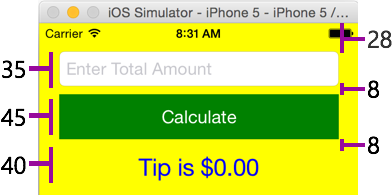
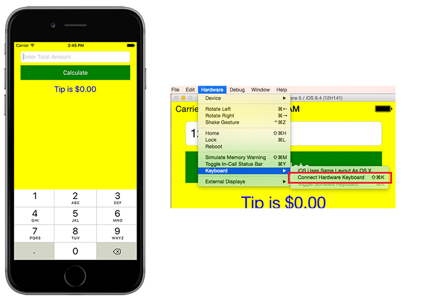
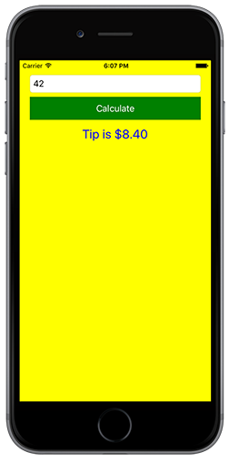

In this exercise, you complete the UI for a simple Tip Calculator by adding three controls to your screen: `UITextField`, `UIButton`, and `UILabel`.

This unit is a continuation of the previous exercise. Use your existing solution as the starting point for these steps.

## Override ViewDidLoad

Here you add the controls to your UI to create the GUI for the Tip Calculator.

1. Open the **MyViewController.cs** source file.

1. Override the `ViewDidLoad` method.

1. Call the base implementation.

    ```csharp
    public override void ViewDidLoad()
    {
        base.ViewDidLoad();
    }
    ```

## Set the background color

Set the `BackgroundColor` property for the view to *Yellow*. You can use the `UIColor.Yellow` constant as your color value or specify an RGB value.

```csharp
public override void ViewDidLoad()
{
    base.ViewDidLoad();
    this.View.BackgroundColor = UIColor.Yellow;
}
```

## Track the safe area to use for views

The `View` property of the `ViewController` class is set to fill the device's full screen. Make sure that your new UI isn't hidden by the notch on the iPhone X and later devices. Each window has _safe area insets_ that describe the edges of the window. The safe area inset gives you the size of the area that isn't safe to use. For example, the notch at the top of the window. You can use the `UIApplication.SharedApplication.Windows` array to select the first Window. Next, you can create a variable and set it to the `SafeAreaInsets.Top` value. You use this variable to adjust the Y position for each control you add.

 ```csharp
 using CoreGraphics;

 public class MyViewController : UIViewController
 {
     public override void ViewDidLoad()
     {
         base.ViewDidLoad();
         ...
         var topPadding = UIApplication.SharedApplication.Windows[0].SafeAreaInsets.Top;

     }
 }
 ```

## Create a text field

1. Create a `UITextField` class-level field named **totalAmount**.

1. Locate the `ViewDidLoad` method.

1. Instantiate the `totalAmount` text field. Set the text field's **Frame** property.

    Calculate the frame by referring to the following diagram. It should be:
    - **20 pts from the left and right** edges of the screen. The width depends on the screen.
    - **28 pts from the top**
    - **35 pts high**
    
    You need to use the `View.Bounds.Width` to expand the control across the view. You can either pass the calculated `CGRect` into the constructor or set the `Frame` property. Add the `topPadding` value - the Y value of the frame. You can find the `CGRect` class in the `CoreGraphics` namespace.

    

    ```csharp
    using CoreGraphics;

    public class MyViewController : UIViewController
    {
        private UITextField totalAmount;

        public override void ViewDidLoad()
        {
            base.ViewDidLoad();
            ...
            var topPadding = UIApplication.SharedApplication.Windows[0].SafeAreaInsets.Top;

            totalAmount = new UITextField() {
                Frame = new CGRect(20, 28 + topPadding, View.Bounds.Width - 40, 35),
            };
        }
    }
    ```

## Set the text field properties

Instantiating the `UITextField` and assign the following properties:

- Set the `KeyboardType` property to `UIKeyboardType.DecimalPad`.
- Set the `BorderStyle` property to `UITextBorderStyle.RoundedRect`.
- Set the `Placeholder` property to `"Enter Total Amount"`.

    ```csharp
    public override void ViewDidLoad()
    {
        base.ViewDidLoad();
        ...
        totalAmount = new UITextField()
        {
            Frame = new CGRect(20, 28 + topPadding, View.Bounds.Width - 40, 35),
            KeyboardType = UIKeyboardType.DecimalPad,
            BorderStyle  = UITextBorderStyle.RoundedRect,
            Placeholder  = "Enter Total Amount",
        };
    }
    ```

## Create a button

1. Create a new `UIButton` class level field named **calcButton**.

1. In the `ViewDidLoad` override:

    - Instantiate the `calcButton` button.
    - Pass `UIButtonType.Custom` to the constructor so you can change its colors.
    - Calculate the frame by referring to the following diagram. Like the text field, it should be:
        - **20 pts** from the left and right edges of the screen
        - **8 pts** below the text field. Remember to add the `topPadding` value.
        - **45 pts** in height
    - You need to set the `Frame` property directly to use the constructor that takes a button type.

    

    ```csharp
    public class MyViewController : UIViewController
    {
        ...
        private UIButton calcButton;

        public override void ViewDidLoad()
        {
            base.ViewDidLoad();
            ...
            calcButton = new UIButton(UIButtonType.Custom)
            {
                Frame = new CGRect(20, 71 + topPadding, View.Bounds.Width - 40, 45),
            };
        }
    }
    ```

## Set the button properties

1. Set the `BackgroundColor` to a dark green using the `UIColor.FromRGB` static method. Change the green component to **0.5f** to make it darker.

1. Use the `SetTitle` method to set the text to `"Calculate"` for the normal control state, `UIControlState.Normal`.

    ```csharp
    public override void ViewDidLoad()
    {
        base.ViewDidLoad();
        ...
        calcButton = new UIButton(UIButtonType.Custom) {
           Frame = new CGRect(20, 71 + topPadding, View.Bounds.Width - 40, 45),
           BackgroundColor = UIColor.FromRGB(0, 0.5f, 0),
        };
        calcButton.SetTitle("Calculate", UIControlState.Normal);
    }
    ```

## Create a UILabel

1. Create a new `UILabel` class level field named **resultLabel**.

1. Calculate the frame by referring to the diagram below. It should be **40 pts** high and have the same left and right margins as the other two controls. You can pass the frame into the constructor, or set the property. Remember to add the `topPadding` value.

    

    ```csharp
    public class MyViewController : UIViewController
    {
        ...
        private UILabel resultLabel;

        public override void ViewDidLoad()
        {
            base.ViewDidLoad();
            ...
            resultLabel = new UILabel()
            {
                Frame = new CGRect(20, 124 + topPadding, View.Bounds.Width - 40, 40),
            };
        }
    }
    ```

## Set the label properties

Set the following property values on the label:

| Property | Value  |
|----------|--------|
| **TextColor**     | `UIColor.Blue` |
| **TextAlignment** | `UITextAlignment.Center` to center the text horizontally |
| **Font**          | `UIFont.SystemFontOfSize(24)` to increase the font size |
| **Text**          | "Tip is $0.00" to assign default text |

```csharp
public override void ViewDidLoad()
{
    base.ViewDidLoad();
    ...
    resultLabel = new UILabel() {
        Frame = new CGRect(20, 124 + topPadding, View.Bounds.Width - 40, 40),
        TextColor = UIColor.Blue,
        TextAlignment = UITextAlignment.Center,
        Font = UIFont.SystemFontOfSize(24),
        Text = "Tip is $0.00",
    };
}
```

## Display the child views

Next, add all the child views into your screen. You can add them individually with the `View.Add` or `View.AddSubview` method. Alternatively, you can add the child views as an array of `UIView` objects by using the `View.AddSubviews` method.

```csharp
public override void ViewDidLoad()
{
    base.ViewDidLoad();
    ...
    totalAmount = ...;
    calcButton = ...;
    resultLabel = ...;

    View.AddSubviews(totalAmount, calcButton, resultLabel);
}
```

## Build the application

**Build and run the application**. You should see an interactive UI. It doesn't have any behavior yet, but you can tap in the edit field and enter values with the on-screen keyboard.

If you don't see the on-screen keyboard when you tap on the text field, but you do see a cursor, then the device simulator might be configured to use the hardware keyboard on your Mac. Change the setting by selecting the **Hardware** > **Keyboard** > **Connect Hardware Keyboard** option on the simulator menu.

Notice that the on-screen keyboard appears automatically when you tap in the edit field. However, the keyboard doesn't dismiss when you tap the button. You'll fix this behavior in a following step.



## Handle button taps

1. Open **MyViewController.cs**.

1. Override `ViewWillAppear` and `ViewWillDisappear` below your `ViewDidLoad` method. Subscribe to the `calcButton.TouchUpInside` event in the `ViewWillAppear` method and unsubscribe from the event in the `ViewWillDisappear` method.

    You can also use a [traditional delegate method handler](/dotnet/csharp/programming-guide/delegates/using-delegates).

    ```csharp
    public override void ViewWillAppear(bool animated)
    {
        base.ViewWillAppear(animated);

        calcButton.TouchUpInside += CalcButton_TouchUpInside;
    }

    public override void ViewWillDisappear(bool animated)
    {
        base.ViewWillDisappear(animated);

        calcButton.TouchUpInside -= CalcButton_TouchUpInside;
    }

    void CalcButton_TouchUpInside(object sender, EventArgs e)
    {
    }
    ```

## Add calculator logic

1. Open **MyViewController.cs**.

1. Add a method called **GetTip** below the `CalcButton_TouchUpInside` method. Set the GetTip method to consume two parameters and return a `double` type. Name the first parameter **amount** and set the type to `double`. Name the second parameter **percentage** and also set its type to `double`.

1. Multiply the amount by percentage, and then divide by 100.0 to calculate the tip value. Return this value as the result of the GetTip method.

    ```csharp
    public double GetTip(double amount, double percentage)
    {
        return amount * percentage / 100.0;
    }
    ```

1. In your `CalcButton_TouchUpInside` method handler, retrieve the current value of the `totalAmount` field by using the `Text` property.

1. Convert the `string` value into a double type by using `Double.TryParse`.

1. Use the `GetTip` method to calculate the tip value.

1. Store the resulting text into the `resultLabel` field by setting the `Text` property. Format the text with `string.Format` so it matches the default text we set earlier.

    ```csharp
    void CalcButton_TouchUpInside(object sender, EventArgs e)
    {
        double value = 0;
        if (Double.TryParse(totalAmount.Text, out value))
        {
            resultLabel.Text = string.Format("Tip is {0:C}", GetTip(value, 20));
        } else {
            resultLabel.Text = "Please enter a valid amount";
        }
    }
    ```

## Dismiss the keyboard

In the `calcButton` touch event handler, call the `ResignFirstResponder` method on `totalAmount` to dismiss the keyboard when the button is pressed.

 ```csharp
 void CalcButton_TouchUpInside(object sender, EventArgs e)
 {
     ...
     totalAmount.ResignFirstResponder();
 };
 ```

## Test the application

1. Build and run the application.

1. Enter a total amount and tap the **Calculate** button. It should display a 20% tip amount.

    

You can view the completed solution in the **exercise2** > **final** folder in your copy of the cloned or downloaded [!INCLUDE [module-exercise-repo](module-exercise-repo.md)] from GitHub.