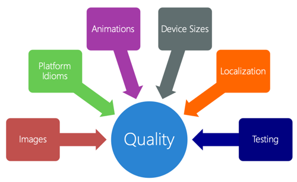
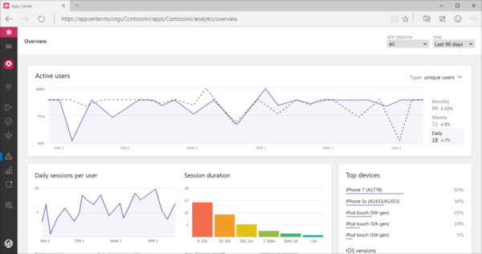

After you finish developing your app, there are several steps you'll take to ensure it's ready for distribution.

In this unit, you'll work through a series of steps to ensure your application is ready for publishing. Following these steps will save you time during the submission process and help you reduce the risk of your app being rejected.

## Polish your app

Users have higher expectations for mobile applications now than they did when smart phones first were released. If your app looks or behaves poorly, users will probably switch to another one that's better. That's why it's important to pay attention to quality.

You'll want to focus on these considerations:

- **Review image quality**: Make sure things look crisp and sharp in every resolution.
- **Use the platform features**: Take advantage of what makes the platform great. Consider iOS 3D Touch and Android navigation drawer. Your users will appreciate that you use the features they love on their devices.
- **Use animations**: Animations let you subtly draw the user's attention to important areas. Show users that you spent time and effort creating your app's user interface.
- **Test your app on different devices**: Testing on different devices allows you to make sure your app scales properly and that all features are available on any form factor.
- **Localize your app to different cultures and languages**: Localization can really expand your application's user base.

## Localize your app

:::image type="icon" source="../media/2-localization.png":::

Users prefer apps in their native language. Some applications might not even be usable if they're not properly translated. Without translations, you could be excluding a large percentage of your potential users.

Surveys show that language is so important in some countries and cultures that people will pay more for a localized app.

## Test your app

Most mobile app stores will test your application before it's published.

Your application will be rejected if it crashes or behaves incorrectly at any point during the review phase. Apps that crash are automatically rejected.

All your applications will go through some form of development testing. It might be unit tests to verify your code logic or user acceptance tests to verify the scenarios in your app. Whatever type of tests you run, make sure to test the edge cases. Include the scenarios that you hope don't happen often but that you know will happen periodically.

Let's look at a few of these scenarios.

### Network connectivity

Most mobile applications use a network connection. What happens when you don't have a connection? What happens if the connection drops out unexpectedly while your app is communicating with a server? Make sure you test both connectivity scenarios.

### Older devices

Users have different upgrade cycles for devices, depending on form factor. Tablets generally tend to be updated less frequently than phones. It's important to test the performance of your app on older devices.

### User-entered data

Mobile apps typically accept user-entered data. What happens when the user enters bad or even malicious data into the application? If your app is storing data in a SQL-type database, like SQLite, it might be vulnerable to SQL injection attacks.

### Device orientation

Most mobile devices have two display orientations: portrait and landscape. Make sure your application responds properly when the device is rotated. And most mobile operating systems let you run your applications side by side. Running an app side by side immediately changes the app's orientation and layout.

## Automated UI testing

*Xamarin.UITest* is a free framework that lets you automate your application's UI execution. Consider creating UI tests with Xamarin.UITest to run your app through its functionality.

You push your tests and your app up to Visual Studio App Center, where it runs on a variety of physical devices. The devices include different form factors, OS versions, and capabilities. The tests you create are the same kinds of tests that vendors often run before they allow your apps in their stores. You'll often find interesting, subtle issues you don't expect, especially when you're trying applications on different-sized screens.

## Add analytics

It's helpful to get reports on how your app is being used and any problems people are having with it.

Each of the three vendors, Apple, Google, and Microsoft, have analytics engines you can integrate with that will provide your app statistics and crash information.

Microsoft provides App Center Analytics. We highly recommend that you use this offering because it integrates nicely with the tools and with the runtime.
