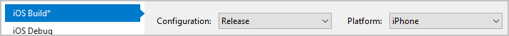

There are some steps you should take before you hit the button to create your app distribution package. For example, you should create a release build and add some icons.

In this unit, you'll go through some of these final steps.

## Create a release build

An app runs differently when built for *release* rather than *debug*. Make sure you always test release builds and that you submit the build that you've tested. And make sure to test on a real device. Testing on a real device often affects how the compiler and runtime generate code, which is based on the processor and architecture.

Verify that your project's build optimizations are turned on. Optimization is turned on by default. If for some reason it's been turned off or you're including debug information, be sure to reset to the optimizing settings.

All app stores will reject builds that contain any debug information.

## Add icons and splash screens

Your app's icon is often the first thing users see when they browse the app stores. The icon is also what draws them back to your application after it's installed.

Design the icon to be simple, eye catching, and meaningful to your app's purpose. Be sure to include multiple versions of your icon to support different resolutions. Include a splash screen, and, if possible, display an animation if your app takes a long time to load. A splash screen will make the load time feel shorter.

## Update version info

Versioning is important for both you and your users. You should use versioning to show your users when the app includes major and minor changes.

### Major versions

Reserve changes to the major-version component of the version number for significant updates. Use a major version when you launch a new feature or a new build that includes significant app-wide improvements.

### Minor versions

Increase the minor-version component of the version number when you add small features or make incremental improvements.

> [!IMPORTANT]
> When you submit updates to the app stores, you'll be required to increment your version number.
