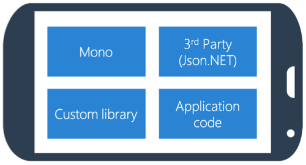
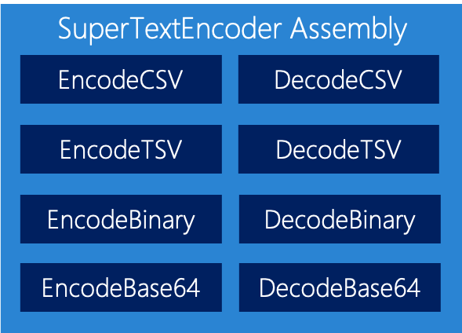
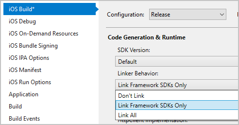

Mobile device users are sensitive about mobile applications and data usage. Even users who need to download new apps or update existing apps check the size of the application first. Xamarin provides tools to manage the final binary size of your app.

In this unit, you'll learn how to use the Linker to manage the final binary size of your application.

Let's look at the items that go into your app before we look at how to manage your app's binary file size.

## Application composition



Assemblies are the building blocks of your apps. These building blocks include Mono, third-party libraries, and libraries that you've created and referenced.

## Referenced assemblies

By default, if you use even a single type from a referenced assembly, your app will include the entire assembly in the output folder.

Let's look at an example. Say you have a library called SuperTextEncoder. SuperTextEncoder has several encode and decode classes:



Let's assume you want to use only a single method from the **EncodeBinary** class. The code that you reference forms part of a single assembly. When you reference even a single method, the entire assembly is included in your app.

In the desktop world, including whole assemblies is fine. It's acceptable for two reasons. First, you have plenty of storage. Second, much of the .NET Framework is probably pre-installed and shared.

In the mobile world, nothing is sharable. Everything will be included in your app package.

If you use types from several assemblies, your app will quickly grow. Because some of the framework assemblies are large, even simple apps can increase in size by 20 Mb to 40 Mb.

## What are SDK assemblies?

SDK assemblies are framework assemblies that contain the .NET Framework and runtime. SDK assemblies also include the iOS and Android framework libraries that you use in your apps.

## What is linking?

*Linking* is the process of removing unused code from referenced assemblies, including platform, third-party, and custom assemblies. Typically, linking produces smaller application binaries.

Mono includes an open-source optimizing linker named Cecil. Cecil can remove types and methods that you don't use in your Mono-based apps, including Xamarin.iOS and Xamarin.Android apps. The Linker analyzes all the code paths in your app and makes a list of every method and field that you use. It then throws away all the items that aren't used. The Linker process is similar to what the garbage collector does with in-memory objects.

Optimization can have a dramatic effect on the size of the compiled app. Your application size can typically be reduced by half of its original size or more.

## Linker settings

Linker settings can dramatically affect the size of your app's package. The Linker provides three options for linking your iOS and Android apps:

- Don't Link
- Link Framework SDKs Only
- Link All



You can set this option in the project options on the build tab for either iOS or Android.

Let's have a look at each of these options.

### Don't Link

Don't Link does exactly what the name suggests. No linking occurs. All assemblies are added as-is to the app package.

For debug builds, you should use Don't Link because it's the quickest compilation type. But Don't Link also generates the largest app package.

As an example, we used Don't Link on an app. The outputted binary size for iOS was 75.3 Mb. We'll use the other options on this same app so you can see how well the Linker works.

### Link Framework SDKs Only

By default, release builds use the Link Framework SDKs Only setting.

The Link Framework SDKs Only switch includes what's referred to as "safe to link" assemblies. "Safe to link" assemblies are assemblies that have an assembly-level attribute applied. The attribute indicates that the assembly should be evaluated by the Linker.

Linking these assemblies almost always works fine because the specific assemblies the Linker examines have been built to ensure that necessary code is always preserved.

You should, at a minimum, always link the SDK assemblies in your release build.

In our example production app, the package size was reduced from 75.3 Mb to 34.1 Mb when we stripped the framework assemblies.

### Link All

Link All tells the Linker to scan all assemblies in your project.

Link All is the most risky option. The Linker can be aggressive. It might remove something that your code depends on but wasn't explicitly referencing.

Link All is also the option that will reduce your package size the most, especially if your app has many non-SDK assemblies or third-party assemblies that aren't marked as safe to link.

In our example app, the total size dropped to 22.9 Mb. That's a 69 percent reduction, which is significant.

## "Safe to link" assemblies

You can include your own assemblies as part of the SDK set that's considered safe to link. Doing so is especially useful if you plan to share the assemblies as framework assemblies.

You can use `LinkerSafeAttribute` to show that code is Linker safe. The attribute is part of the iOS and Android runtimes. It helps you avoid creating a dependency on the iOS and Android runtimes themselves.

But `LinkerSafeAttribute` isn't available in any of the .NET Standard versions. When you share code, you'll typically use a .NET Standard library. Not having the attribute available is a problem, but there's a solution. The Linker looks for the name "LinkerSafeAttribute" in any namespace, not the specific type. You can define a custom attribute named `LinkerSafeAttribute` in your shared libraries:

```csharp
public sealed class LinkerSafeAttribute : Attribute
{
    // Can be defined in your PCL code
}
```

You then use either the built-in iOS or Android attribute or your own version and declare an assembly-level instance:

```csharp
// Add in a single source file to tell the
// Linker that this assembly should be considered an
// SDK assembly
[assembly: LinkerSafe]
```
