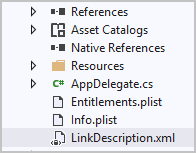
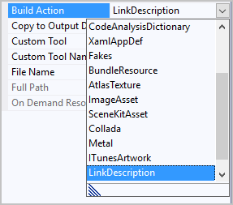

The Linker will walk through every bit of your code and remove anything you don't have a direct reference to, including your own code.

If that sounds a little dangerous, it is. The Linker can only work with what it sees. In complex apps, you often use abstractions and other techniques to hide final implementations. These techniques hide references from the Linker, which means you can end up with a program that won't run because it doesn't have all the classes and assemblies it needs.

In this unit, you'll learn how to control the Linker so that it ignores specific assemblies, types, and operations.

## Linker directives

Configuring the Linker to ignore an entire assembly might not be fine-grained enough for your needs.

Say you're using a third-party library in a single assembly, and you only use a single method from a single class. Remember, even if you include only one method, the entire assembly is added to your binary.

If you want more control, you can provide hints to the Linker through two mechanisms:

- Attributes applied in your code.
- A Linker directive file that's written in XML and provided to the Linker during the compile process.

Let's look at each approach.

## Preserving types in library code

The first approach is to go through your classes and add a `Preserve` attribute to types that you know you need. This attribute has been added to critical types in the SDK assemblies. The attribute tells the Linker that the type must always be included, even if it's not directly referenced.

When you apply this attribute to a class, you can also set the `AllMembers` property. `AllMembers` specifies to preserve not only the type, but all the fields, methods, and properties in it.

```csharp
[Preserve(AllMembers=true)]
public class TodoTask
{
    [PrimaryKey, AutoIncrement]
    public int ID { get; set; }
    public string Name { get; set; }
}
```

If you want to preserve the entire assembly, you can put the attribute on the assembly itself, as shown here:

```csharp
[assembly: Preserve]
```

If you just want to keep a specific field, property, or method, you can put the `Preserve` attribute right in the definition itself.

For example, the following class contains an `ID` property: 

```csharp
public class TodoTask
{
    [PrimaryKey, AutoIncrement]
    public int ID { get; set; }
    public string Name { get; set; }
    public string Notes { get; set; }
    public bool Done { get; set; }
}
```

You might not reference the `ID` property in your code directly, but you might still want the field created in the database. The property will be linked away unless you preserve the property in the class definition. Here's how you can use the `Preserve` attribute protect the property:

```csharp
public class TodoTask
{
    [PrimaryKey, AutoIncrement]
    [Preserve]
    public int ID { get; set; }
    public string Name { get; set; }
    public string Notes { get; set; }
    public bool Done { get; set; }
}
```

### Preserving types in a .NET Standard library

You're probably using .NET Standard libraries to hold your shared business logic.

Like `LinkerSafeAttribute`, the `Preserve` attribute is part of the core Xamarin.iOS and Xamarin.Android assemblies. It's not available to .NET Standard libraries.

The Linker looks for the `Preserve` attribute by name only. You can define your own library version of the attribute and then apply it to your classes and members. The Linker will respect the attribute.

The namespace isn't important. The Linker only checks the name of the attribute and whether two fields are defined:

- `AllMembers`: Used when the attribute is applied on the type itself.
- `Conditional`: Allows you to keep a member only if the type itself will be kept because of a direct dependency.

Here is an example of a `PreserveAttribute` class definition:

```csharp
[AttributeUsage(AttributeTargets.All, AllowMultiple=true)]
public sealed class PreserveAttribute : System.Attribute
{
    public bool AllMembers;  // Keep all members
    public bool Conditional; // Keep member only if the type itself is kept
}
```

## Advanced Linker settings

The second approach is to create a Linker configuration file. You use XML to create a list of specific assemblies, types, and operations to preserve. The Linker uses the information to make sure the preserved items are kept in the final binary.



Keep in mind that you only need to list things that you don't actively reference but want to keep. Hard references to methods and types in your code will always be preserved.

To use the Linker XML file, you add it to your project and then set the **Build Action** for the file to **LinkDescription**:



The format of this file is well defined. It lets you control the process as much as you need to.

### Preserving an entire assembly

You can direct the Linker to preserve an entire assembly. All types and methods will be kept in the final binary even if your code doesn't reference them.

Let's start by looking at a basic example:

```xml
<?xml version="1.0" encoding="UTF-8" ?>
<linker>
    <!-- preserve entire App.Core assembly -->
    <assembly fullname="App.Core">
        <type fullname="*"/>
    </assembly>
</linker>
```

The file will always have a root tag of `<linker>` and a set of `<assembly>` children.

In the `<assembly>` section, you can specify a full name or partial name for each assembly you add to the file. Here, you're telling the linker to keep the **App.Core** assembly. This definition will match any assembly by the assembly name.

Inside the `<assembly>` tags, you'll list the types to keep. You can specify to keep all types by using a wildcard.

### Preserving a specific type

You can also add `<type>` tags to preserve specific types. For example, say you want to keep the **MainPage** type in the **App.Core** assembly. You can use this XML to describe the exclusion:

```xml
<!-- preserve the App.Core.MainPage type in the App.Core assembly -->
<assembly fullname="App.Core">
    <type fullname="App.Core.MainPage" preserve="fields" />
</assembly>
```

Notice the `preserve` attribute in the previous example. This attribute is optional. You'll use the attribute to tell the Linker to preserve every field in the type. By default, the Linker will preserve all operations because none are listed.

The Linker file also lets you be specific about operations that you want to preserve. To preserve operations, you can use the `<method>` and `<field>` tags. If you have overloaded methods, you can specify the signature instead of the name, as shown here:

```xml
<assembly fullname="App.Core">
    <type fullname="App.Core.MainPage">
        <!-- preserve the ValueChanged event -->
        <method name="add_ValueChanged"/>
        <method name="remove_ValueChanged"/>
        <!-- preserve the Value property -->
        <method name="get_Value"/>
        <method name="set_Value"/>
        <!-- preserve the _value field -->
        <field name="_value"/>
    </type>
</assembly>
```

### Preserving all types in a namespace

You can also preserve types by referring to the namespaces they're defined in:

```xml
<!-- preserve the namespaces in the App.Core assembly -->
<assembly fullname=" App.Core">
    <namespace fullname="App.Core" />
    <namespace fullname="App.Core.Utils" />
    <namespace fullname="App.Core.ViewModels" />
</assembly>
```

When you define types through namespaces, every type declared in the specified namespace is kept.

## Create a distribution package

After you have a compacted app, you can create a distribution package. Distribution packages are often zipped containers that contain the app and all its assets. Each platform uses packages a little differently. The best way to stay up to date is to check the documentation from each vendor. You can also find excellent guides on [docs.microsoft.com](https://docs.microsoft.com/).