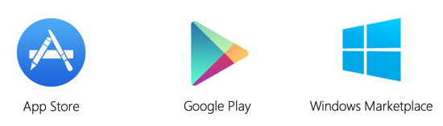

After you've created a distribution package, you'll want to publish it to an app store.

In this unit, you'll learn about the different publishing options and the rules you need to follow to have your app accepted.

## Publishing models

There are three ways to distribute your apps:

- Ad hoc or sideloading
- Store
- Enterprise

Let's look at each of these distribution options. Each option serves a specific purpose. After you understand each option, you can choose the best one.

### What is ad hoc or sideloading?

**Ad hoc or sideloading** allows you to distribute your apps directly to your customers. Android supports this type of distribution without any restrictions. Apple and Microsoft allow this distribution type only for testing purposes and limit the number of devices you can deploy to.

### What is store publication?

**Store publication** allows you to distribute your app through a store. All three vendors support this distribution model. Store publication is the most common approach. It provides for both commercialization and broader market visibility because it's marketed by the vendors.

### What is Enterprise publication?

**Enterprise publication** is designed for internally used apps within a corporate structure. For example, say you work for a computer manufacturer. You have an application that's used to manage your warehouse inventory and used only in-house. You can distribute the app on your own intranet.

For Android, enterprise publication is the same as the ad hoc approach. Google puts no limitations on private distribution. You essentially self-sign your apps with your own certificates.

Apple and Microsoft use enterprise publication to distribute apps without using their public stores. Both require you to obtain an enterprise certificate and follow their rules of deployment.

## Choosing a store and market

The store model is the most common deployment option among app developers. Each vendor has a branded store where you can publish your app.

The vendor markets your app, provides access to it from devices, and hosts the binary for you.

Google is, by far, the most open of the platforms. There are more than a hundred app stores for Android. These stores support customized Android builds, different locales, and even specific categories of applications. If you support Android, you should consider distributing your app in multiple stores.

Apple and Microsoft each have only a single app store that you can use to distribute your app.

## Read the publishing agreement

Before you publish to any public store, make sure to read through the specific store's publishing agreement. The agreement describes the rules each vendor expects you to follow. The agreement also includes guidelines outlining what content is considered acceptable.

Each store has different requirements, and some are stricter than others. Generally speaking, you should:

- Avoid illegal activity.
- Avoid internal or undocumented APIs.
- Make sure your content matches the age restrictions.
- Avoid pictures or depictions of real violence.
- Avoid hidden features.

## Provide marketing information

Your app's icon and screenshots are the first things potential buyers will see. But there are several additional items you'll provide to the store.

### What is SEO?

*SEO*, or search engine optimization, is the process that allows you to improve search engine rankings.

### What information do you need to give the store?

Every store requires publishing data that you need to include with your binary to describe your app. You'll include:

- One or more videos that show your app in action.
- Screenshots of important scenarios from your app.
- An application name and description.
- A description of what the app does.
- SEO keywords to help users find your app in the sea of apps.

Spend some time thinking about how to best show off your app. Know the audience that you want to attract and tailor your marketing data to match that audience.

## App review process

After you submit your app, it will go through a review process. Reviews might take some time, often between 2 and 10 days, depending on the time of year. For example, the review process might take a little longer during holidays.

You'll get an email after your app is reviewed. The review email explains that the app is published and available or that it's been rejected.

If your app is rejected, remember that you can always fix the issue and resubmit the app.