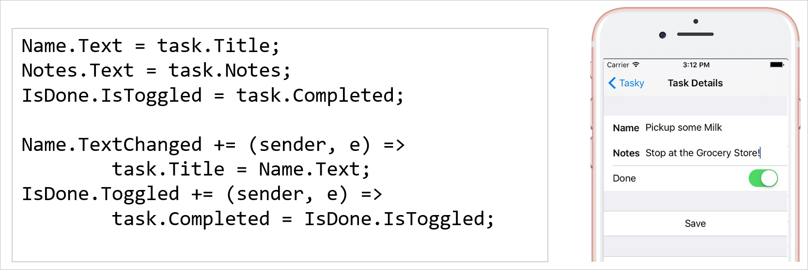
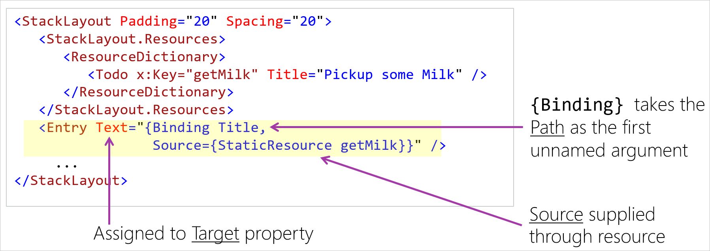
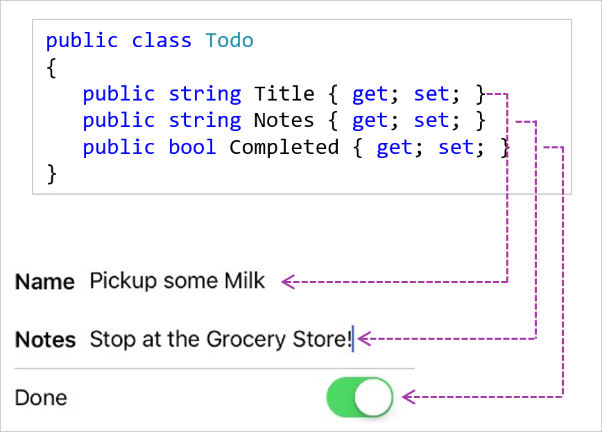

Most applications are driven by data. It might be user-generated or downloaded from the internet. The data might be compiled directly into the app. Even games rely heavily on data for scores, leader boards, account tokens, and so on. When your data changes, make sure that what's shown in the UI stays synchronized with what's stored in your code-behind.

## Disadvantages of using code to synchronize data and UI

Apps typically have two synchronization tasks:

* New data arrives from the web. You update the UI.
* The user enters values into the UI. You update your data-model objects. 

You can use code for both of these jobs. The following image shows the UI for a "to-do list" application and the code used to transfer data between the UI and the data-model objects. The `task` object is the data model. `Name`, `Notes`, and `IsDone` are the UI elements that display the data. Notice that there are two blocks of code: one loads data into the UI, and the other reacts when the user changes the data.



This approach can work for small apps. But it gets difficult to do as your app gets bigger and the interactions become more complex. For example, you might have several controls that manipulate the same data. Or there can be events in one control that affect the state of other controls. It's also challenging to write unit tests when all your logic is in the `Page`'s code-behind file.

## What are data bindings?

A _binding_ ties two properties together. One property is in your UI and the other is in your data-model object. If the value of either property changes, the binding object can update the other one. In other words, bindings are intermediary objects that synchronize your UI and data. We use the terms _source_ and _target_ to identify the two objects involved.

The rules for source and target are different:

* **Source**: A source can be an object of any type. In practice, you typically use a C# data-object as your source. You need to identify the property on that source object to participate in the binding. You identify the property by setting the `Path` in the binding.

* **Target**: The target object must derive from `BindableObject`. The target property must be implemented by using a special property called a `BindableProperty`. All Xamarin.Forms controls ultimately derive from `BindableObject` (via `View`). Their properties are mostly `BindableProperties`. This architecture makes all Xamarin.Forms controls convenient binding targets.

The following illustration summarizes the rules for the source and target of a binding.


## Create data bindings in XAML

It's most common to create bindings in XAML. There are a couple of reasons to prefer XAML. First, most people consider bindings to be part of their UI code because the bindings get data for the UI to display. Second, there's a markup extension named `Binding` that makes it easy to do.

Let's look at an example binding created in XAML by using the `{Binding}` markup extension. It's binding the `Todo.Title` property of the source to the `Entry.Text` property of the UI control.



For the source:

* The object is in the page's resource dictionary with a `Key` of `getMilk`.
* The `Path` is `Title`.

For the target:

* The object is the `Entry` control.
* The property is `Text`.

When this XAML file is loaded, the `{Binding}` markup extension creates a binding between our `Todo` and our `Entry`. The binding object reads `Todo.Title` and loads the value into `Entry.Text`.

## Create data bindings in code

You can create bindings in C#. This technique can be useful if you generate your UI dynamically. In practice, it's rare because the structure of most UIs is static and the syntax for code-based bindings is verbose. We'll take a quick look at how to do it in case you ever need it.

```csharp
// Create Source
ToDo task = new ToDo() { Title = "Pickup some Milk", ... };

// Create target
Entry Name = new Entry();

// Create binding, identifying Source and Path
Binding nameBinding = new Binding()
nameBinding.Source = task;
nameBinding.Path = "Title";

// Set Binding, identifying Target object and Target property
Name.SetBinding(Entry.TextProperty, nameBinding);
```

There are a couple interesting things to call out here.

* We identify the target property by using the name of the bindable property. Here, we use `Entry.TextProperty`. Bindable properties are defined by static members that use the naming convention of a "Property" suffix. The instance property named `Text` is simply a convenient wrapper around the underlying bindable property.

* The `Path` is of type string. In our example, we set the path to a simple property name `Title`. Path lets you do more powerful things. For example, you can use nested properties like `Title.Length`. You can even use indexers for enumerable values, like `Title[0]`. This rich `Path` syntax also is available to XAML bindings.

## Use the same source for multiple bindings

So far we've discussed one binding at a time. But in the most common situation, we have several controls that pull data from the same source object. For example, the following image shows part of the UI for a to-do app and the data-object that's used as the binding source. Notice how this page displays three properties from a single `Todo` object.



This situation is so common that bindings have a special case to handle it. The `BindableObject` class defines a property named `BindingContext`. All Xamarin.Forms pages, layout panels, and controls inherit from `BindableObject`, so they all have this property.

When you create a binding, the `Source` setting is optional. A binding without a setting for `Source` automatically searches the visual tree for non-null `BindingContext` properties:

1. The search begins with the target object itself. If that `BindingContext` is non-null, the search stops and the `Path` is applied to that object. If the `BindingContext` is null, then the search moves on.

1. The search next goes to the parent of the target object. Typically, this object is a layout panel. The same process happens here. If the panel's `BindingContext` is non-null, the search stops. If it's null, the search moves to the parent of the panel.

1. This process continues until it reaches the page. The search ends by checking the `BindingContext` of the `Page`.

It's common to set the `BindingContext` at the page level. Our XAML bindings contain only the source path, which helps make the XAML smaller and more readable.

```csharp
// In code-behind we set Page.BindingContext
BindingContext = new Todo() { Title = "Pickup some milk", Notes = "Stop at the Grocery Store!", Completed = true }
```

```xml
<!-- In XAML our bindings do not need to set Source -->
<StackLayout Padding="20" Spacing="20">
    <Entry Text="{Binding Title}" />
    <Entry Text="{Binding Notes}" />
    <Switch IsToggled="{Binding Completed}" />
</StackLayout>
```

There's one last nice feature that's worth mentioning. Bindings watch for changes to the *object reference* of their source. This feature works even for bindings that use `BindingContext` as their source. If the `Source` or `BindingContext` is reassigned to another object, the bindings grab the data from the new source and update their target.