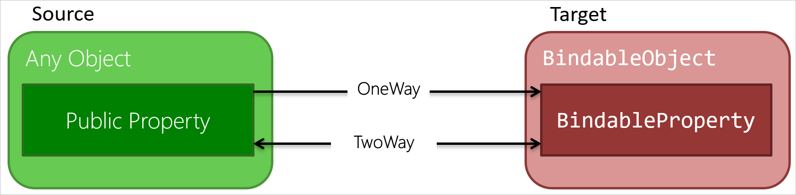
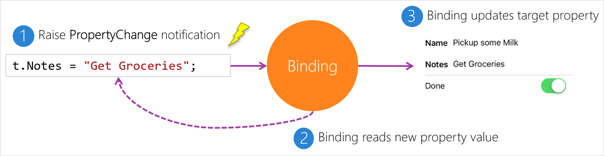

Not every data binding needs the same capabilities. You want to choose a behavior that minimizes code complexity and processor burden. There are two operations you can use:

- Copy to the UI when code-behind data changes.
- Copy to code-behind when the UI changes.

## One-way vs. two-way bindings

A _one-way binding_ transfers data only from the source to the target. Remember that your source is typically a code-behind object. Suppose you have a property in your source that you bound to a `Label`. You obviously want the data from the source to be loaded into the `Label`. But, is there any need to send data back the other direction? That doesn't even make sense for a `Label`. There's no way the user can edit the value. This scenario is exactly where you use a one-way binding.

A _two-way binding_ sends data in both directions between the source and target. Consider binding a source property to an `Entry` control. This case feels different than the `Label` example because the user can edit the value in the `Entry`. You want to capture the user's input and transport it to the code-behind data object. This situation is where you use a two-way binding.

The following illustration shows the two types of bindings you can create. Notice that "one way" means "copy only to the UI."



## What is binding mode?

The _mode_ of a binding determines whether it's one way or two way. Any binding that you create can be either one way or two way. It's determined by the setting you select for the `Mode` property on your `Binding` objects. The following code shows how to explicitly set the mode:

```xml
<Label Text="{Binding Title, Mode=OneWay}" />
<Entry Text="{Binding Notes, Mode=TwoWay}" />
```

## Default binding mode

The default binding `Mode` is different for every property. It's determined by whether the target property can receive user input:

- Properties that are user editable default to two way. Examples are `Entry.Text` and `Switch.IsToggled`.
- Properties that aren't user editable default to one way. Examples are `Label.Text` and `Picker.Title`.

This decision might seem confusing at first, but it helps keep your XAML as clean as possible. It means the default `Mode` is almost always what you want. The following code shows two pairs of equivalent binding declarations. There's no need to set the mode in either case.

```xml
<Label Text="{Binding Title, Mode=OneWay}" />
<Label Text="{Binding Title}" />

<Entry Text="{Binding Notes, Mode=TwoWay}" />
<Entry Text="{Binding Notes}" />
```

## How do bindings know when the target changes?

When the user enters a new value into the UI, a two-way binding needs to send that value to the source. How does the binding know the user has changed the UI?

Recall that the target of a binding must have `BindableObject` as a base type, and the target property must be a `BindableProperty`. `BindableProperty` has a built-in notification mechanism that raises an event when its value changes. Two-way bindings automatically subscribe to these events.

For example, a binding that targets an `Entry.Text` property subscribes to the `Text` property's change event. When the property raises the event, the binding knows that the user entered a new value into the `Entry.Text` field. The binding grabs the new value from the entry and sends it to the source.

## How do bindings know when the source changes?

What if the value of a source property changes? For example, suppose a push notification arrives from the web that updates a `Todo` item. Both one-way and two-way bindings should send the new value to the UI.

This scenario presents a challenge. Most source objects are implemented by using regular C# properties, as shown in the following code. There's no built-in way for the binding to know one of these properties was set.

```csharp
public class Todo
{
    public string Title { get; set; }
    public string Notes { get; set; }
    public bool Completed { get; set; }
}
```

The solution is for you to write code that raises an event when any of your source properties change. You need to implement the `INotifyPropertyChanged` interface on your source class. The interface has one member, an event named `PropertyChanged`. Bindings automatically look for this interface on their source object and subscribe to the event.

To implement the interface, modify your property setters so they raise the event when a property value changes. The following code shows how to implement one of the properties on your source object. Repeat this pattern for your other properties.

```csharp
public class Todo : INotifyPropertyChanged
{
    public event PropertyChangedEventHandler PropertyChanged;

    string notes;
    public string Notes {
        get { return notes; }
        set {
            if (notes  != value) {
                 notes = value;
                PropertyChanged?.Invoke(this, new PropertyChangedEventArgs(nameof(Notes));
            }
        }
    }
    ...
}
```

The recommended style shown in the previous code has a few subtleties worth mentioning:

- Check that the incoming value really is different. Don't raise the event if the new value is the same as the old value.

- Update the backing field before you raise the event. The new value then is available to the event's subscribers.

- Pass the name of the property that changed when you raise the event. It's error prone to hardcode a property name like `"Notes"` because you might fail to update that string if you change the name of the property. Many developers like to use the `nameof` operator to generate a string for the property name. If you change the property name, your refactoring tool should update the `nameof` expression.

The binding's event handler checks to see if the property name you passed matches the binding's `Path`. In other words, is this event a notification for the property that this binding is responsible for? If so, the binding reads the new value of the property and updates the UI. The following illustration shows an overview of the process.

