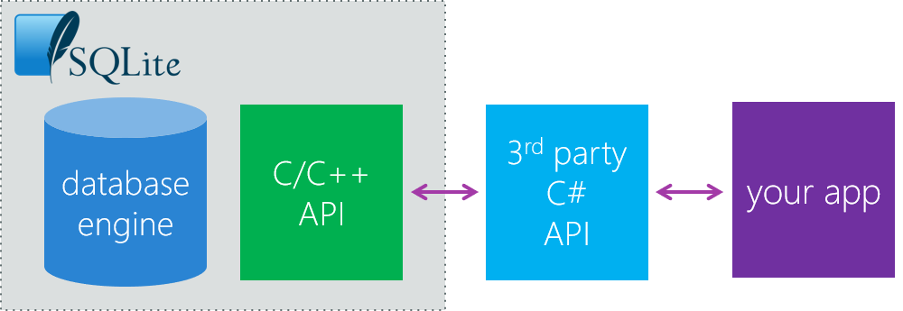

Storing data in SQLite is useful when you have relational data. For example, suppose you are building an application to manage a library. Each book in the library has one or more authors, and an author can write multiple books. This kind of relationship can be easily modeled in a SQLite database.

In this unit, you'll learn how to use SQLite in a Xamarin application by using *SQLite.NET*. 

## What is SQLite?

SQLite is a lightweight cross-platform local database that's become an industry standard for mobile applications. SQLite doesn't run on a server and is stored in a single disk file on the device's file system. All read and write operations are run directly against the SQLite disk file.

The SQLite native libraries are built in to Android and iOS by default; however, the engine only supports a C/C++ API. This scenario isn't ideal for .NET developers, who want some way  for SQLite and .NET to interact.


> [!NOTE]
> If you wish to download SQLite.NET, you can find it here: https://www.nuget.org/packages/sqlite-net

## What is SQLite.NET?



There are several C# wrappers around the native SQLite engine that .NET developers can use. Many Xamarin developers use a popular C# wrapper called SQLite.NET.

SQLite.NET is an *object-relational mapper*. It helps simplify the process of defining database schemas by enabling us to use the models that are defined in our projects to serve as the schema. For example, consider the following code snippet:

```csharp
class User
{
    public int Id { get; set; }
    public string Username { get; set; }
    ...
}
```

By using an object-relational mapper, you can take this initial *User* class and automatically have it create a database table called *User* that has columns for *Id* and *Username*.

SQLite.NET is shipped as a NuGet package. Add it to each of your projects in Xamarin.Forms.

## How to connect to a SQLite database

SQLite.NET establishes a connection to a SQLite database through a **SQLiteConnection** object. When you instantiate this object, you have to pass in the filename for the database file. It will then either open the file if it exists or create it if it isn't present.

Following is an example of how to do it:

```csharp
string filename = ...
SQLiteConnection conn = new SQLiteConnection(filename);
```

Remember that `filename` needs to point to a location in the app sandbox.

## How to create a table

Recall that SQLite.NET is an object-relational mapper, which means you can build our database schema from C# classes. Let's go back to the previous example of our **User** class.

```csharp
class User
{
    public int Id { get; set; }
    public string Username { get; set; }
    ...
}
```

SQLite.NET can build our database schema from this C# class, but there are many attributes that you can add to the class to make modifications to the schema.

Here are some examples of available attributes:

- **Table**: Specify the name of the table if you want it to be something other than the class's name.
- **PrimaryKey**: Specify that a column is the primary key.
- **AutoIncrement**: Specify that a column should automatically increase in value when a new row is inserted.
- **Column**: Specify the name of a column if you want it to be something other than the property name.
- **MaxLength**: Specify the maximum number of characters that can be used in the column.
- **Unique**: Specify that the value in the column must be unique from all other rows.

Going back to the **User** class, following is an updated version that uses all these attributes:

```csharp
[Table("user")]
public class User
{
    // PrimaryKey is typically numeric 
    [PrimaryKey, AutoIncrement, Column("_id")]
    public int Id { get; set; }

    [MaxLength(250), Unique]
    public string Username { get; set; }
    ...
}
```

After you define our C# class to use as our database schema, you need to tell SQLite.NET to create the table. To do that, use the **CreateTable** method on the **SQLiteConnection** class. Here's an example:

```csharp
SQLiteConnection conn = new SQLiteConnection(filename);
conn.CreateTable<User>();
```

If you call the **CreateTable** method and the table already exists in the database, it checks the schema class to see if there are any changes. If there are any changes, the operation becomes an update, and it attempts to update the database schema.

## How to do basic read and write operations

After you  create a table, you can start interacting with it. The first thing you can do is insert some data. To do this, use the **Insert** method on the **SQLiteConnection** instance. For example, if you want to insert a new *User* into the database, the code would look similar to the following example:

```csharp
public int AddNewUser(User user)
{
    int result = conn.Insert(user);
    return result;
}
```

The **Insert** method returns an **int**, which represents the number of rows that were inserted into the table. In this case, that number is one.

It's common to want to retrieve the data from a table after you insert it. SQLite.NET makes it easy to retrieve all the rows from a table by using the **Table** method. Here's an example of how you would use it:

```csharp
public List<User> GetAllUsers()
{
    List<User> users = conn.Table<User>().ToList();
    return users;
}
```

> [!NOTE]
> The **Table** method returns a **TableQuery\<T>**. To get a **List**, you use the **ToList** method.

## Execute a SQLite query by using LINQ

Although you can use the **Table** method to retrieve all the rows from a table, you don't always want to do that. Sometimes you want to return only a subset of the rows or run more complicated queries. For these tasks, use LINQ with SQLite.NET.

SQLite.NET supports many common LINQ queries including:

- **Where**
- **Take**
- **Skip**
- **OrderBy**
- **OrderByDescending**
- **ThenBy**
- **ElementAt**
- **First**
- **FirstOrDefault**
- **ThenByDescending**
- **Count**

With these methods, you can use the extension method syntax or the LINQ C# syntax. For example, here's a snippet of code that enables you to get a user by username by using LINQ C# syntax:

```csharp
public User GetByUsername(string username)
{
    var user = from u in conn.Table<Person>()
               where u.Username == username
               select u;
    return user.FirstOrDefault();
}
```
