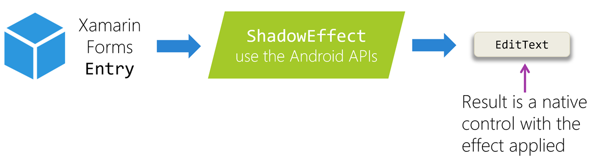
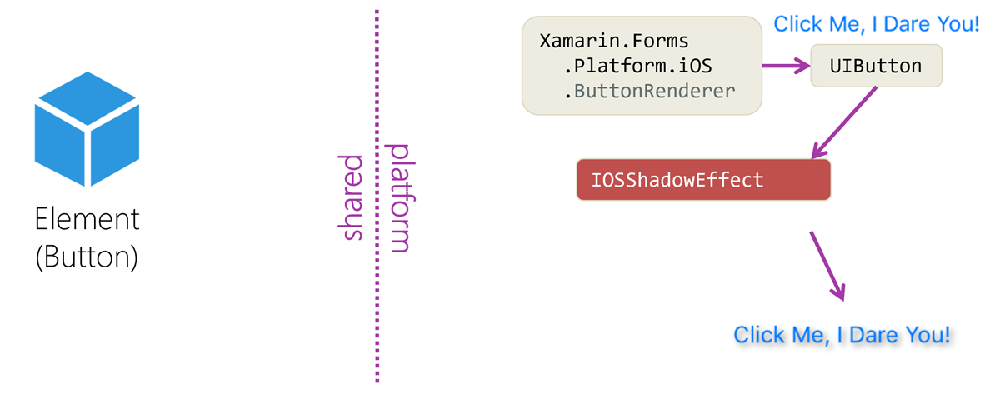

Effects are platform-specific classes that modify the underlying native control used by a Xamarin.Forms element. The native controls are usually a lot more flexible and powerful than the Xamarin.Forms element. For example, the Xamarin.Forms `Entry` effect doesn't expose a drop shadow option directly, but every supported platform has some mechanism for creating one. You can access those options through effects.



## How do effects work?

Effects are applied after the renderer has already created the native control. The effect, therefore, needs to provide only the specific modifications that it's responsible for. In the following diagram, the effect adds the drop shadow behavior.



For any effect, you need one class *per platform*, because the effect does platform-specific work. In the preceding diagram, for instance, the IOSShadowEffect applies iOS-specific APIs. Because you want to support Android with the shadow effect, you'd need an Android class as well. The platform-specific classes derive from the `PlatformEffect` base class.

The `PlatformEffect` derived classes are registered with a string value, and your Xamarin.Forms app code can look them up by that string and add them to an element.

## Resolve and add an effect to an element

From within your shared Xamarin.Forms app code, you can find an effect by using `Effect.Resolve`. This method accepts a string parameter and matches that string to a `PlatformEffect` identifier. The returned effect is cast as its ancestor type, `Effect`, as shown here:

```csharp
    // This code finds a PlatformEffect registered as "MyCompany.ShadowEffect"
    // on whatever platform we're currently running on.
    Effect shadowEffect = Effect.Resolve("MyCompany.ShadowEffect");
```

Xamarin.Forms elements have an `Effects` property of type `IList<Effect>`. You can apply the `Effect` behavior by adding it to that collection:

```csharp
    interestingButton.Effects.Add(shadowEffect);
```

You can also remove the behavior by removing the `Effect` from the collection:

```csharp
    interestingButton.Effects.Remove(shadowEffect);
```

### Don't share Effect instances

Each call to `Resolve` returns a new instance of an `Effect`. That instance should be used with only one `Element`. To apply an `Effect` to multiple elements, call `Resolve` once for each element, as shown in the following code:

```csharp
    var shadowEffectForInteresting = Effect.Resolve("MyCompany.ShadowEffect");
    interestingButton.Effects.Add(shadowEffectForInteresting);

    var shadowEffectForOther = Effect.Resolve("MyCompany.ShadowEffect");
    otherButton.Effects.Add(shadowEffectForOther);
```

## Use an effect from XAML

To apply an effect from within XAML, you create a class derived from `RoutingEffect`. The base class constructor calls `Resolve`, and you need only to pass it the identifier string. As the following code demonstrates, no additional implementation is needed in the derived class:

```csharp
public class ShadowEffect : RoutingEffect()
{
    public ShadowEffect() : base("MyCompany.ShadowEffect")
    {}
}
```

That class can now be used in XAML to instantiate and add the effect behavior:

```xaml
<Button ...>
    <Button.Effects>
        <local:ShadowEffect />
    </Button.Effects>
</Button>
```

The use of `RoutingEffects` can also make effects that are applied in code more elegant by isolating repeated hard-coded *magic strings* into a single location. You can then allow your page code to use strongly typed references:

```csharp
    // No need for an explicit call to Resolve with a 'magic string'
    interestingButton.Effects.Add(new ShadowEffect());
```
