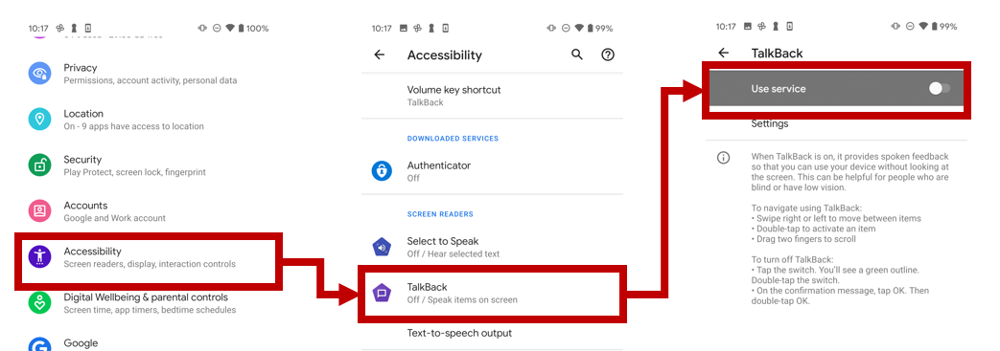
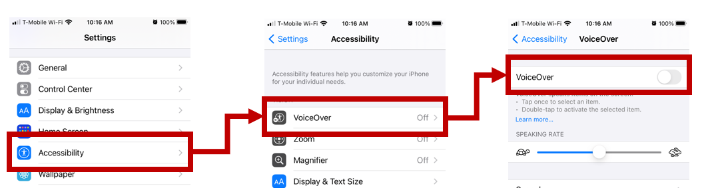
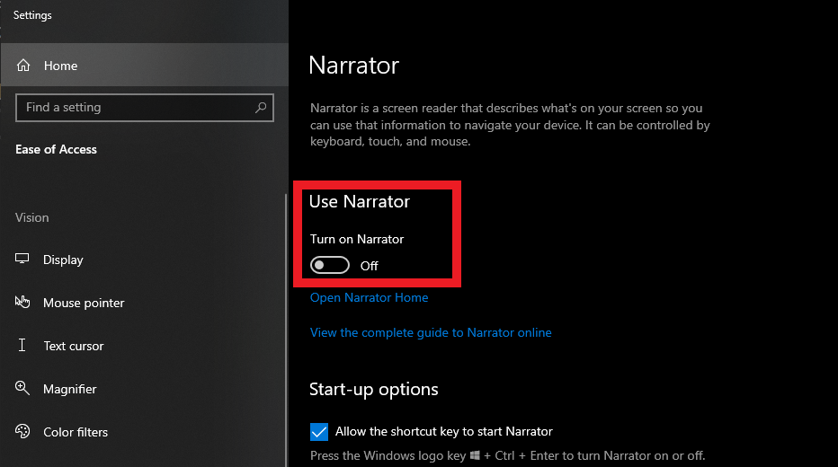

[!include]

The first step before implementing accessible features in the app is to turn on the screen reader. Let's walk through how to turn on the screen reader for each operating system to test accessibility in the app.

## Enable the screen reader on Android

TalkBack is the primary screen reader used on Android. It's included on most devices but can also be downloaded directly from the Google Play app store. Enable TalkBack on your device by following these instructions:

1. Open the **Settings** app on your Android device.
1. Browse to and select **Accessibility**.
1. Select **TalkBack** from the section that lists screen readers.
1. Turn on the **User service** toggle.
1. A confirmation dialog appears. Select **Allow** to enable TalkBack control.

We recommend that you go through the TalkBack tutorial, which opens automatically the first time you turn on TalkBack.

## Enable the screen reader on iOS

VoiceOver is the main screen reader that's available across iPhone, iPad, Mac, and other Apple devices. To enable VoiceOver on your device, follow these instructions:

1. Open the **Settings** app on your iOS device.
1. Browse to and select **Accessibility**.
1. Select **VoiceOver** from the **Vision** section.
1. Turn on the **VoiceOver** toggle.
1. A confirmation dialog appears. Select **OK** to enable VoiceOver.

We recommend that you go through the VoiceOver tutorial. Open it by selecting **VoiceOver Practice** in the **VoiceOver** section.

## Enable the screen reader on Windows

Narrator is a screen reader built directly into Windows to enable users to complete common tasks without a mouse. You can enable Narrator in one of two ways:

- Press **Windows logo key** + **Ctrl** + **Enter** together to start Narrator. You can press these keys again to stop Narrator. (On older versions of Windows, the shortcut was **Windows logo key** + **Enter**.) On many keyboards, the Windows logo key is on the bottom row of keys, to the left or right of the Alt key.

- Press **Windows logo key** + **Ctrl** + **N** to open Narrator settings, and then turn on the toggle under **Use Narrator**.

We recommend that you go through the Narrator tutorial. You can find it in the Narrator settings.
