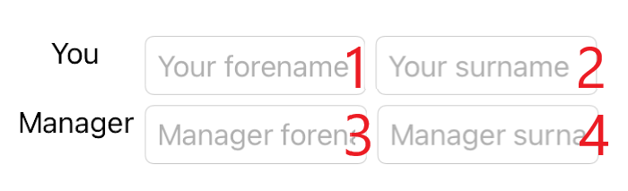

[!include[](../../includes/xamarin-not-maintained.md)]

To complete the project, you must now implement a way to enter data for the user's and their manager's forenames and surnames.

## Add data-entry elements for names

Replace `<!-- User and Manager Information -->` with the following XAML:

```xaml
<Grid
    Margin="0,20,0,0"
    ColumnDefinitions="*,*"
    RowDefinitions="Auto,Auto,Auto">
    <Label
        AutomationProperties.IsInAccessibleTree="True"
        HorizontalOptions="Center"
        Text="You" />
    <Label
        Grid.Column="1"
        AutomationProperties.IsInAccessibleTree="True"
        HorizontalOptions="Center"
        Text="Manager" />

    <Entry Grid.Row="1" 
            Placeholder="Enter forename"/>
        
    <Entry Grid.Row="2" 
            Placeholder="Enter surname" />

    <Entry
        Grid.Row="1"
        Grid.Column="1"
        Placeholder="Enter forename"/>
    <Entry
        Grid.Row="2"
        Grid.Column="1"
        Placeholder="Enter surname" />
</Grid>
```

## Run the application

When you run the application and use the screen reader to move through elements on the screen, the default order is row-based. The entry of names changes back and forth between the user and the manager. 


The default tab order of controls is the same order in which they're listed in XAML or added to a collection. In `Grid`, items are added to the layout based on the row. This is not an accessible order for data entry. Instead, we'd prefer the user to fill in the forename and then the surname before moving to the next person.

## Reorder the elements

Reorder the `Entry` elements so they appear in the order in which the screen reader should read them:


```xaml
<Grid
    Margin="0,20,0,0"
    ColumnDefinitions="Auto,*,*"
    RowDefinitions="Auto,Auto">
    <Label
        AutomationProperties.IsInAccessibleTree="True"
        VerticalOptions="Center"
        Text="You" />
    <Label
        Grid.Row="1"
        AutomationProperties.IsInAccessibleTree="True"
        VerticalOptions="Center"
        Text="Manager" />
    <Entry Grid.Row="0" Grid.Column="1"
        Placeholder="Your forename"/>

    <Entry Grid.Row="0"
        Grid.Column="2"
        Placeholder="Your surname" />
    <Entry
        Grid.Row="1"
        Grid.Column="1"
        Placeholder="Manager's forename" />
    <Entry
        Grid.Row="1"
        Grid.Column="2"
        Placeholder="Manager's surname"/>
</Grid>
```

Now, when you run the application, you'll see the new column-based accessibility order as you move through the elements. You've also improved the screen reader information on `Entry` by updating `Placeholder` with more valuable information that's read back, such as "Manager's surname" and "Manager's forename."




> [!NOTE]
> If you're interested in further changing the accessibility order, you can use APIs for that. However, you should maintain a logical and meaningful content order before using those APIs.

You've now explored multiple ways to enhance the accessibility of the application. Let's recap what you've learned and discover even more ways to make apps accessible.
