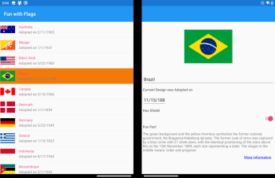

Mobile devices are becoming more varied in size and shape, such as the dual-screen Microsoft Surface Duo. Applications can take advantage of the additional space to build new features, but still need to work well on traditional devices.

Suppose you're building a data-driven app where the user drills down into more details. On a single-screen device the user will typically be switching back-and-forth between screens, while a dual-screen device provides space for both the list and detail information to be shown at the same time. The `TwoPaneView` control can be used to build apps that work well for both.

In this module, you'll use `DualScreenInfo` and `TwoPaneView` to display a list of items, and navigate into more details for each item. You'll start with an existing single-screen app, and by adding a `TwoPaneView` show data in the other pane. Finally, you'll customize the behavior when the application is spanned across two screens and when it is unspanned to a single screen. By the end of this module, you'll be able to build a Xamarin.Forms application that supports both single- and dual-screen devices.

[!include]

While the Surface Duo SDK is in preview you should download the [Surface Duo emulator preview from Microsoft Download Center](https://www.microsoft.com/download/details.aspx?id=100847) and follow these [setup instructions](https://docs.microsoft.com/dual-screen/android/get-duo-sdk).

## Learning objectives

In this module, you will:

- Add dual-screen support to a Xamarin.Forms app.
- Add a `TwoPaneView` control to customize the UI for single- and dual-screens.
- Customize the layout using the `DualScreenInfo` class to detect spanning and switch navigation modes depending on the number of screens.
- Tweak the layout for larger devices like tablets and desktops.
- Learn how to detect the hinge angle on dual-screen devices.

## Prerequisites

[!include]
