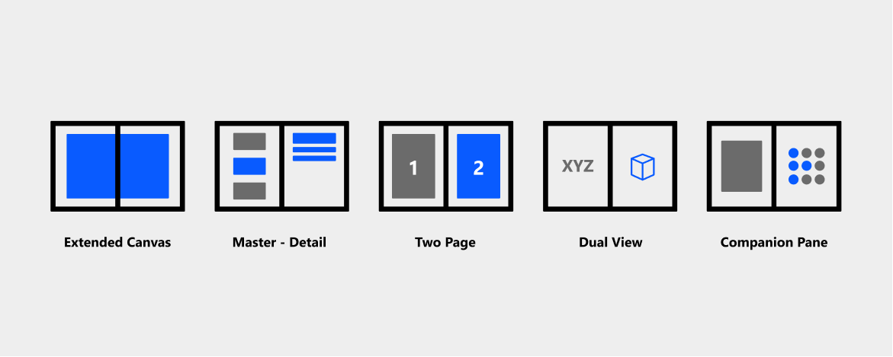

Xamarin.Forms provides two different classes that can help display content on dual-screens:

- **TwoPaneView** - a layout control that can host other controls and automatically adapt to two screens.
- **DualScreenInfo** - a helper class that provides access to screen information to help adapt your app for two screens.

To access these classes in your Xamarin.Forms apps, add the **Xamarin.Forms.DualScreen** NuGet to your solution and call the `DualScreenService.Init(this)` method in the Android main activity `OnCreate`.

## Use TwoPaneView

The TwoPaneView is a layout control that positions two views side-by-side (or above and below each other, depending on the orientation). To use the TwoPaneView in a content page, first add a namespace that references the Xamarin.Forms.DualScreen NuGet:

```xaml
xmlns:dualScreen="clr-namespace:Xamarin.Forms.DualScreen;assembly=Xamarin.Forms.DualScreen"
```

The following XAML shows a simple example of a `TwoPaneView` layout, with a `Label` in each pane. The panes can contain any Xamarin.Forms views including a custom view control.

```xaml
<dualScreen:TwoPaneView>
    <dualScreen:TwoPaneView.Pane1>
        <Label Text="Pane1 Content" />
    </dualScreen:TwoPaneView.Pane1>
    <dualScreen:TwoPaneView.Pane2>
        <Label Text="Pane2 Content" />
    </dualScreen:TwoPaneView.Pane2>
</dualScreen:TwoPaneView>
```

By default the TwoPaneView will attempt to always render both panes, which means that when the app is running on a single-screen, the screen will be split between two views.

On the Surface Duo, applications can be spanned across two screens. The TwoPaneView control has additional properties that determine where the two panes are rendered in relation to each other (in both single- or dual-screen):

- **TallModeConfiguration** – when in tall mode, the panes can be Left/Right, Right/Left, or a single pane only can be shown.
- **WideModeConfiguration** – when in wide mode, the panes can be Top/Bottom, Bottom/Top, or a single pane only.
- **PanePriority** – whether to show `Pane1` or `Pane2` if `SinglePane` mode is set.

There are three display modes:

- **SinglePane** – only one pane is currently visible.
- **Wide** – the two panes are laid out horizontally. One pane is on the left and the other is on the right. On the Surface Duo, the two screens are in portrait mode.
- **Tall** – the two panes are laid out vertically. One pane is on top and the other is on bottom. On the Surface Duo, the two screens are in landscape mode.

## Use DualScreenInfo

The `DualScreenInfo` class provides a number of methods:

- **SpanningBounds** – when spanned across two screens, return two rectangles indicating the bounds of each visible area. This property will return an empty array if the window isn't spanned.
- **HingeBounds** – the position of the hinge on the screen.
- **IsLandscape** – if the device is landscape. This property is useful because native orientation APIs don't report orientation correctly when an application is spanned.
- **SpanMode** – whether the layout is in tall, wide, or single pane mode.

An example of how we can use this class is creating a property to indicate if an app is spanned across two screens, by checking the current view mode:

```csharp
public bool DeviceIsSpanned => DualScreenInfo.Current.SpanMode != TwoPaneViewMode.SinglePane;
```

The other properties can be used to affect your app layouts, even if you choose not to take advantage of the TwoPaneView.

## User interface patterns

We have identified five common user interface design patterns



- Extended canvas - useful for maps or a drawing canvas.
- List-detail - hierarchical navigation through data.
- Two page - book reading experience.
- Dual view - different views of the same data (such as a list and a map).
- Companion pane - tool palettes or game controllers.

These design patterns are described in more detail in the [dual-screen documentation](https://docs.microsoft.com/dual-screen/introduction#dual-screen-app-patterns).
