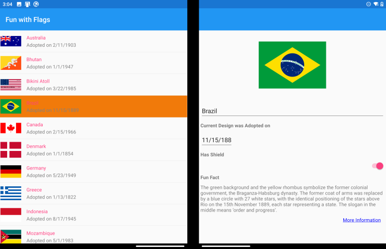
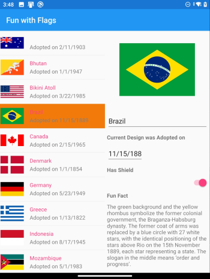

[!include[](../../includes/xamarin-not-maintained.md)]

In this exercise, you'll work with an existing list-detail app. The app has a list view that shows different country/region flags. The first version of the code works well on single-screen devices but does not adapt to dual-screens. You'll change the code so that it uses a dual-screen layout.

## Open the starter solution

1. Clone or download the [!INCLUDE [module-exercise-repo](module-exercise-repo.md)].

    [!include[](../../../includes/android-windows-path-length-warning.md)]

1. Open the **exercise1** > **start** folder.
1. Open the **FlagFacts.sln** solution.
1. Explore the FlagFacts shared project. The single-screen navigation relies on pushing and popping a ContentPage using Xamarin.Forms navigation.
1. Open the code-behind for both XAML files (AllFlagsPage and FlagView).
1. Notice that the `DependencyService` is used to create and set the `BindingContext` on both content pages. We will rely on this behavior as we change the way navigation works in the app.
1. Run the application on an Android device or emulator.

## Add dual-screen NuGet

1. Add the **Xamarin.Forms.Dualscreen** NuGet to your solution (include it in every project).
1. In the **Android** project, add this `Init` method in the `MainActivity.OnCreate` method in **MainActivity.cs**:

   ```csharp
    Xamarin.Forms.DualScreen.DualScreenService.Init(this);
    ```

1. Also in the Android project, ensure the `[Activity]` attribute in the **MainActivity.cs** file has all these attributes declared:

    ```@csharp
    [Activity(Label = "FlagFactsDuo", Icon = "@mipmap/icon", Theme = "@style/MainTheme", MainLauncher = true,
    ConfigurationChanges = ConfigChanges.ScreenSize | ConfigChanges.Orientation
    | ConfigChanges.ScreenLayout | ConfigChanges.SmallestScreenSize)]
    ```

    These attributes ensure that when your app switches from single- to dual-screen it doesn't destroy and recreate the activity.

Now that the project is configured for dual-screen support, you will refactor the code to support two screens.

## Extract controls from FlagDetailsPage

The "detail view" in the app is `FlagDetailsPage`. To show the details side-by-side on a dual-screen device you need to extract the controls into a custom view control:

1. Create a new item in the **FlagFacts** project by right-clicking on the project and choosing **Add > New Item...**.
1. Choose the XAML **Content View**, and name it `FlagView`.
1. Copy the `<ScrollView>` and all its contents from **FlagDetailsPage.xaml** and paste into **FlagView.xaml**. Leave the `ToolbarItems` in the original content page.
1. Move the `OnMoreInformation` method from the content page to the **FlagView.xaml.cs** codebehind:

    ```csharp
    private void OnMoreInformation(object sender, EventArgs e)
    {
        Launcher.OpenAsync(((FlagDetailsViewModel)BindingContext).CurrentFlag.MoreInformationUrl);
    }
    ```

    You will need to add `using Xamarin.Essentials;` and `using FlagData;` statements to the top of the file.

1. In the **FlagDetailsPage.xaml**, add a new namespace so we can add locally defined classes:

    ```csharp
    xmlns:views="clr-namespace:FlagFacts"
    ```

1. Also in the **FlagDetailsPage.xaml**, delete the existing `<ScrollView>` content and replace with a reference to the new view:

    ```csharp
    <ContentPage.Content>
        <views:FlagView />
    </ContentPage.Content>
    ```

We will use the `FlagView` in this unit below, and the `FlagDetailsPage` later in the module.

## Add TwoPaneView to AllFlagsPage

1. In the **AllFlagsPage.xaml**, add these two namespaces so that you can reference the `FlagView` and also the dual-screen controls:

    ```xaml
    xmlns:views="clr-namespace:FlagFacts"
    xmlns:dualScreen="clr-namespace:Xamarin.Forms.DualScreen;assembly=Xamarin.Forms.DualScreen"
    ```

2. Replace the XAML content with the code below. The existing `ListView` is now wrapped in `Pane1` of the `TwoPaneView` control, and the `FlagView` content view is in `Pane2. When the app runs, these two views will appear side-by-side.

    ```xaml
    <dualScreen:TwoPaneView x:Name="twoPaneView">
        <dualScreen:TwoPaneView.Pane1>
            <!--existing ListView-->
            <ListView ItemsSource="{Binding Flags}"
                      SelectedItem="{Binding CurrentFlag, Mode=TwoWay}"
                      ItemTapped="ListView_ItemTapped">
                <ListView.ItemTemplate>
                    <DataTemplate>
                        <ImageCell DetailColor="Gray"
                                   ImageSource="{Binding ImageUrl, Converter={StaticResource irConverter}}"
                                   Text="{Binding Country}"
                                   Detail="{Binding DateAdopted, StringFormat='Adopted on {0:d}'}"/>
                    </DataTemplate>
                </ListView.ItemTemplate>
            </ListView>
        </dualScreen:TwoPaneView.Pane1>
        <dualScreen:TwoPaneView.Pane2>
            <!--view is shared with FlagDetailsPage-->
            <views:FlagView />
        </dualScreen:TwoPaneView.Pane2>
    </dualScreen:TwoPaneView>
    ```

3. _Comment out_ the body of the `ListView_FlagTapped` method, since the list and detail are now on the same content page, databinding takes care of the selected item being displayed.

    ```csharp
    private async void ListView_FlagTapped(object sender, ItemTappedEventArgs e)
    {
        //await this.Navigation.PushAsync(new FlagDetailsPage());
    }
    ```

## Run the app

Run the modified app and it will render the list and details side-by-side. When the app is spanned it displays nicely:



However when the app starts on a single screen (and for other devices like iPhone), the default behavior is for the views to appear squashed together side-by-side on single screens too:


