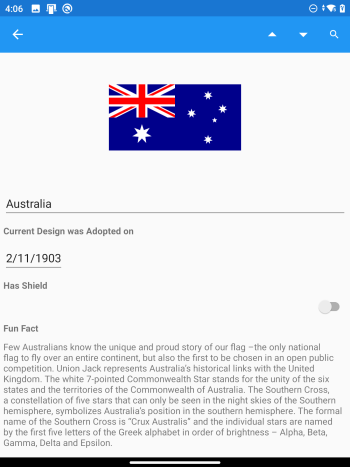

In this exercise, we're going to fix how the panes display on single-screens, so that the app adapts to all device types.

We'll continue with the solution from the previous exercise. If you don't already have it, you can open the solution from the **exercise2 > start** folder in your copy of the cloned or downloaded [!INCLUDE [module-exercise-repo](module-exercise-repo.md)] in Visual Studio.

## Add DualScreenInfo to AllFlagsPage

1. In **AllFlagsPage.xaml.cs** create a `DeviceIsSpanned` property using `DualScreenInfo`:

    ```csharp
    using Xamarin.Forms.DualScreen;
    // ...
    bool DeviceIsSpanned => DualScreenInfo.Current.SpanMode != TwoPaneViewMode.SinglePane;
    ```

1. Add a field `wasSpanned` to the class, which will be used to keep track of the window state:

    ```csharp
    // is not spanned when first viewed...
    bool wasSpanned = false;
    ```

1. Add `OnAppearing` and `OnDisappearing` overrides to respond to dual-screen property changes (you'll also need `using System.ComponentModel;`):

    ```csharp
    protected override void OnAppearing()
    {
        base.OnAppearing();
        DualScreenInfo.Current.PropertyChanged += DualScreen_PropertyChanged;
        UpdateLayouts(); // for first page load
    }
    protected override void OnDisappearing()
    {
        DualScreenInfo.Current.PropertyChanged -= DualScreen_PropertyChanged;
        base.OnDisappearing();
    }
    ```

1. Implement the methods `DualScreen_PropertyChanged` and `UpdateLayouts`:

    ```csharp
    void DualScreen_PropertyChanged(object sender, PropertyChangedEventArgs e)
    {
        UpdateLayouts();
    }
    async void UpdateLayouts()
    {
        if (DeviceIsSpanned)
        {   // two screens: side by side
            twoPaneView.TallModeConfiguration = TwoPaneViewTallModeConfiguration.TopBottom;
            twoPaneView.WideModeConfiguration = TwoPaneViewWideModeConfiguration.LeftRight;
            wasSpanned = true;
        }
        else
        {   // single-screen: only list is shown
            twoPaneView.PanePriority = TwoPaneViewPriority.Pane1;
            twoPaneView.TallModeConfiguration = TwoPaneViewTallModeConfiguration.SinglePane;
            twoPaneView.WideModeConfiguration = TwoPaneViewWideModeConfiguration.SinglePane;
            // wasSpanned check is needed, or this will open on first-run or rotation
            // stack count is needed, or we might push multiple on rotation
            if (wasSpanned && Navigation.NavigationStack.Count == 1)
            {   // open the detail page
                await Navigation.PushAsync(new FlagDetailsPage());
            }
            wasSpanned = false;
        }
    }
    ```

    The `UpdateLayouts` method will now be called whenever the app is spanned or unspanned (or the device is rotated). When spanned, the `twoPaneView` is configured to show the two views side-by-side. When the app is on a single screen, only the list is shown.

    When the app is moved to single screen, the `if` statement checks if the app was previously spanned, and if so, pushes the flag details onto the navigation stack. Showing the detail page ensures the app navigation works as expected when unspanning back to a single screen.

1. Revisit **AllFlagsView.xaml.cs** to uncomment the `ListView_FlagTapped` method, and add a check for `!IsDeviceSpanned`:

    ```csharp
    async void ListView_FlagTapped(object sender, ItemTappedEventArgs e)
    {
        if (!DeviceIsSpanned)
        {   // use Navigation on single screen
            await this.Navigation.PushAsync(new FlagDetailsPage());
        }
    }
    ```

    This method will now use the `Navigation` class to push the flag details if the app is on a single screen. Showing the detail page via the navigation class ensures the app works as expected on all single-screen devices.

## Update the FlagDetailsPage code-behind

1. Add the these methods (exactly as above) to **FlagDetailsPage.xaml.cs**:

    - `DeviceIsSpanned`
    - `OnAppearing`
    - `OnDisappearing`
    - `DualScreen_PropertyChanged`

    and these `using` statements:

    - `using Xamarin.Forms.DualScreen;`
    - `using System.ComponentModel;`

1. In **FlagDetailsPage.xaml.cs** implement `UpdateLayouts` as shown here:

    ```csharp
    async void UpdateLayouts()
    {
        if (DeviceIsSpanned)
        {   // the detail view should never be showing when spanned
            if (Navigation.NavigationStack.Count > 1)
            {
                await Navigation.PopToRootAsync();
            }
        }
    }
    ```

    This will cause the detail content page to be hidden if the app is spanned, which is important because Pane2 shows the detail on the second screen.

## Run the app

Now when you start the app on a single screen, it uses the navigation stack to switch between the list and the detail page.

If the app is spanned, the list and detail view is shown side-by-side using `TwoPaneView`.

When you span or unspan the app, the detail view will be pushed onto the navigation stack or popped off the navigation stack as required. These screenshots show how the app working on a single screen:

 and 
