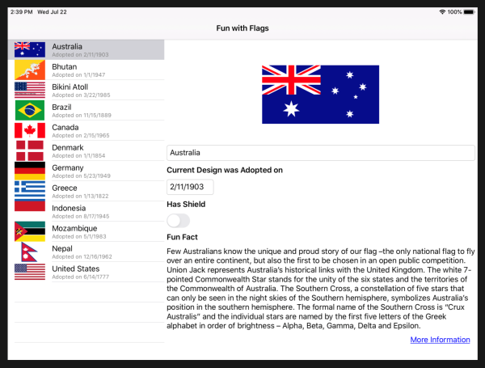

In this exercise, we're going to adapt the display for larger screen sizes like tablets and desktops. `TwoPaneView` can set the two panes to specific widths or proportionally, and we can use the same navigation strategy as for dual-screen display.

We'll continue with the solution from the previous exercise. If you don't already have it, you can open the solution from the **exercise3 > start** folder in your copy of the cloned or downloaded [!INCLUDE [module-exercise-repo](module-exercise-repo.md)] in Visual Studio.

## Detect larger screens

We can use the Xamarin.Forms `Device` class to detect whether the app is running on a large screen.

Add the following code to **AllFlagsPage.xaml.cs**:

```csharp
bool DeviceIsBigScreen => (Device.Idiom == TargetIdiom.Tablet) || (Device.Idiom == TargetIdiom.Desktop);
```

## Update layout and navigation

1. In **AllFlagsPage.xml** update the XAML `TwoPaneView` element to include proportional sizes for the two panes:

    ```xaml
    <dualScreen:TwoPaneView x:Name="twoPaneView"
        Pane1Length="1*"
        Pane2Length="2*"><!--proportional layout 1/3 for list, 2/3 for details-->
    ```

    These properties do not apply when the mode configuration is set to `SinglePane`, because only one pane is visible; and they do not apply on a Surface Duo, because the two panes are sized to fit the two screens.

1. Open **AllFlagsPage.xaml.cs**.
1. Update `ListView_FlagTapped` so that the navigation is _not_ used when the app is running on a large screen, by changing the `if` clause to `!DeviceIsSpanned && !DeviceIsBigScreen`. The method should look like this:

    ```csharp
    async void ListView_ItemTapped(object sender, ItemTappedEventArgs e)
    {
        if (!DeviceIsSpanned && !DeviceIsBigScreen)
        {   // use Navigation only on phone-size single-screens
            await this.Navigation.PushAsync(new FlagDetailsPage());
        }
    }
    ```

1. Change the `UpdateLayouts` method `if` clause to `DeviceIsSpanned || DeviceIsBigScreen` so that the `LeftRight`/`TopBottom` configuration is used for both spanned _and large screens_. When the device has a large screen, the two panes will be sized proportionally due to the XAML attributes we added previously.

    ```csharp
    void UpdateLayouts()
    {
        if (DeviceIsSpanned || DeviceIsBigScreen)
        {   // two panes: side by side
    // ... remainder of method unchanged
    ```

1. Run the app on a tablet or desktop computer supported by Xamarin.Forms, and the layout will adapt to resemble the dual-screen size-by-side appearance:

    
